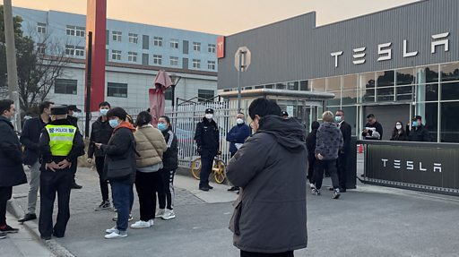

# [Chinese] 特斯拉三月内两度降价 中国车主怒冲门市抗议

#  特斯拉三月内两度降价 中国车主怒冲门市抗议

**特斯拉三月内两度降价 中国车主怒冲门市抗议**

特斯拉（Tesla）电动车近期因销情不佳，在短短3个月内两度调降车价。这令很多此前刚刚购买特斯拉的车主不满。

1月10日，数十名特斯拉的中国车主在上海某交付中心抗议。

特斯拉Model 3和Model Y车价，分别下调至22.99万元和25.9万元人民币。特斯拉1月7日回应，公司没有计划提供赔偿。车主们表示，如果特斯拉不提供降价后补偿，他们将继续对车商施加压力。

特斯拉是中国市场销量前十的新能源汽车中唯一的外资品牌。但特斯拉去年12月在中国大陆的销量比之前一年同期暴跌41%。随着中国对购买电动车的补贴已于2022年底完结，整个行业将面临“痛苦转型期”。特斯拉降价的目的，被认为是要努力维持竞争力和销量。

