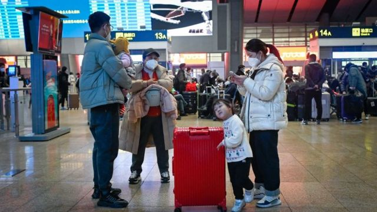
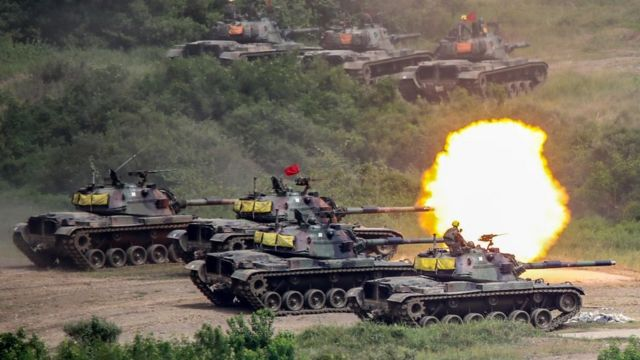
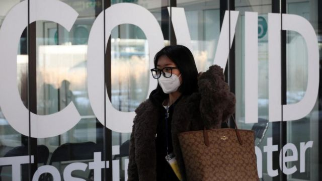
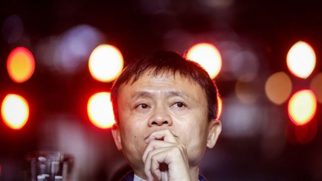
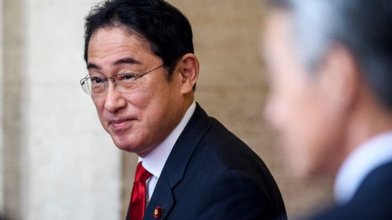

# [Chinese] 中国解封、限制日韩公民赴华、美国推演台海战争等本周重要故事

#  中国解封、限制日韩公民赴华、美国推演台海战争等本周重要故事

> 图像来源，  Getty Images

**新的一年第二周，中国新冠政策大转向后出现的变化持续受到关注。有年轻人希望尽快感染，以防过年回乡传染给老人。中国停止向韩国和日本公民发放短期赴华签证，以报复两国针对中国游客的入境新冠检疫措施。**

美国华府智库战略与国际研究中心（CSIS）发布报告，推算北京若在2026年对台湾发动战争，可能带来的影响。

在商业领域，中国互联网金融企业蚂蚁集团发布公告，公布了一系列股东投票权的变化。

国际上，日本首相岸田文雄周五（1月13日）访问白宫，与美国总统拜登举行首脑峰会，这是他2021年上任以来首次访问美国。

刚刚过去的一周，BBC中文有以下新闻内容受到读者关注。如果你错过了，带你一一回顾。

##  1\. 中国民众在不安中迎接“开关”

过去一个月，中国防疫政策的突然逆转导致了席卷全国的新冠感染潮。中国老人新冠疫苗加强针接种率不高，且疫苗选择较为单一，如何防止老人感染，成为家家户户忧心的问题。特别对于农村家庭来说，在快速解封下，人们担心药物及医疗系统是否会不堪重负。

但结束持续三年的严格防疫措施，则同样有支持者。有中国年轻民众告诉BBC，期盼解封能让生活“恢复正常”。

BBC采访了一些中国家庭及年轻民众，了解他们对于快速解封的看法，一些家庭成员对于长者染疫表达了忧心。

##  2\. 兵棋推演两岸战争 台湾或会“惨胜”

> 图像来源，  Getty Images
>
> 图像加注文字，台湾军演画面。台湾政府最近已将兵役时间增加到一年。

美国华府智库“战略与国际研究中心”（CSIS）主持的兵棋推演（wargame）报告称，北京若在2026年对台湾发动战争，结论是美国及日本介入协助台湾的情况下，在三周左右的时间，中国人民解放军将会战败，并对北京政权产生严重影响。而台湾将“惨胜”，经济重创民生崩溃，同时美国及日本的军事力量也都遭遇严重折损。

这是近几年智库主持的最大规模的台海战争模拟之一，此前不同智库的报告推论几乎都是北京战胜，拿下台湾。此次模拟推演的结论不同，引发各界关注。

##  3\. 中国以来华签证“对等报复”日韩入境限制

> 图像来源，  Reuters
>
> 图像加注文字，韩国仁川机场

中国已停止向韩国和日本公民发放短期赴华签证，以报复两国针对中国游客的入境新冠检疫措施。周三，中国国家移民管理局进一步表示，即日起对韩国、日本公民暂停签发口岸签证及暂停72小时、144小时过境免签政策。

中国政府此前表示，暂停签证的做法将持续到针对中国的“歧视性”入境限制被取消。

日本和韩国不是仅有的对中国旅客实施入境检疫要求的国家，但它们的措施是最严格的。

上周，韩国停止向中国游客发放旅游签证，中国外交部称此举“不可接受”、“不科学”。

##  4\. 蚂蚁集团宣布马云“放手”

> 图像来源，  Getty Images
>
> 图像加注文字，2011年，马云以支付宝金融牌照需回归内资为由，将支付宝从阿里巴巴集团剥离。

1月7日，蚂蚁集团发布公告，公布了一系列股东投票权的变化，其结果是，其创始人马云将不再是蚂蚁集团的实际控制人。

2020年年末，蚂蚁在港交所上市已进入倒计时，但在突然而至的巨大监管压力下，放弃潜在募资规模370多亿美元的上市计划。

蚂蚁集团是中国资金流量最大的互联网金融企业，覆盖支付、储蓄、借贷、保险、投资等服务，月度活跃用户超过7.3亿人。

##  5\. 日本首相岸田文雄首次访美

> 图像来源，  Getty Images

日本首相岸田文雄周五（1月13日）访问白宫，与美国总统拜登举行首脑峰会，这是他2021年上任以来首次访问美国。两国近日发布，称全球进入“战略竞争新时代”。两位领导人将讨论一系列地区和全球问题，其中多个方面涉及到中国的利益。

根据，他们将讨论朝鲜核武器和弹道导弹计划，俄罗斯- 乌克兰战争，以及如何维护台湾海峡的和平与稳定。另外根据，他们预计还将讨论安全问题和全球经济，包括在半导体等技术出口管制方面的合作。

日本东京大学东洋文化研究所教授松田康博对BBC中文说， 美日两国是军事同盟，像是一个矛和盾的组合，“以前在抗衡威胁时，美国是矛，日本是盾；现在日本也将成为一些矛的部分，那么美国作为矛的角色负担可以得到减轻”。

