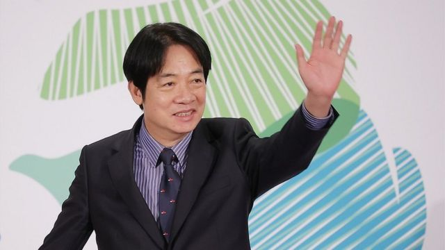
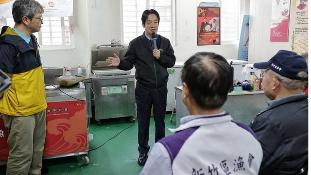
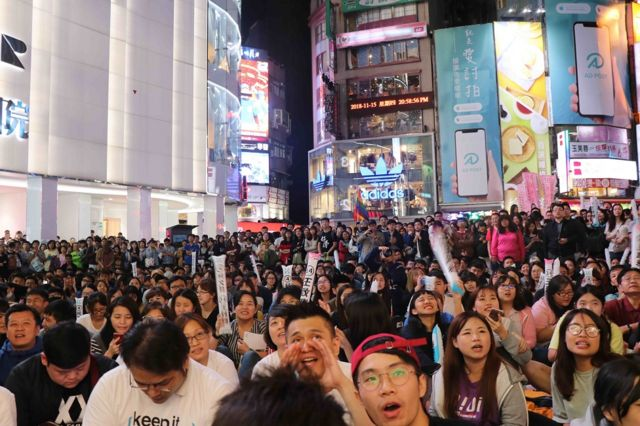

# [Chinese] 赖清德当选民进党党主席 “务实台独者”的他会是下任台湾总统吗？

#  赖清德当选民进党党主席 “务实台独者”的他会是下任台湾总统吗？

  * 吕嘉鸿 
  * BBC中文 

7 小时前

> 图像来源，  President Office ,Taiwan
>
> 图像加注文字，赖清德主要工作是要在弥合在去年大选后，民进党党内各派系内部倾轧所造成的伤害。

**台湾执政民进党党主席补选周日（1月15日）举行，作为代主席和唯一候选人的赖清德高票当选，但投票率只有17.6%。**

赖清德当日晚间说，这是民进党赢回人民信任的开始，每一张党主席选票、每一项提出的建议，都将是党再起的力量；他无比珍惜，必定全力以赴，不敢辜负所托。

现任总统蔡英文因为去年地方选举大败辞，去党主席。之后，赖清德宣布参选，成为唯一候选人。

赖清德的当选也意味着他成为代表民进党参与2024总统大选上最热门人选。

赖清德宣布参选后，频密参加各地举办“向党员报告”座谈会，被视为民进党地方选举败选后，党内能够力挽狂澜，延续民进党政权的第一人选。

外界分析，以“务实台独者”自称的赖清德，下一步何时参选总统，如何找回民进党支持者将受到关注。

##  “务实台独者”如何攻顶总统一职？

作为新任民进党党主席，舆论认为，赖清德肯定会代表该党参选2024总统大选。 因此，他的“统独”立场及中国政策也开始受到检视。

根据报导，2013年，中国维权人士陈光诚访台，赖清德是当年唯一亲自出面接待他的县市首长。

2014年，赖清德首次访问中国，在上海复旦大学谈话时称，“两岸合作取代对抗、交流取代围堵”，释出善意。

但他也说，台湾独立的主张在台湾社会有“极大共识”，即使民进党的台独党纲能够被拿掉，但也“没有办法解决台湾人民要求独立的主张”，引发两岸高度关注。

2017年9月26日，时任行政院院长的赖清德在立法院公开答询时自称自己是务实的，“主张台湾独立的政治工作者”。

由于这是台湾首位在立法院公开台独主张的行政院长，震撼两岸，并遭致北京严厉抨击。 但他也深获台湾独派人士拥戴。

去年初，身为副总统的赖清德与美国副总统贺锦丽（Kamala Harris）在宏都拉斯新任总统卡斯楚的就职典礼“巧遇”； 去年安倍晋三遇刺身亡后，他前往日本东京参加私人家祭 **，** 开启了台湾政治人物以私人行程拜访日本的模式。

台湾东海大学政治学系张峻豪教授向BBC中文解释称，赖清德鲜明的“务实台独工作者”的角色和民进党的“抗中保台”主张，在去年地方选举大选间似乎无法再吸引选民。 这些将成为他迈向总统之路的一大挑战 。

台湾中山大学副教授姚立明早前接受媒体访问时说，蔡英文在其任期剩下的一年半内，面临如何与赖清德在“党政”上合作，彼此无私的将好政策及政党理念落实的挑战这一艰巨任务。

1月3日出访帛琉时，赖清德被媒体问及其两岸路线是否延续蔡英文路线，他的回答是“当然是如此”。此外，谈及过去自称“务实的台独工作者”一事，赖清德回应称，台独系指“台湾不属于中国的一部分”，这是台湾的共识。

1月8日他批评台湾有人散播怀疑美国言论，回应说：“如果让有心人得逞，台湾会很危险。”

张峻豪教授说，赖清德的主要工作之一是要弥合去年选举后，民进党党内各派系内部倾轧所造成的伤害。“换句话说，党主席需要整合民进党党内派系，才能往立委提名及总统大选之路前进，”他说。

但赖清德过去在台南市长（2010-2017）及行政院长（2017-2019）任内，处事风格强硬，受到批评，被认为是择善固执，比较不接地气；任职市长时，与市议员及议会关系紧张。 基于他的政治风格，他如何有效整合党内派系有待观察。

姚立明对台湾媒体说，新任民进党主席的角色，应该是在这一年内公平排出私心地举办该党明年立法委员及总统选举的提名工作，同时重整空军（网路战略）及陆军（地方支持者），再找回中间选民。

他强调说，针对2024总统大选，不管是与民进党党内或他党潜在参选人竞争，一年多来的民调显示，赖清德都名列前茅姚。 姚立明认为，赖清德应该专心准备大选，主席的工作可以给党内其他人员处理。
  * 

> 图像来源，  President Office, Taiwan
>
> 图像加注文字，赖清德

##  “矿工之子”

赖清德1959年出生于台北万里一个贫困矿工之家。 父亲在他二岁时因矿灾丧命；母亲独自拉拔他与其他5位手足。

赖清德毕业于于台北建国中学和台湾大学复健系。之后，他南下就读台南成功大学医学系，毕业后在台湾南部行医。1994年开始步入政坛，为民进党辅选。1996年，他参选台湾台南国民大会代表，开始成为民进党中生代的明日之星。

之后，赖清德的从政之路一帆风顺，2008年后，民进党总统大选大败，前总统陈水扁因政治献金案遭判刑收押，但赖清德在民进党“本命区”台南仍然广受支持。他连任立委数次后，在2010年以60%得票率当选台南市长。

4年后，他以72.9%的得票率连任，创下台湾地方自治史首长选举纪录，因为清廉及勤政的形象，他被台湾媒体及支持者称为“仁医市长”，成为台湾政坛耀眼明星。之后，他接任台湾行政院长；2020年，接任台湾副总统等职位，在从政路上赖清德几乎没吞过败仗。

> 图像来源，  BBC NEWS CHINESE
>
> 图像加注文字，如何接地气，赢回年轻族群是赖清德领导的民进党的一大课题。

##  “择善固执”或“不接地气”？

2016年，民进党的另一明星蔡英文当选总统，赖清德被视为民进党的“储君”第一人选。不过，2017年，蔡英文执政初期遇到乱流，属于民进党大派系“新潮流”的赖清德上位行政院长一职。任职前后，政府推出的“年金改革”，引发在台湾势力庞大的“军公教”退伍人士强烈反弹，同性婚姻合法化遭到党内外保守派抵制等。

赖清德接任行政院长后，政府推出的劳工政策，也引发劳工及工运人士抨击，尤其他提到，低薪照护老人的工作者，可以为社会“积累功德”，引发一片哗然。2018年，在野党国民党的韩国瑜异军突起，“韩流”席卷全台湾，民进党在年底的地方选举及公投大败，蔡英文辞去党主席，赖清德在隔年一月也辞职下台。

> 图像来源，  BBC Chinese
>
> 图像加注文字，民进党2022年地方选举大败

2019年，赖清德加入民进党党内总统初选，挑战寻求连任的蔡英文。在地方选举重伤的蔡英文，面对赖清德的严厉批评，两人间裂痕浮现。 同时，赖清德获得党内独派大老支持，被媒体称为“独派金孙”。

结果，因在外交议题表现出色以及获得年轻族群的支持， 蔡英文胜出初选，并在2020年和赖清德搭档连任总统。

代表民进党的她在中国因素以及团结一致的态势下，以破纪录的817万多票大胜对手韩国瑜。

从政30年，医生出身的赖清以清廉及勤勉的印象出现在台湾媒体，他的妻儿鲜少曝光在公开场合，直系家人也几乎从未参与政治，生活低调。

他的个性被支持者形容为择善固执及直言不讳，批评者认为他过于强势，难以沟通。譬如他担任台南市长在内，为了铁路地下化，强制一些民众搬迁，手段被病诟。

然而， 2016年台南地震导致住宅大楼倒塌，他一周内几乎24小时不眠不休，每天前往勘灾的坚毅形象，被市民称为“赖神”。

但是，他也因为政治洁癖屡被批评。当年有评 论者称  ，赖清德“爱恨分明”，不容许有灰色地带，这表现在他对于任何指责或媒体批评都看得很重。

譬如，担任台南市长一职时，为了抗议市议会议长涉嫌贪污以及对其施政公开挑衅，他选择200多天不踏入市议会接受质询，震撼台湾政坛。赖清德的支持者赞誉他不与贪腐为伍。但他的批评者则说，因为“政治道德洁癖”，不进议会，回避市议员质询，违逆了代议士政治及民主政治规则。彼时台湾监察院还对赖清德提出弹劾。

该市议长遭判刑解职后，赖清德以“邪不胜正”总结自己不进议会的政治豪赌，并在记者会上以“改革黑金从台南出发”口。如今他曾支持的民进党台南市议院议长及副议长涉嫌贿选，这让外界开始严密检视，他担任党主席后，能否秉持同一原则，秉公处理？

