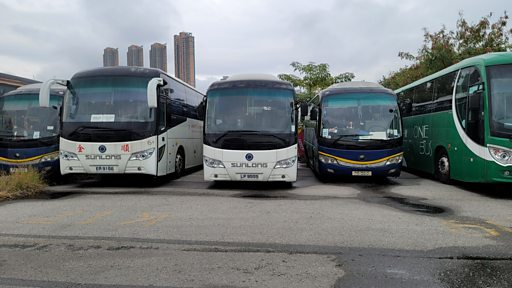

# [Chinese] 通关后的香港 数以千计冬眠旅游巴士如何重新上路？

#  通关后的香港 数以千计冬眠旅游巴士如何重新上路？

**通关后的香港 数以千计冬眠旅游巴士如何重新上路？**

中国大陆于1月8日重启公民出境旅游，同步恢复与香港之间的免检疫通关，但对陆路通关设有配额制度。大陆与香港之间通过广深港高铁维系的铁路通关也定于1月15日恢复。

“开关”消息公布后，一些有关汽车的事情受到香港媒体关注——大批从事旅游与跨境客运的大巴因新冠病毒病（COVID-19）疫情而闲置“旅游巴坟场”近三年，恍如遭废弃，亟待修复或替换；相关行业赶忙招聘司机填补，工资被抢高，波及本地专营巴士（公交、公车）人手。

香港巴士运输行业准备好迎接“全面开关”了吗？都遇到了哪些困难？BBC中文听听业内人士与工会的说法。

采访、制片：叶靖斯｜摄影：王溦、关美清、叶靖斯

