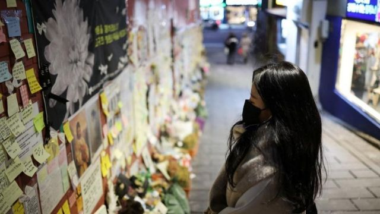
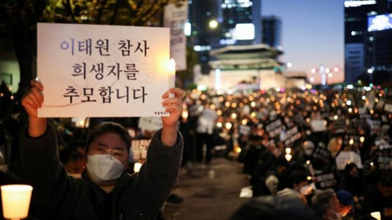

# [Chinese] 梨泰院踩踏事故：调查报告出炉高官免责 死者家属斥“蜥蜴断尾求生”

#  梨泰院踩踏事故：调查报告出炉高官免责 死者家属斥“蜥蜴断尾求生”

> 图像来源，  Reuters
>
> 图像加注文字，事故发生在2022年10月29日晚，造成159人死亡。

**韩国首尔梨泰园去年10月发生踩踏惨剧，韩国警察专案部门调查两个半月後在1月13日公开报告，指责地方政府和应急服务单位应对不力，并未追究高级官员。**

事故发生在2022年10月29日晚，有指当时超过10万人在梨泰园聚集庆祝万圣节，人群被困在狭窄斜巷并发生踩踏，造成159人死亡，大部分是年轻人。

调查人员已拘捕6名地方官员，包括时任首尔龙山警署署长李林宰和首尔龙山区厅长朴熙英，涉嫌公务过失致死，另外起诉首尔地方警察厅长等17名公务人员。

死者家属李政民（音译）接受BBC采访时批评，该报告好像“蜥蜴断尾求生”。

负责调查的韩国警察厅梨泰院踩踏事故特别调查本部本部长孙济汉指出，地方政府、警察、消防部门和地铁官员都是“有法律责任预防和应对灾害”的人。

但他表示，很难认定首尔市长吴世勋、国家警察厅长尹熙根、行政安全部长李祥敏有直接责任。

报告发表前，首尔西部地方检察厅10日曾对涉案警察部门采取搜查行动。韩国《中央日报》引述检察机关消息人士称，这是源于特别调查本部希望在春节前结案，希望由检察部门出面搜查，以加快效率。

报告内容引起死者家属和韩国公众批评，舆论认为应追究更高级别的官员。去年12月，韩国议会曾通过动议，要求内政部长李相民下台。

死者家属李政民对BBC表示希望“指挥的官员”负责，“即是内政部长、国家警察局长，甚至是总统，都应该承担责任”。

他的28岁女儿李珠英（音译）本来今年结婚，当晚与未婚夫一起到梨泰园，只有未婚夫生还，从此阴阳分隔。

“我一定要得到那些当权者的道歉，这样我女儿才能瞑目安息，”李先生说。“我已经告诉她，爸爸会用尽全力。”

调查指，地方部门在事故发生前没有预防对策，接到紧急求助电话后也没有采取适当措施，有关单位误判情况、延迟分享资讯、部门之间缺乏合作，这些叠加失误导致大规模伤亡。

> 图像来源，  Reuters
>
> 图像加注文字，舆论认为应追究更高级别的官员。

韩国警察厅去年11月1日成立由501人组成的特别调查本部，调查了548人，分析多达180个闭路电视画面丶社交媒体和新闻的相关影片。

纪录显示，警方早在踩踏惨剧发生前的数小时——首尔时间18:34（格林尼治标准时间09:34）——接到报警电话。在接下来的三个半小时里，还有至少10通求助电话来自该区。

但在这11通电话中，警方只回应了其中4通，提醒人们注意过度拥挤。
 BBC韩语网解读报告内容指出  ，事发时现场每1平方米有6至10人站立，踩踏发生时，每人平均受力224至560公斤，压力巨大。死者具体死因包括压迫性窒息、气道阻塞性窒息、和因缺氧而导致的脑水肿。

韩国开放网络大学白承柱教授此前曾向BBC韩语网指出，按照相关限制，现场每平米只应有5人站立。

