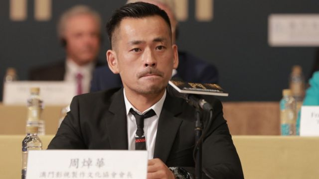
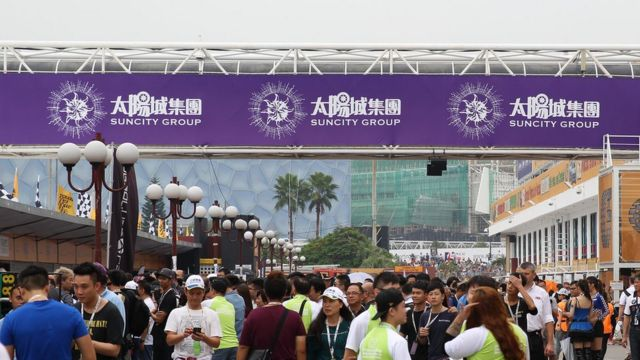
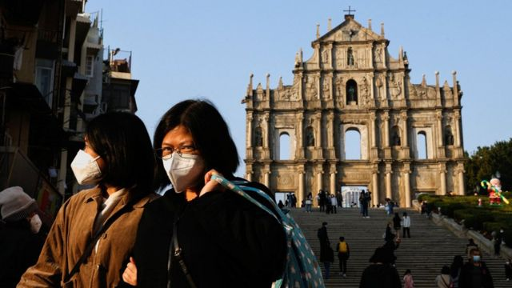
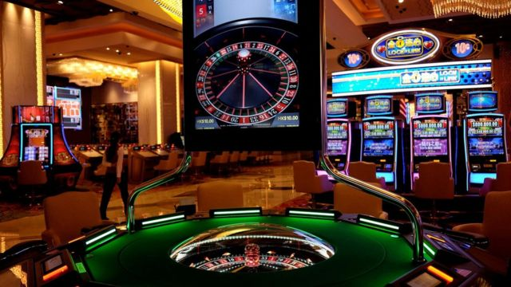

# [Chinese] 洗米华案：澳门“赌厅之王”周焯华百多项控罪成立，被判刑18年

#  洗米华案：澳门“赌厅之王”周焯华百多项控罪成立，被判刑18年

> 图像来源，  Getty Images
>
> 图像加注文字，周焯华被起诉近300项控罪。

**绰号“洗米华”的澳门太阳城集团创办人周焯华涉嫌非法经营赌博，被控289项罪名，案件星期三（1月18日）在当地初级法院宣判，裁定百多项罪名成立，包括黑社会罪、不法经营赌博、诈骗，合共判刑18年。**

周焯华案源于2021年11月浙江温州侦办其所涉嫌的跨境赌博犯罪案件，并获澳门检察院批准逮捕。特区司法警察旋即将周焯华带走调查，并移交检察院起诉。

抓捕行动发生时，正值 澳门咨询修订《博彩法》  ，准备重新竞投赌场牌照之际，也是中国大陆《刑法》第11次修订，“组织参与国外、境外赌博罪”入刑后不久。

起诉书称，2013年3月至2021年3月，以周为首的不法集团在六家博企娱乐场经营“赌底面”，即私下以杠杆加大赌博金额，赌资达8000多亿港元，从中赚取至少215亿元不正当利益，导致澳门特区少收博彩税82.6亿元，政府和多家博企提出民事损害赔偿请求。

##  周焯华与他的贵宾厅王国

周焯华1974年5月30日生于澳门，有报道称，他与不少同期出生的澳门居民一样，持有葡萄牙公民身份。

据港澳等地多家中文媒体报道，周焯华1994年涉足赌场所谓“扒仔”的借贷中介，在赌场周边街头“兜售”借贷服务。

“扒仔”是指在賭場內替賭客打氣向贏錢賭客讨小費的人。他们有别于“叠码仔”，后者从事替赌厅拉客，从而与赌厅分红。 “叠码仔”在2008年合法化  ，成为受监管的博彩中介人。

早于1998年，周焯华取得菲律宾的网络博彩准照，2007年受澳门一家酒店拉拢，开设赌场贵宾厅并成立其太阳城集团。《澳门日报》指出，太阳城集团凭借贵宾厅业务赚得大量资金，自2011年起拓展电影、餐饮、金融、房地产、拍卖行、车业、奢侈品、旅游娱乐、演唱会等业务，近年更在菲律宾、越南等地投资兴建综合旅游娱乐度假村，并通过收购，将业务扩展至俄罗斯。

> 图像来源，  Getty Images
>
> 图像加注文字，太阳城集团透过经营赌场贵宾厅而崛起。

周焯华透过其担任会长的“澳门励志青年会”高调参与亲北京活动，例如参观中国中央政府驻澳门联络办公室（澳门中联办）与澳门特区政府合办的毛泽东图片展、国家安全教育展等。

然而，2020年，有网络传言称周焯华支持“港独”，甚至协助美国与台湾转交资金予香港黑社会帮派，以让反政府示威升级为“黑暴”。周焯华7月13日透过太阳城集团网站发表视频否认，称该传言“极度荒谬”。

周焯华被浙江温州警察通缉后，上海极左派网站发文说：“那些想靠‘爱国’洗白自己的黑帮人士，该重新审视一下这个时代了。

##  洗米华案：从浙江温州到澳门
 2019年7月8日  ，中国官方新华社旗下《经济参考报》报道称，周焯华透过菲律宾与柬埔寨网络赌博平台，招揽中国大陆赌客遥距参与境外赌博。报道形容他是“亚洲新赌王”，并称，“太阳城网络赌博在大陆每年的赌注额在万亿元以上，相当于中国彩票年收入的近两倍”。

他当时曾回应说“严重失实”，保留追究法律责任权利。
 2021年11月26日  ，浙江省温州市公安局发布案情通报，宣告已获当地检察院批准逮捕澳门居民周焯华，指控他涉嫌“在中国境内实施开设赌场犯罪行为”，“敦促其尽快投案自首，争取宽大处理”。

温州警方称， 周焯华自2007年以来，发展中国大陆境内人员为股东级代理和赌博代理，组织中国公民前往其承包的境外赌厅赌博、参与跨境网络赌博活动；在中国境内成立资产管理公司，为赌客提供换取赌博筹码服务、帮助追讨赌债、协助客户跨境兑付资金；利用地下钱庄等非法渠道为赌客提供资金结算服务。

当地警察称，截至2020年7月，以他为首的跨境赌博犯罪集团在中国大陆共发展股东级代理199人、赌博代理1.2万余人、赌客会员8万余人。一位名为张宁宁的女子被列为骨干之一，据香港媒体报道，她是香港居民。

> 图像来源，  Reuters
>
> 图像加注文字，周焯华在最后陈述中强调，其企业为澳门带来巨大经济贡献。

案情通报发布后翌日，澳门司法警察将周焯华带走调查。 特区政府发表声明  证实，是在“收到内地有关部门的通报”后，“根据之前刑事侦查所获的证据”采取行动。

澳门与中国大陆之间并未订立刑事司法互助协定，澳门媒体也追问当局凭什拘捕周焯华。司警回应称，澳方早于2019年8月已根据情报立案侦查，又反称并未掌握温州警察所通报的情况。

司警还称，包括“47岁本澳周姓男商人”在内的11名嫌犯“都承认有关架设赌博平台以及有关的犯罪活动”，但拒绝配合调查其他案情。

澳门知名左派报章《新华澳报》社长兼总编辑林昶 后来在其专栏中形容  ，澳门司警抓捕周焯华，是“以‘默契’形式进行无形的‘区际刑事司法协助’”，促请澳门特区政府尽早重启《区际刑事司法协助法》立法工作。该法案原已提交澳门立法会审议，但特区政府于2016年6月主动撤回。

2022年10月20日，澳门特区终审法院院长岑浩辉 在司法年度开幕典礼致辞  时，提出与《新华澳报》相同的见解，并称区际刑事司法协助“不应长期缺位”。

2021年12月1日，在香港上市的太阳城集团发布公告，宣布周焯华辞去集团董事会主席。

2022年9月2日，澳门特区初级法院开庭审理“涉及太阳城集团犯罪的刑事案件”，涉及周焯华与张宁宁等合共21名被告人。周焯华作为“第一嫌犯”面对289项控罪，包括“不法经营博彩”罪、“清洗黑钱”罪、“加重清洗黑钱”罪、“犯罪集团”罪、“在许可地方不法经营赌博”罪、和“相当巨额诈骗”罪。

法院为此 发表新闻稿  详列控罪内容，被澳门媒体形容为罕见之举。

同时，特区检察院代表特区政府和四家博彩企业——永利渡假村、澳娱综合度假、美高梅金殿超濠与威尼斯人——对周焯华等人提出“连带责任”民事索赔。太阳城在这四家博彩企业的赌场内均有经营贵宾厅。

其中，澳门特区政府索赔82.6亿港元，或另行结算少收的博彩税收数额；美资永利渡假村索赔7.95亿澳门元；隶属已故赌王何鸿燊的澳门博彩控股旗下的澳娱综合度假索赔1.78亿港元；属金沙集团旗下的威尼斯人索赔3亿港元。美高梅金殿超濠的索赔金额则“待日后厘清及结算”。

特区政府与三家博企相加，索赔总额为97.97亿澳门元（12.18亿美元；82亿元人民币；95.12亿港元）。

检察院并未进一步说明民事索赔理据，但据澳门媒体报道，在2022年11月结案陈词阶段，除获检察院代表索赔的四家博企外，港商吕志和旗下银河娱乐也有律师出庭，五家博企代表律师均对检察院索赔立场表示认同。

澳门方面庭审进行之际，温州市中级法院9月30日对张宁宁等35人开设赌场罪、非法经营罪案件宣判。其中，张宁宁被数罪并罚，判处有期徒刑七年，罚款80万元人民币。 温州市中院判决认定  ，张宁宁等人受周焯华指使而犯案。

##  “赌底面”指控

> 图像来源，  Reuters
>
> 图像加注文字，“赌底面”涉及同时于赌台和外围押注。

澳门初院的庭审过程在相当程度上围绕于太阳城集团有否参与所谓“赌底面”活动，大意是赌客在赌台下注同时，透过外围赌博，以杠杆式乘大若干倍，私下与他人对赌。司警与检察院据此起诉周焯华“在许可地方不法经营赌博”罪。

公诉方指控周焯华涉及220多次赌底面纪录，其中14次下达了指示。证据显示，赌底面集团由周焯华操控辩护，但律师否认太阳城有参与其中。

司警方面称，2013至2021年间，太阳城赌底面转码数（营业额）有8238多亿澳门元，不法收益达210多亿澳门元。

周焯华本人在对法庭的最后陈词中，对多项控罪“感到无奈，以及不解”，强调太阳城集团4000多员工，在澳门经营十多年来，为澳门创造上千亿澳门元的博彩收益。
 澳门论尽媒体引述周焯华的陈述说  ：“我要向同事，特别是被羁押的同事以及他们的家人，说一句万分抱歉，令他们活在痛苦之中。”

