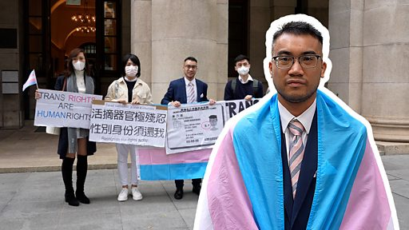

# [Chinese] 跨性别身份案：香港“跨仔”谢浩霖争取证件上的性别“正名”之路

#  跨性别身份案：香港“跨仔”谢浩霖争取证件上的性别“正名”之路

**跨性别身份案：香港“跨仔”谢浩霖争取证件上的性别“正名”之路**

跨性别男性谢浩霖（Henry Tse）在2017年和另两名原诉申请司法复核，挑战香港入境事务处以“完成全套变性手术”才能变更身份证上性别的标准。谢浩霖等原诉在初审和二审均败诉，现正于终审法院进行终极上诉。

根据香港现行政策，若要更改身份证上的性别，必须切除原有生殖器官、建构异性生殖器官。案件争议在于这项规定有否侵犯他们在《香港人权法案条例》下不受残忍对待的权利。

许多跨性别权利的支持者表示，强制进行全套变性手术是侵害身体自主权。

案中代表政府的律师则认为，社会各界对如何确立跨性别人士身份的议题上没有统一标准，相关疗程也是因人而异，当局难有公平一致的标准去断定身份。政府以完整性别重置手术作为更改性别的门槛，可解决实际层面的困扰。

跨性别权利近年在欧洲逐渐获得进展，目前有20个以上的国家已将换証程序与强制手术脱钩。在亚洲，多数国家仍普遍要求跨性别者进行性别重置手术，部分仍不允许更改法定性别。邻近的台湾则在2021年刚通过首个未经手术而变更性别登记的案例。

谢浩霖表示“现在是经历一个改变中的一个历史时刻”。经历两次败诉、五年的司法复核，他的案件在2023年1月4日来到终审法庭，预计在今年迎来最终判决。

影片製作：张友慈

