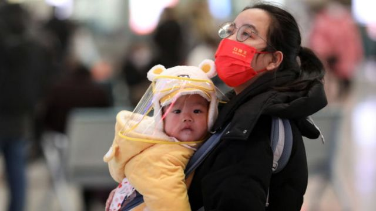
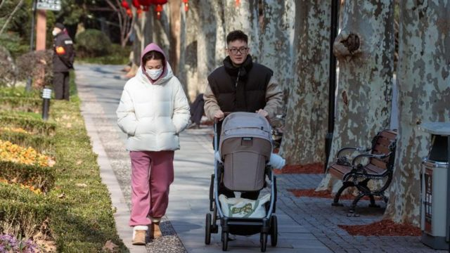
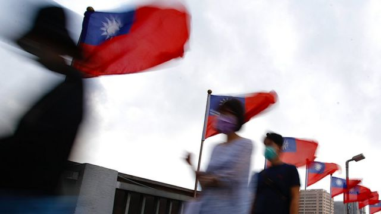
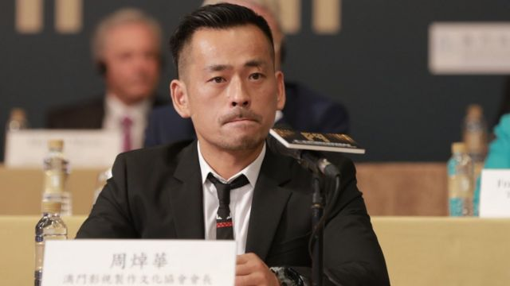

# [Chinese] 中国人口萎缩、在台港人“二次移民”、中国青年偷渡“润美”等本周更多重要故事

#  中国人口萎缩、在台港人“二次移民”、中国青年偷渡“润美”等本周更多重要故事

> 图像来源，  Getty Images

**中国人口60年来首次萎缩，比官方预期中提早了九年。“三孩”政策不见效，同时也面临“润潮”的人口流失，有90后青年冒险“走线”跟随南美难民的路线偷渡到美国。**

香港移民潮方面，大批港人在台湾陷入法律及政治困局，申请“定居”时处处碰壁，越来越多人决定“二次移民”到西方国家。

刚刚过去的一周，BBC中文有以下新闻内容受到读者关注。如果你错过了，带你一一回顾。

##  1\. 中国人口60年来首次萎缩

> 图像来源，  EPA
>
> 图像加注文字，中国公布2022年人口数据，显示该国人口60年来首次出现萎缩。

中国公布2022年人口数据，现在人口为14.118亿人，比上一年年末減少85万人。

这是1960年代初毛泽东领导“大跃进”运动后，该国遭遇大饥荒以来，人口首次下降。有分析指， 这标志着中国已经进入“人口负增长时代”，已实施两年的“三孩”政策效果不彰。

学者易富贤对BBC中文表示，人口减少比官方预期提前了九年，意味着中国过去几年的政策制定都是基于错误的人口数据，未来需要大幅改变许多社会和经济政策。

##  2\. 中国90后青年“走线”偷渡“润”到美国

新冠疫情爆发后，中国出现越来越多“润”出国（英文“run”的谐音，意指离开）的讨论，希望移民或暂时移居他国。

有民众以“非常规”的方式，随着南美洲难民的脚步，穿越巴拿马雨林，一路向北到达美墨边界，再“翻墙”偷渡进入美国，他们将这一条非法入境的路程叫做“走线”，BBC中文访问了其中两名“走线”青年。

##  3\. 在台港人陷法律、国安困局后“二次移民”到西方

> 图像来源，  Getty Images

2019年“反送中运动”后，移居台湾的人数翻倍到上万人，但获官方批出定居身份（取得身份证）的人数每年仍维持在千余名的水平。

BBC中文了解到，过去一年大批投资移民港人已放弃等待台湾身份，改为“二次移民”到英国等西方国家。他们说台湾当局朝令夕改，新旧制度混着处理，并用“拖字诀”让港人知难而退。

有学者指，“台湾没有移民政策，只有移民行政”。背后更深层的原因，包括中华民国《宪法》及《港澳条例》引申出的法律问题，执政民进党受派系及选举考量影响，以及两岸关系紧张加剧国安危机等。

##  4\. 中美科技间谍战

> 图像来源，  Getty Images

美国宣判的一宗工业间谍案，再次展现美中两国在科技领域的争锋相对。

59岁的美国华裔工程师郑孝清因盗窃通用电力公司（General Electric Power）的关键技术，被判监两年。他被指时中国“千人计划”中的一员。

##  5\. 澳门“赌厅之王”周焯华被判刑18年

> 图像来源，  Getty Images
>
> 图像加注文字，周焯华被起诉近300项控罪。

澳门太阳城集团创办人周焯华（绰号“洗米华”）涉嫌非法经营赌博，被控289项罪名，澳门初级法院裁定其中百多项罪名成立，合共判刑18年。

周焯华案源于2021年11月，浙江温州侦办其所涉嫌的跨境赌博犯罪案件并发出逮捕令，澳门特区司法警察旋即把他带走调查。

澳门与中国大陆之间并未订立刑事司法互助协定，澳门媒体曾质疑当局凭什拘捕周焯华。当地左派报章《新华澳报》后来在专栏文章指，澳门司警抓捕周焯华，是“以默契形式进行无形的区际刑事司法协助”。

