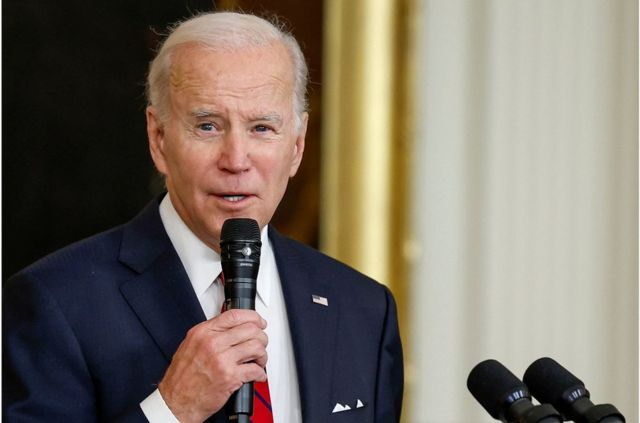
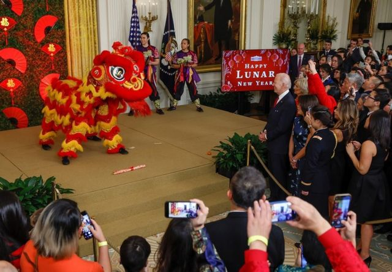
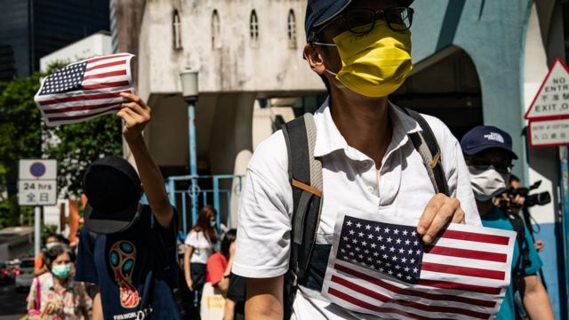

# [Chinese] 美中两国就香港问题“唇枪舌剑” 拜登延长港人“延迟强制离境计划”

#  美中两国就香港问题“唇枪舌剑” 拜登延长港人“延迟强制离境计划”

> 图像来源，  Reuters
>
> 图像加注文字，拜登1月26日签署备忘录，延长身在当地香港人的"延迟强制离境"计划24个月。

**美国政府在布林肯即将访华之际宣布延长援港措施，美中两国近日频频就香港问题“唇枪舌剑”。**

美国总统拜登1月26日签署备忘录，延长身在当地香港人的“延迟强制离境”（Deferred Enforced Departure，DED）计划24个月，至2025年2月届满。

合资格人士除了原本受惠的港人外，也将扩大至有关措施最初公布日2021年8月5日之后入境美国的港人，他们签证过期后可逗留至少两年，以免被遣返回港。

该计划最初给予身在美国的港人18个月的延期离境待遇，容许期间申请就业许可，有关安排原订今年2月5日到期，据估计已有近4000名身在美国的香港人受惠。

拜登表示，美国外交策略的核心是在世界各地捍卫民主和促进人权，延长有关计划是“向被夺走自由的港人提供避风港，可以促进美国在该地区的利益”，并强调美国会继续坚定支持香港人。

> 图像来源，  Reuters
>
> 图像加注文字，1月26日当天，白宫举行了农历新年招待会，图为美国总统拜登在观看中国舞狮表演。

> 图像来源，  Anthony Kwan
>
> 图像加注文字，2020年7月4日，曾有香港民众到美国驻香港领事馆附近集会，举起美国国旗庆祝美国独立日。

白宫声明表示，中国政府在2020年6月单方面实施香港《国安法》后，港人在《基本法》及《中英联合声明》保障的权利和自由受到北京方面侵蚀，并持续损害香港的自治及仅余的民主进程，限制学术自由和打击传媒自由。

声明又指，2020年6月至今，香港至少有150名反对派政治人物和示威者面对有政治动机的香港《国安法》相关控罪，目前有超过1200名政治犯，过万人因为参与反政府示威遭起诉，以上种种都是充分的外交政策理由以延长计划。

位于美国华盛顿的一家无党派非政府组织“香港民主委员会”（HKDC）等多个港人团体对该备忘录表示欢迎，但指该计划只属临时措施，呼吁美国国会研究长期方案，例如提供“P-2”难民身份或临时保护身份（TPS）。

根据该备忘录，有关宽限并不包括在公布日后自愿返回香港或中国的人，也不适用于在美国被判犯有重罪或两项以上轻罪、被《移民与国籍法案》规定不得入境或应遣返者，以及被确定不符合美国利益、对公共安全构成威胁、对美国外交政策严重不利者等。

##  中国驻美使馆斥“险恶用心”

这次备忘录公布的时机，适逢美国国务卿布林肯将在2月初首次访问中国之前。

中国驻华盛顿大使馆发言人刘鹏宇批评，拜登政府此举进一步暴露美国破坏香港稳定和遏制中国发展的“险恶用心”，敦促美国停止干涉香港事务。

中国外交部驻港公署批评美方“操弄签证政策，为外逃反中乱港分子提供避风港，充分暴露其唯恐香港不乱的险恶用心”，又指美方借机诋毁香港法治和人权状况，恶意攻击香港《国安法》，蓄意干预香港事务和中国内政，公然践踏国际法原则和国际关系基本准则，表示强烈不满和坚决反对。

香港特区政府也发表声明指，坚决反对美国政府对香港《国安法》作出毫无事实根据的蓄意抹黑，“美国政府明言所谓备忘录的最新举措基于其外交政策利益，充分显露出险恶用心和霸凌野蛮”，强烈敦促美方停止干涉香港特区事务。

##  过去两年1.5万美国人离港

近日美国官员频频就香港问题发声，新任美国驻港澳总领事梅儒瑞（Gregory May），1月25日晚在华府智库战略与国际研究中心（CSIS）线上论坛发表上任后首个公开演说，他批评北京上月对香港《国安法》释法，扩大香港行政当局影响法庭案件的权力，且不受司法机构监管，恐进一步削弱司法独立。

梅儒瑞说，很多香港人不支持严苛对待《壹传媒》创办人黎智英和其他政治犯，指美方会继续发声批评北京和香港当局“破坏香港高度自治的行径”。

他又指，过去两年共有15,000名美国人因为不同原因离港，以2019数据统计占了在港美国整体人口约两成，不少企业已将总部或关键人员迁出香港，未来在港企业将面对在中国内地营商的风险。

被问到美国是否干预香港事务时，他强调目前仍有数万美国人在港生活，1,300间美国公司在港，投资以百亿美元计，因此美国是持份者，对香港问题发声并非"干预"。

对此，中国外交部驻港特派员公署发声明谴责梅儒瑞干“吃饭砸锅”的勾当，“不断诋毁香港法治和自由，为反中乱港分子撑腰打气，唱衰香港发展前景，只能暴露其乱港遏华的险恶用心，必将会被铁一般地事实狠狠打脸”，又强调香港《国安法》护国安、保家安、得民心，已成为香港繁荣稳定的“守护神”。

香港特区政府也发表近3000字的声明，批评梅儒瑞对香港《国安法》的失实和无理指控是“无事生非，危言耸听”，指该法律让广大香港市民生活和经济活动回复正常、营商环境恢复，而全国人大常委会根据《中华人民共和国宪法》和香港《国安法》的相关规定行使解释权，是“一国两制”下的重要一环，体现了法治原则。

