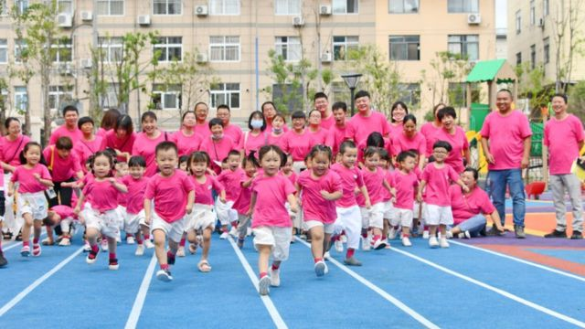
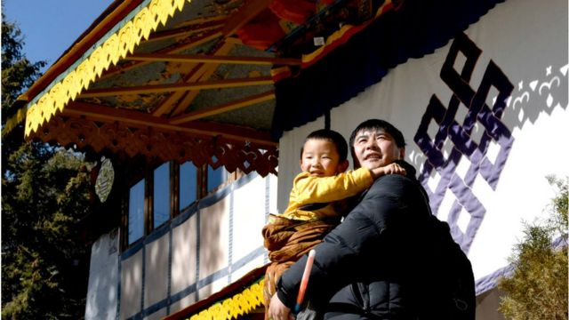
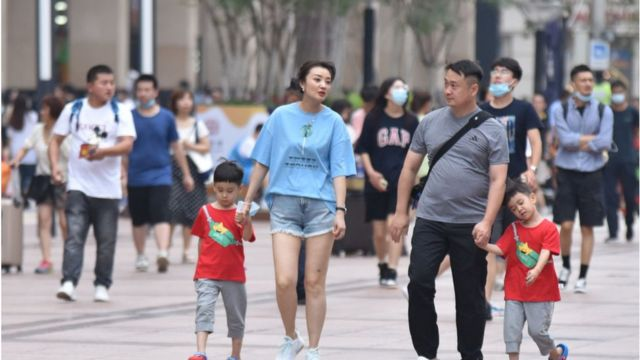

# [Chinese] 中国四川生育登记取消结婚前提为何引发热议

#  中国四川生育登记取消结婚前提为何引发热议

> 图像来源，  Getty Images

**近日，中国四川当局发布消息称生育登记取消结婚限制引发关注和热议。官方回应指，新规并非鼓励非婚生子，而是为了保证“未婚先孕”人群的权益。**

人口专家对BBC表示，新规是是尊重民众生育权的一种进步，但对提高中国低迷的生育率影响甚微。

##  新规

四川省卫健委官网印发《四川省生育登记服务管理办法》，广受关注的首先是生育登记取消了是否结婚的限制，将生育登记的中心转移到生育意愿和生育结果上，回归人口监测及生育服务本位；其次取消了生育数量的限制，凡生育子女的公民，均办理生育登记。

官方确认，该办法将在今年2月15日起施行，有效期五年。

四川当局称，完善生育登记制度，是实施好三孩生育政策及配套支持措施的内在要求。

四川卫健委还表示，办理生育登记，是为了保证更好开展妇幼服务，保障相关部门对当地人口的有效监测。《办法》并非鼓励不结婚生孩子，而是为了保证“未婚先孕”人群的权益，让其进行生育登记后就享有一些妇幼保健的服务。

根据中国媒体报道，此前广东、安徽、陕西等省份在其生育登记办法中，都放宽了生育登记的要求，不将是否结婚作为限制。

长期关注中国人口问题的美国威斯康辛大学研究员易富贤对BBC中文表示，过去政策是有“生育配额”的：一孩、二孩、三孩。“现在相当于完全取消‘配额’，因此没有必要将结婚为前提。主要是与国际接轨，尊重非婚生育权，但并不意味着鼓励非婚生育。”

> 图像来源，  Getty Images

他还指出，生育登记并非上户口，进行生育登记可以享受医疗保险、围产期妇幼保健服务。

北京市两高律师事务所副主任、北京市律协婚姻家庭专业委员会副主任张荆对中国媒体称，这项规定能够在一定程度上保障单身妈妈在生育中的合法权利，对于工薪人群来说，有了生育登记后可办理出生证明，可以享受生育津贴和产假。

##  能否提高生育率？

今年1月17日，中国的国家统计局称，中国2022年出生人口为956万人，死亡人口为1041万人，人口比上一年年末減少85万人。这是1960年代初毛泽东领导"大跃进"运动后，中国遭遇大饥荒以来，人口首次下降。

去年8月，中国国家卫健委等17个部门发布多项支持生育的措施，涵盖住房、托儿等多个方面，期望以政策带动低迷的生育率。但这些措施目前似乎并未奏效。

在生育率低迷的背景下，四川新推出的规定也被很多网友解读为，政府鼓励未婚生孩子，是政府在“催生”。

> 图像来源，  Getty Images
>
> 图像加注文字，在生育率低迷的背景下，四川新推出的规定也被很多网友解读为，政府鼓励未婚生孩子，是政府在"催生"。

微博网民“楠楠的果园”说：“为了催生，开始无所不用其极了 。”

微博网民“LeoBarca”说：“我一直想生二胎，可条件不允许我生，十年没有涨工资了，还在降！你让我拿什么生！”

易富贤指出，光有生育权是不够的，还需要得到保障。就如婴儿光有生存权是不够的，还需要精心抚养才能长大。

他认为，今后中国的生育率难以逆转，非婚生育比例也不可能高。

“中国目前这种生育环境，民不聊‘生’，居民可支配收入只占GDP的44%，而国际社会占60%至80%，中国住房市场总值是GDP的4倍，美国只是1.6倍，日本是2.1倍，教育成本也奇高。”易富贤说，“双亲家庭都养不起两个孩子，何况单亲母亲。”

