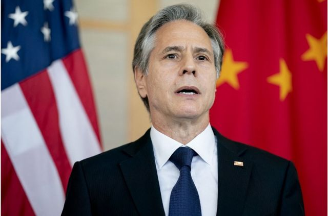
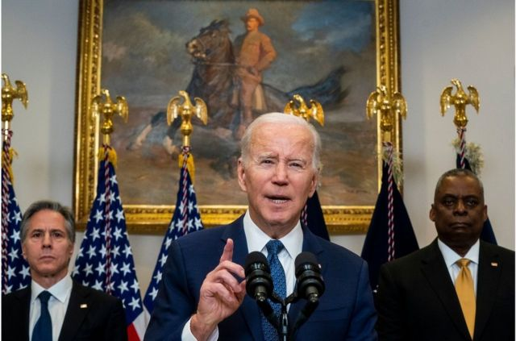

# [Chinese] 美中新冷战持续：即使布林肯访华成行也料“乍暖还寒”

#  美中新冷战持续：即使布林肯访华成行也料“乍暖还寒”

最近更新： 5 小时前

> 图像来源，  AFP

**美国国务卿布林肯（Antony Blinken）原计划于2月5日至6日访问中国。如果此计划成行，他将是2018年10月以来首位访华的美国国务卿，也是拜登政府自2021年执政以来访华级别最高的美国官员。**

然而，美国国务院2月3日临时决定推迟此次访华计划，原因是一个中国飞行物体2月1日出现在美国领空。 北京于其后承认属于中国，并解释是"民用飞艇"，因西风带影响和自身控制能力有限而严重偏离预定航线。

美国当局批评，事件侵犯主权及违反国际法，并担心布林肯若如期访华，讨论的议程将大幅收窄。 不过，华府也表明相信能以外交处理双方关系，布林肯亦会在情况许可下尽快访华。

此行是美国总统拜登和中国国家主席习近平去年11月在印尼G20峰会见面后敲定。此前，外界曾观望两国关系能否藉布林肯访华进一步破冰，惟学者普遍认为不应抱有太大期望。

“这次访问的象征意义将大于实际意义。”美国巴克内尔大学（Bucknell University）国际关系系教授朱志群对BBC中文说。

“访问的重要性是在于保持两国高层级沟通管道畅通，但基于双方在台湾等关键争议上立场南辕北辙，可预期会面不会有实质性的成果。”

##  官方未公布行程

美中双方迟迟未就布林肯访华的具体行程公布细节，也引起外界揣测。英国《金融时报》2月2日引述消息报道，布林肯预计会与习近平会面。

美国白宫国家安全会议发言人柯比（John Kirby）1月31日确认布林肯的访华日期，但没有公布访问行程。

他表示美方将与中国官员讨论俄乌战争，又说前美国众议院议长佩洛西去年8月访问台湾后，北京搁置了美中关于军事及气候变化的会谈，布林肯将寻求恢复这些对话。

北京方面，中国外交部2月1日回应布林肯访华时表示，“目前没有可以提供的消息”。

中国官媒《人民日报》同日发表署名“钟声”、题为《中美必须找到正确相处之道》的评论文章，指“搞盲目反华是行不通的”，重申台湾问题是中国核心利益中的核心。

前一天，中国外交部发言人毛宁表示“美方不能一边要沟通、谈合作，一边干涉中国内政、损害中国利益”，强调台湾问题是中国核心利益中的核心，警告美方不要试图突破这条红线。

##  台湾议题升温

台湾问题显然是美中冲突的主要症结，在布林肯访华前夕，美国政治新闻网站《酒杯新闻》（Punchbowl News）引述华府官员报道，美国众议院议长麦卡锡（Kevin McCarthy）计划春季访问台湾。

他若成行，将是继佩洛西（Nancy Pelosi，裴洛西）去年8月访台之后，又一位将到台北的美国众议院议长。

麦卡锡最新回应称“目前无计划到访台湾”，但强调中国不能左右他要去哪里。

此前，美国众议院在1月10日以365票赞成、65票反对表决通过，成立“美国与中国共产党战略竞争特别委员会”。

该委员会是麦卡锡竞选议长时的政见，成立后有委员称要在台湾开听证会，讨论军售等问题。

学者朱志群强调，美中如在台湾问题上无法解决分歧，双方都不可能在真正意义上缓和关系，而两国在台湾问题的取态都受到各自的国内政治影响。

他解释，中国民族主义高涨，中国领导人不太可能在关键的台湾问题上妥协。而在三权分立的美国，行政部门试图遵循“一个中国”，国会却不断提升美国与台湾的“非官方”关系，一些国会议员甚至主张与台湾建立外交关系，完全放弃“一中政策”，这种不一致和矛盾的政策让事情变得更糟。

澳大利亚国立大学的政治学者宋文笛对BBC中文指出，预料布林肯访华时将澄清，美国国会和台湾之间的关系升温并不代表拜登政府，拜登也没有直接控制权，因此中国不应对美国国会的动作过度反应。

##  贸易科技战

> 图像来源，  EPA
>
> 图像加注文字，拜登去年10月公布任内首份国家安全战略，点名中俄是首要挑战，指中国是“美国最大竞争对手”。

在布林肯访华前的一周，美中贸易、科技战也持续白热化。美国贸易代表办公室（USTR）公布2022年售卖侵权产品“恶名市场”名单，点名微信、淘宝等多个中国网购平台。

高科技方面，传出美国已经与日本、荷兰达成协议，将对出口到中国的半导体设备实施新限制。

另有报导指拜登政府正在制定不对华为供货的正式政策，其中包括5G级别以下的产品，例如4G设备、Wifi6和Wifi7、人工智能、高性能运算和云端，并拟切断英特尔（Intel）和高通（Qualcomm）等对华为供货。

中国外交部发言人毛宁1月31日表示，中方对有关报道表示“严重关切”，指责美国的行为是“赤裸裸的科技霸权”。

学者宋文笛预期布林肯访华时将传达一个讯息，就是即使在美中战略竞争下，在高等技术脱钩和经济遏制之间仍有合作空间。

事实上，美国财政部长耶伦（Janet Yellen）料今年将访问中国，她上月曾在瑞士苏黎世与中国国务院副总理刘鹤面对面会谈。

##  新冷战结构持续

分析认为，美中可在气候变化及部分经济议题上合作，但从根本上改善两国关系的空间很小。

拜登去年10月公布任内首份国家安全战略，点名中俄是首要挑战，指中国是“美国最大竞争对手”，华府不寻求与北京发生冲突或新冷战，但需展开有效竞争，未来10年将会相当关键。

学者朱志群指出，尽管华府强调无意与中国开展新冷战，但新冷战事实上正在进行。“这是由于与全球权力转型——中国崛起而美国相对衰落——所引起的内在冲突，两国关系的对抗性结构将在可见的将来持续下去，短期内不会有改变或突破。”

研究美中台关系的台湾东吴大学政治系助理教授陈方隅指出，美中冲突的原因，是中国在民族主义推动下试图挑战国际秩序及美国地位，而美国也把中国视为战略竞争者，“上一个是苏联”，在这个大格局下双方关系不会“回暖”。

“美国和中国是世界上最大的两个经济体，高层官员增加来往交流是很正常的事，是为了管控分歧避免误判，因为战争往往是由于误判。但是他们的结构性竞争关系完全不会改变，所以没有暖不暖的问题。”

