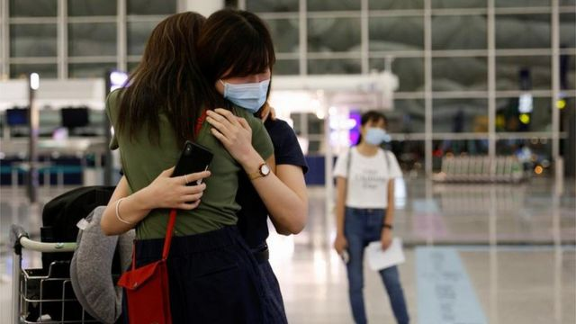
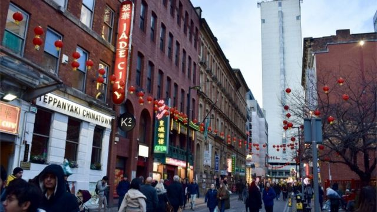

# [Chinese] 香港BNO移民潮：面临续领特区护照的居英港人陷“进退两难”境地

#  香港BNO移民潮：面临续领特区护照的居英港人陷“进退两难”境地

  * 林子晴 
  * BBC中文特约记者 

> 图像来源，  Reuters
>
> 图像加注文字，官方数据显示约移民英国的香港人约14万之多

**两年前， 张妈妈带着14岁儿子从香港移民英国。儿子的唯一旅行证件——香港特区护照将于一年后过期，一家人面临不得不返回香港或者通过中国驻英国的使领馆办理新护照。不然， 他的儿子将在后面的两年内无法离开英国，去其他第三国旅行。**

起初，她非常抗拒这两个选项，现在却又不得不面对。“我已经逃了出来，为何我还要回去换领护照呢？”她说。

##  进退两难

离港前热衷支援香港社会运动的张妈妈说，为护照一事回到《国安法》实施下的香港和踏入中国驻英国使领馆让她担心自己和家人的安全。她说，去年10月发生在中国驻曼彻斯特总领事馆打人的一幕，让很多像她这样的居英港人不寒而栗，在面临需要申领香港特区护照时犹豫不决，备受煎熬。

以从属家人身份通过英国国民（海外）护照————即BNO护照的入境签证计划移民英国的港人， 连续居住五年，可以申请获得英国永久居留权，获永居的一年后， 还可申请获得英国公民身份。但在这之前， 他们必须要持有效的香港特区护照，以便到英国之外的地方旅行。

英国内政部数据显示，截至去年底，当局批出了近15万份BNO英国国民（海外）签证申请，当中超过5.9万人是凭从属家人身分移民英国，很多持有香港特区护照作为唯一的海外旅行证件。

进退两难的，并非张妈妈一人。不少像她这样的居英港人都有类似的担忧，不敢轻易回港申领特区护照。尽管他们也可以在网上申请， 经中国在英使馆或领事馆取证，自中国驻曼城总领事馆发生示威者受袭风波后，这个选项也让许多人望而却步。

在英国服务港人的社区组织反映，接到了不少抱相同疑虑的求助，个案至少达30宗。

按香港入境事务处网站指引，海外港人欲续领香港特区护照，除了可回港办理，也可在网上递表， 选择亲身到中国驻外国的使领馆领取护照。

26岁的港人Mary（玛丽）同样凭BNO从属家人身份移民英国，她的香港特区护照将在今年9月到期，但她已经决定不再申领新护照。

2019年香港示威期间， 玛丽曾经因向被捕者和在囚者人士提供支援遭警方调查和拘捕，但没有遭到检控。她称，移居英国后，身在香港的家人曾收到警方来电，查问她的下落。她说，自己和家人并不清楚警方来电的目的，但估计是与她之前的支援工作有关。

“这情况下， 我没有办法回去（香港），”她说。

玛丽说，如果自己的特区护照过期前，都没有新安排出现，她只能选择未来数年不会离境英国。

这意味着下面数年她将无法与自己年近八十的父母见面。她说，还在香港的两老，因为年迈无法出远门来英国， “原本计划在香港邻近的地方和他们见面.....没有新护照，这种变通都行不通了。”

“一提起这事，我就想哭了。”

同样因政治考量，为续领护照问题伤透脑的移英港人李小姐说，她在2021年5月与两名孩子抵达英国，在移居前已经为两人更换护照，但由于香港儿童护照的有效期只有五年，两人的护照将会在他们可以申请成为英国公民前失效。

她说，她在英国有参与支持香港的集会，基于目前香港的政治环境，忧虑会遭到香港当局追究；加上经济状况也不大许可， 她不考虑回港为孩子续领护照，因此她们或将有一年要渡过没有有效护照的生活。

在英国注册协助港人的非政府组织“港援”（Hong Kong Aid） 的个案工作员陈先生则指，组织接触的200多个BNO港人里，至少有60至70人表示过持相关忧虑，其中有在跟进的个案为十多个。

他说，即使港人在网上申请， 由于他们需要填写电邮、电话和英国地址，这样令很多人认为续领护照，“就如同是向中国政府或香港政府更新个人资料，令到他们担心被检控的风险，或者是会波及家人，所以很多人宁愿（选择不换新特区护照从而）不离开英国。”

进退两难之际，张妈妈说一直在试图为儿子寻找其它出路。

英国政府规定，若有关人士在英国拥有居留许可或永久居留许可，而又不能在所属国家领取护照或旅行证件，便可向内政部申请“旅行档”（travel document，即旅行文件）。

张妈妈去年年中曾尝试按该指引申请，却遭一盘冷水。当局在拒绝信上指，“由于她无充分的理由惧怕中国政权，不接受她所指踏入（中国）使领馆所导致的恐惧”，并建议说，如果她害怕中国当局的话，可以申请庇护。

这让她大为不解。她说，他们母子两人辛苦在英国安定下来了，她在工作、儿子也在上学，“要我申请庇护实在不合理，那样我不能上班，儿子不能上学，要花费公帑，何谓呢？”

英国内政部发言人回覆BBC中文查询时称，当局明白在中国大使馆换领护照的安全忧虑。不幸的是，英国无法协助其他国籍人士换领护照。持香港特区护照并要换领护照的人士，要联络中国大使馆，或另安排替代文件。政府现时没有计划向仅持香港特区护照的港人发出这种文件。

张妈妈向内政部求助无门后，听闻其他港人可以在远离中国使领馆的签证中心领取护照后，她尝试在网上申请护照；岂料收到香港政府通知，要求她与儿子仍要进入中国驻伦敦大使馆内领取护照。

这使她大感不安，但经过多番挣扎后，还是决定硬着头皮试一下。当然，她说要采取一切措施确保母子安全。“真希望下一代不需要再面对这些恐惧。”

> 图像加注文字，英国北部曼彻斯特市区的唐人街。

##  “曼城风波”种下政治恐惧

去年十月，一群居英的香港示威者在中国驻曼彻斯特总领事馆门外抗议，其间有人从领事馆走出来与示威者发生冲突。一名示威者被拖进领事馆内遭殴打，最后事主被英国警员拉出，才脱离危险。

这一幕经国际媒体报道，让世人震惊，也让很多在英港人视中国使领馆为“危险之地”。

伦敦克尼华人社会服务中心经理林怀耀说，曼城总领事馆风波发生后，中心至少收到超过30名港人查询或表达有关在中国驻英国使领馆换领香港特区护照的人身安全忧虑。

但还是有人说要冒险搏一搏。

21岁的居英港人阿杰，去年夏天发现作为自己在英国唯一身份证件的香港特区护照快将到期后，瞒着父母去申领新护照，形容过程“战战兢兢”。

2019年，阿杰曾经参与香港“反修例”运动的一场警方指称的非法集会时，被现场的警员记名，面临被捕的风险，仓促中，他随父母移居英国。

他说，自己不打算回港换领护照，爸妈也极力反对他踏入中国驻英国使领馆。

最终，他还是到网上申请了特区护照。随后，寄来的领证通知书指示他到伦敦市中心银行站附近的中国签证申请服务中心领取护照，而非香港政府网站上显示的中国驻伦敦大使馆。

这让他感到松了一口气。 但出发前，阿杰依然严阵以待，在脑海里预演过各种会发生的情境，如遭扣押或审问等等的可能，还采取许多措施，比如，开启手机上GPS定位系统，与朋友分享自己的即时位置等。

“我当然也害怕”，他说，“但每每想起未来五年困在英国，很难与牵挂的家人朋友见面，处境同样难耐，那样的话与被捉有任何分别？”

岂料，他的领取护照过程有惊无险，只用了七分钟。

阿杰所指的签证中心，按其网站显示，是由中国桥集团（英国）有限公司营经，隶属中国银行集团，为中国政府代理签证事宜的商业机构，受英国法律管辖，不属于使领馆范围。另外两家设于英国的签证中心，分别我位于曼彻斯特和爱丁堡，均与驻两地的中国领事馆的地点不同。

林怀耀指，即使签证中心不属使领馆范围，也无法䆁除很多港人的疑虑。他指，在曼城事件中，香港示威者Bob（鲍勃）是在英国国土上行使言论自由权利，也会被拖入中国总领事馆范围殴打，“使领馆人员非理性和不可预测的暴力行为，引起港人恐惧。”

香港入境事务处回覆BBC中文就如何决定护照领取地点的查询时指，当局是根据香港法律第539章《香港特别行政区护照条例》 处理香港特区护照的申请和事宜。在处理每宗个案时， 当局会根据有关法律、政策和程序，处理每个案件，并考虑到所有相关因素，包括每宗案件的个人情况。

中国和香港政府早已表明强烈反对英国BNO签证计划。

中国外交部曾发表声明指，该签证计划是英方试图把大批港人，“变成二等英国‘公民’”，已经彻底改变了原来中英谅解的BNO性质，此举严重侵犯中国主权，粗暴干涉香港事务和中国内政，严重违反国际法和国际关系基本准则，中方对此强烈愤慨、坚决反对。

中国与香港政府不再承认BNO作为有效旅行证件和身份证明。港府也曾发表声明指，BNO签证计划明显是英国“利用部分港人仍持有BNO护照或身分作政治炒作，借口为有关港人在英居留和入籍提供新路径。”

