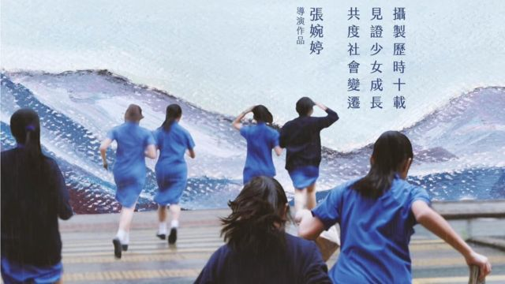
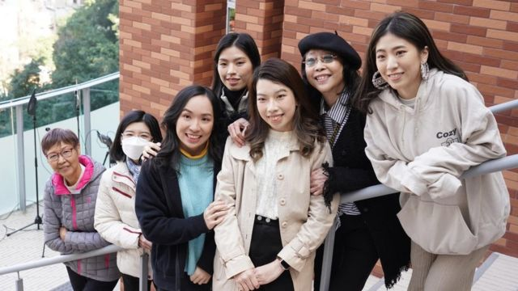
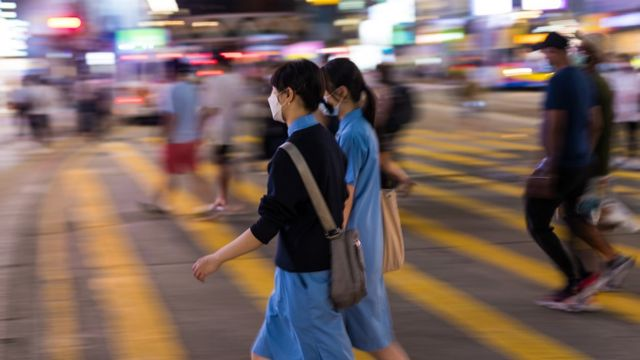
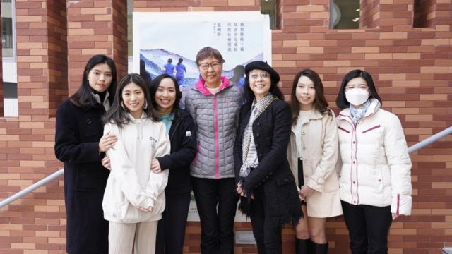
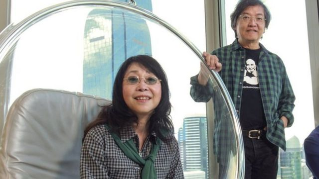
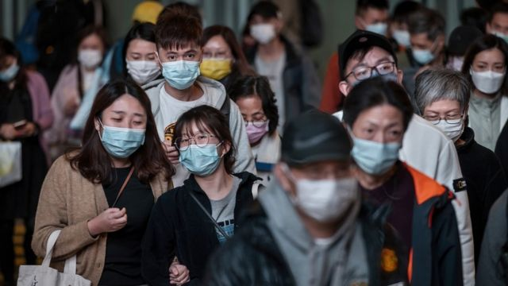

# [Chinese] 香港纪录片《给十九岁的我》撤映风波的五个启示

#  香港纪录片《给十九岁的我》撤映风波的五个启示

  * 李澄欣 
  * BBC中文记者 香港报道 

> 图像来源，  Golden Scene
>
> 图像加注文字，《给十九岁的我》纪录片海报

**香港纪录片《给十九岁的我》因拍摄伦理风波引发巨大争议，持续占据舆论焦点，事件暴露了权力不对等和伦理问题，也意外地成为港人在当前政治气氛下的情感投射。BBC中文访问多名纪录片导演及学者，梳理出五个引人思考的问题。**

《给十九岁的我》由香港72岁的知名导演张婉婷执导，受其母校、老牌名校英华女学校（Ying Wa Girls' School）委托拍摄，原意是记录校舍迁址的变化，为重建工作筹款，后来演变成一部以该校六名千禧年代出生、背景各异的女学生为主轴的人物纪录片。

该片制作历时十年，追踪拍摄六人从中学到大学的成长过程，时间上横跨2012年“反国教”（反对国民教育）示威、2014年“雨伞运动”、2019年“反送中”运动等多场社会运动，侧面记录了香港过去十年的时代巨变。团队耗时三年剪接，把30万小时的影片素材辑成136分钟的电影版。

该片最先在2021年底于校友圈子内部放映，2022年举行多场包场放映及优先场，票房超过700万港元，好评如潮，更获得香港电影评论学会的最佳电影奖。张婉婷受访时指看到“不少影评都反应正面”，认为对片中女生不构成伤害，决定将影片公映，2月2日在全港各大院线上画。

转折点发生在今年1月底，前记者吴芷宁在社交平台发表观后感指该片“好看但有点不舒服”，质疑导演太强势并有剥削学生之嫌，引发大众关注当事人权益。2月4日，片中主角阿聆、阿佘陆续在《明周文化》发表“万言书”及受访，控诉校方和片方不尊重学生私隐，在拍摄及公映问题上对她们进行误导和施压，指责导演为了拍戏“将你的快乐建筑在我的痛苦上面”。

事件震惊全香港，此前的一致好评瞬间转为对制作单位排山倒海的抨击，英华女学校校长和张婉婷随即公开道歉，2月6日起暂停公映。事件更上升至社会公共事件，港府官方机构包括私隐专员公署和教育局均介入。

##  1\. 纪录片伦理与权力关系

> 图像来源，  Golden Scene
>
> 图像加注文字，英华女学校前校长李石玉如、导演张婉婷（右二）与片中部分主角出席活动（资料照片）。

“每个人都要求删这段、删那段的话，纪录片便剪不成”——这是导演张婉婷拒绝六位主角看定剪（final cut）的理由。直到《给十九岁的我》在校内活动放映，学生才在大银幕上首次观看。女生阿聆在自白中透露，她观看后情绪不稳要求医，医生诊断以她的状态来看，电影不适合公映，但导演坚持把影片送往电检公映。

纪录片导演、香港浸会大学电影学院高级讲师应亮接受BBC中文访问时直言，张婉婷的做法违反操守，人物纪录片的行规是放映前必须给主角看，如被拍者要求删剪片段，导演要当场做承诺；若对方要求不放映，则双方可协商。“如果你很舍不得你的片，你可以问她可否不做商业放映，只做电影节，或只在外地放，这些都可以谈。如果他百分之一百不愿意，那就真的不能放，这条底线很清楚。”

他认为《给十九岁的我》是人物纪录片的“典型失败案例”，操作上犯下低级错误，反映导演缺乏自觉，没意识到被拍者是共同执导（co- direct）。“比如被拍者会打电话给导演说几天之后有事情发生，你来拍吧——那其实他也是导演跟编剧。作品不全然属于导演，而是一种合作，拍摄者必须认识到：你是导演不到别人的生活的，你只是加入了你的观点、态度，和你的专业给你的敏感、结构技术能力而已，如果没有别人的生活，你根本完成不了你的创作。”

研究摄影伦理的台湾国立政治大学传播学院教授郭力昕说，纪录片道德一直是棘手的问题，因为是用别人的真实去进行创作，双方关系并不对等——不只是采访、受访的不对等，也是一个懂影像、一个不懂影像的不对等，“被拍者不一定理解影像的意义怎么被生产出来，可能连自己怎么受伤都不知道”。

他说，在权力悬殊的情况下，只能够依赖导演的道德和良心把关，但很难把持。“今天一个导演用意良善，希望藉着几个人物给广大观众启发和反省，但是他可能要跟那些在剥削题材、宣称要给社会什么讯息的人竞争市场和观众，而那些人又很辣——在弄一些非常煽情的东西，你就可能降低你的底线，道德的底线越来越松——所以给受访者看过、有他的同意权就更重要了，法律是道德的最低门槛。”

##  2\. “同意”只是法律问题吗？

> 图像来源，  Getty Images
>
> 图像加注文字，研究传媒法律的香港大学中国法研究中心访问学者甄美玲向BBC中文指出，“一件事的同意，不能搬到另一个用途上”。

香港法律没有肖像权，片中主角揭露校方当年称拍摄目的是制作DVD供筹款用途，在她们就读中一、年仅12岁时要求家长签下同意书。该文件只有半页，允许导演拍摄学生在校内外情况，摄录队有绝对创作及剪接自主权，版权属英华女学校所有，同意校方用作出版、放映、广播、公开展示或分发之用途。

在片中，张婉婷没有掩饰一些女生拒绝拍摄的镜头，甚至用旁白指她们拒拍是因为踏入“反叛期”。有主角事后透露，制作团队以同意书具法律效力为由施压，有同学由中一哭诉至中五才获准退出计划，学生都自嘲是签了“卖身契”。

研究传媒法律的香港大学中国法研究中心访问学者甄美玲向BBC中文指出，合约（contract）在法律上是指双方均有代价（consideration），即金钱或利益的交换，但女生参与拍摄并无酬劳，因此同意书并不是合约，她们有权随时退出，若导演违反学生意愿继续拍摄，是侵犯私隐的行为，加上该片在校内放映后转战电影节及商业公映，已背离最初拍摄目的，“一件事的同意，不能搬到另一个用途上”。

主角之一阿佘批评摄影师像“狗仔队”一样偷拍她在校外吸烟一幕，“你想拍我吸烟，有好多机会拍，不需要这样偷偷地在对面街zoom- in（用变焦镜头使景物放大或将景物推近）来影我”。另一名女生阿聆则表示，校方和导演施压公映时，指她成年后仍有继续参与拍摄是给了“默許同意”（silent consent），具法律约束力。

这些细节都引起社会对“同意”的争议。法律学者甄美玲指香港的私隐法例落后，未能跟上西方的标准及新世代的观念。“现在矇混过关的同意是不行的，不可以从他的行为去暗示（imply）有同意，必须有明示同意（explicit consent）。”

研究妇女议题的香港中文大学人类学系副教授郑诗灵则说，同意并非一次性、永久有效，而是一个持续的过程（continuous consent），国际社会近年在性别议题上非常强调此观念。“我经常举这个例子：以前政教合一，在宗教角度同意了结婚就是永久同意性行为，很多国家到了近二、三十年才认可婚内强奸（marital rape）这件事，每一次都要双方同意，否则就是性暴力。同样道理，女生们在中一时同意拍片，这十年变化那么大，拍摄目的也不同了，起初同意不等于永远同意。”

她续说，同意也要看权力结构，例如韩国重男轻女严重，处于弱势的女性较难对性骚扰、性暴力等说不。而在学校，师生关系不对等，学生也很可能会碍于压力不敢明确拒绝。“关心学生的老师会觉得‘我为你好’，但你要意识到自己的权力位置，确保有给空间他们做选择。对着学生时，有没有尊重大家是平等的？这是定剪之前就应该做的。”

联合国《儿童权利公约》指出，每个儿童都是独立个体，要尊重他们表达意见的权利，并应根据他们的年龄和成熟程度给予应有的看待。

意大利纪录片导演、香港中文大学人类学系助理教授影波（Alberto Gerosa）说，他的惯常做法是分别征求家长和小孩的同意。“青少年在家里表现出一套，在外面则完全不同，就造成了这种情况：同一个家庭的两个成员可能都想对他们的经历有不同看法，而往往是相互矛盾的看法。如果父母同意，但孩子不同意，我就会把电影的重点放在父母身上，或干脆换一个家庭。”

他还指出，“同意”的重点在于被拍者摄后是否有权改变主意，但这并非法律问题，而是道德问题。“道德上的答案才显示出制作人的优次考虑：仅仅因为我们拿到授权书，并不代表要使用这些材料。未经同意曝光别人的私生活，就是猥亵（obscene）的做法。”

##  3\. 人重要还是作品重要？

> 图像来源，  Golden Scene
>
> 图像加注文字，英华女学校前校长李石玉如、导演张婉婷与片中部分主角出席活动（资料照片）。

《给十九岁的我》主角之一、饱受情绪困扰的阿聆在校内首映至今一年以来，不断问校方和导演这个问题：是学生重要还是作品重要？

有关争议引出其他受害者发声，14年前曾拍摄纪录片《KJ音乐人生》的香港音乐家黄家正在社交平台发长文，重提11至17岁期间被拍摄的内情，指当时父子关系紧张，曾多次要求导演张经纬不要公开相关片段，但导演不理会，甚至不耐烦地跟他说：“你估我现在很闲跟你耗吗？我觉得你跟你老窦的关系，也是时候应该有个了结吧。”

当年张经纬凭纪录片一举成名，获颁新晋导演奖，其作品是香港金像奖史上首部获提名的纪录片，也是台湾金马奖史上获奖最多的纪录片。但被拍摄的黄家正在纪录片面世后的其中三年，“整个屋企家破人亡，无家可归”，一度无法继续学业，过去14年也受尽折磨，他批评导演“不惜一切牺牲了我明确表达的意愿，想自己的作品每一个位也剪辑到他心目中的最好”。

台湾学者郭力昕指出，世界各地都有导演打着“有社会意义”的旗号拍纪录片，但其实在“剥削和冒犯当事人”，当中不乏叫好叫座的作品，包括2004年上映、台湾导演吴乙峰执导的纪录片《生命》，该片以1999年的“九二一大地震”为主题，在电影院场场爆满，票房破千万，连时任台湾总统陈水扁都在“双十”国庆日致词时都提到该片。不过郭力昕认为影片有伦理问题，其中一位失去挚亲的女主角想自杀时，导演不耐烦地教训她，责怪她灾后一年还不能振作，“态度很傲慢，是一部想着自己的纪录片”。

另一部充满争议的是1998年由台湾导演吴耀东拍摄的《在高速公路上游泳》，记录了其学弟、患爱滋病和躁郁症的男同志辜国瑭，该片粗暴地展现权力关系，导演因辜国塘不想配合“剧本”而对这个朋友感到恼怒，为了“报复”，在情绪愤怒下完成剪接。吴耀东最终获奖，但辜及其家人在纪录片放映后非常痛苦。20年后，导演带着忏悔之心再找辜国瑭拍成《Goodnight & Goodbye》，郭力昕如此形容该片：“充满了粗暴，他只是在想着自己的片子，但又说自己要赎罪，他剥削了他的同学，也剥削了自己。”

意大利导演影波强调，创作者有幸能记录他人的故事，就要把被拍者的尊严放在首位，高于其他一切考虑。他以德国导演韦纳·荷索（Werner Herzog）拍摄的纪录片《熊人》（Grizzly Man）为例，该片主角蒂莫西·崔德威尔（Timothy Treadwell）每年都到阿拉斯加的灰熊保护区接近灰熊，如是者13年后被灰熊所杀，导演剪走了主角被自己所爱的灰熊活活吃掉时最骇人的片段，为当事人留有体面。“导演掌握着话语权，可以为了电影好看而用不雅的方式展示人物，当然也可以选择不这样做。当事人的尊严是神圣的，是不容讨论的。”

他分享个人经验时说，他在2016年乌克兰战争期间曾到当地参与纪录片制作，超过10TB的拍摄素材记录了当地学生在三年之间，从激进民族主义分子到志愿参军，其后在战争中受伤，归来后重新适应平民生活的过程。“影片探讨民族主义和战争之间的关系，公开主角的脸可能会使他们的家人陷入危险，因为他们住在乌东地区。我们最终决定撤回这部片子，至今还没有发行。他们的安全比我们的艺术野心更重要。让我再做一次决定，我还是会这样做。”

在《给十九岁的我》闹出风波后，导演张婉婷随即上电台受访，向受影响女生道歉，“你开心点嘛，我们现在不做啦”。英华女学校前校长李石玉如发声明指，十分重视片中呈现的每一个学生，对引起学生的困难深感抱歉，该校办学团体中华基督教会负责人王家辉也公开表明：“人是比电影更加重要。”

##  4\. 纪录片=真实？

> 图像来源，  South China Morning Post/Getty Images
>
> 图像加注文字，导演张婉婷和已故导演罗启锐，两人多年来情侣档拍电影，作品包括《秋天的童话》和《岁月神偷》。

很多人批评《给十九岁的我》时，与同样是记录事实的新闻片相提并论。这涉及纪录片的性质与目的，在不同情况下，个人私隐与公众知情权有不同的优先次序。

以新闻为例，传媒法律学者甄美玲上世纪八、九十年代在曾在香港电台及无线电视任职记者，负责《铿锵集》和《星期二档案》等半小时新闻专题（long form或news documentary），目的是监督公权力或探讨公共议题，她说为了保障公众利益及编辑自主，从来不会要求受访者签同意书或看定剪。

《给十九岁的我》则属人物类的创意型纪录片（creative documentary），没有公众利益，是用独特视角关心人性。纪录片导演应亮说：“比如同样拍一个中国维权人士，新闻会聚焦在他的公共身分，但创意型的人物纪录片可能是拍他作为父亲有很多遗憾，而不在于他怎么维权。深入到人性层面和私生活，很多灰色地带和隐私的东西都有机会被呈现，当事人其实真的有话语权。”

另一个迷思是导演的介入——《给十九岁的我》备受诟病的其中一点是张婉婷在采访时的诱导性问题，以及旁白加入大量主观意见，擅自帮女生改别名如“香港小姐”，又指有些女生“收兵”、“怀疑援交”等。有主角事后澄清有关描述不实，批评导演太“多嘴”。张婉婷受访时坦言这是刻意的安排，希望加入个人评论和角度，而不是做只能观察和记录的“墙上苍蝇”（the fly on the wall）。

对此，导演应亮强调创作型纪录片不是新闻，不必客观。“纪录片一定有立场，不用不偏不倚，电影作为艺术是没有一定的标准的。” 像美国著名纪录片导演迈克尔·摩尔（Michael Moore），拍摄《华氏911》、《美国黐Gun档案》（Bowling for Columbine，或译《科伦拜恩校园事件》、《科伦拜恩的保龄》）等多部作品，都带有强烈的主观意识。

1926年最早出现“纪录片”这个词，随后英国纪录片教父约翰·格里森（John Grierson）下了这个定义：“对‘真实’的创造性处理（The creative treatment of actuality）”。但纪录片界一直对“真实”有不同看法，以美国的梅索兄弟（Albert & David Maysles）与怀斯曼（Frederick Wiseman）为代表的导演，主张冷静观察，坚持不介入、不引导、不评论，以旁观的方式记录，来“再现”真实；另一类以格里尔森、维尔托夫（Dziga Vertov）和伊文思（Joris Ivens）为代表的导演，则通过拍摄者的参与式记录，来“再造”真实。

意大利导演影波对BBC中文指出，“纪录片是真实”本身就是个神话，片中被认为的“真实”只是写实主义的风格选择，不等同客观。“虚假的客观性伪装，是为糟糕的电视节目或新闻记者准备的。纪录片作品都写明由谁导演，已充分说明了它并不客观，制作上每个创造性的决定都是为了表达导演的主观观点，而导演最终也要对其负责。在此角度下，导演的参与程度越高越好。”

纪录片不断打破传统，现在有剧情式纪录片（docudrama），加入虚构、重演、动画等元素，“真实”与虚构的界线越来越模糊。台湾学者郭力昕说，影像、真实、权力之间的关系是永恒议题。“影像跟真实没有必然关系，有时候影像甚至是更好的欺骗，取舍之间就决定了真实是怎么被建构起来，而建构者就掌握话语权。”

##  5\. 社会气氛下的情感投射？

> 图像来源，  Getty Images
>
> 图像加注文字，香港法律没有肖像权，片中主角揭露校方当年称拍摄目的是制作DVD供筹款用途（图为香港街头行人）。

《给十九岁的我》争议发酵超过一周，从学生与导演、学校之间的契约矛盾，提升到广泛的社会讨论，甚至变为情绪化的声讨。有网民骂张婉婷出卖学生，把片名改作《恰十九歲的你》，恰在广东话指欺负。黄秋生、张坚庭、陶杰等名人在社交平台维护张婉婷，都被网民围攻。

纪录片导演应亮坦言：“香港这几年没有言论自由，好不容易有一个议题可以讨论，大家就拼命去骂。这也折射了电影之外的整体环境。”

香港社会政策及公共行政学者钟剑华指出，网上舆论群情汹涌有部分是2019年“反送中”运动后的一个情绪出口，近期法庭审理香港国安法最大案件——“47人案”备受触目，但政治话题在《香港国安法》实施后的高压气氛下不能讨论，于是所有焦点转移到纪录片风波，加上涉及的女生在不情愿下被迫拍摄和放映，挑动了很多香港人的心理和情感投射，大家都为学生抱打不平，“这种成人世界与年轻人世界、强权与弱势、民主与威权之间的矛盾，很多人能代入”。

导演和校方回应事件时不断重复“为你好”、“用爱浸死你”、“要感恩”、“为大局着想”、“不要辜负别人的付出”等论述，这种高姿态的家长式威权口吻招致负评。钟剑华说：“我相信张婉婷和校长的初衷都是一番好意，但他们表述上套入了权势的思维套路，令人反感，所以成为被针对的对象。”

不少人在社交平台分享求学时的遭遇，当年在保守的价值观下怎样被“情绪勒索”或压抑自我，也有大量网民赞扬片中主角顶住压力勇敢发声。

香港中文大学文化及宗教研究学系讲师李薇婷分析指，港人经历过社会运动的洗礼，对权力、自主、程序正义很有意识，不会再逆来顺受，她说现在有一股暗涌正在累积，希望改变教育和文化氛围。“以前是用大家的利益，去取消一个人的悲伤，我们看到近几年开始有一种集体觉醒，会关心情绪健康和个人感受。我们不再被逼接受强加于我们的‘为你好’，而是可以反问：如果我不喜欢你‘为我好’的方式呢？”

回到电影本身，《给十九岁的我》入围香港电影金像奬最佳剪接、导演及电影三项提名，校方已宣布会退选最佳电影，惟与张婉婷一同提名“最佳导演”的郭伟伦已表明会继续接受提名，张婉婷则表示尊重及配合郭的决定，但不会出席颁奖礼，意味着该片仍会角逐两项奖项，届时可能再引发争议。

导演应亮指香港没有纪录片产业，金像奖也没有最佳纪录片的奖项，虽然过去十年通过教学和受社会运动启发，培育了不少优秀的新一代纪录片导演，但老一代电影人和观众仍没有经过足够的准备。“张婉婷虽然是著名导演，但拍纪录片是第一次，她没有那个意识，还是在用剧情片的方式做纪录片。这很遗憾，所以香港缺乏这部分的文化吧。”

他说近年香港多了纪录片作品，可惜因为政治审查无法在港放映，他担心这次事件造成一个大大的负面刻板印象，伤害本来就非常弱势的本地纪录片工作者，影响日后拍摄、制作和发行。

台湾纪录片产业比香港成熟得多，商业院线都会放映很小众的纪录片，学者郭力昕认为这次《给十九岁的我》引发的争议在香港形成公共讨论是好的开始。“素养的建立要从观看开始，什么都要看，不是说有毒就避开，大家多讨论、辩论，才会提升社会对纪录片的识读能力与文化水平。”

