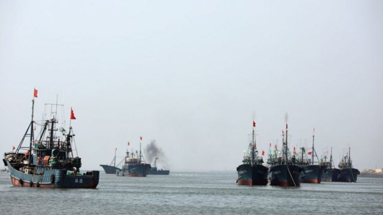
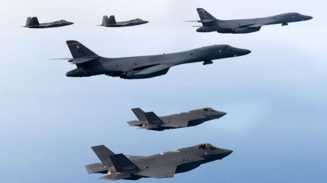

# [Chinese] 中国“发现不明飞行物并准备击落” 网民称“必须对等还击”

#  中国“发现不明飞行物并准备击落” 网民称“必须对等还击”

> 图像来源，  Getty Images
>
> 图像加注文字，大连海事局两日前（10日）发布航行警告，称12日至19日期间在渤海海峡黄海北部“执行军事任务，禁止驶入”。

**山东青岛即墨区海洋发展局12日向中国媒体证实，日照附近海域发现不明飞行物，正准备击落。尽管该消息并未说明不明飞行物是什么以及来自何方，但随着美国击落中国“间谍”气球一事发酵，这一消息在中国网络上迅速蹿红。许多中国网民情绪高涨，急切盼望中国对美国采取反制措施。**
 大连海事局  两日前（10日）发布航行警告，称12日至19日期间在渤海海峡黄海北部“执行军事任务，禁止驶入”。周一起，又增加了五天实弹射击。

美国一周前称，发现用于情报收集的中国气球进入本国领空，此后美国军机用导弹将其击落。中国承认这个气球是自己的，但坚称其为民用，并强烈谴责美国击落气球的行为。中共喉舌《人民日报》连续数日发文，批评美国搞霸权霸凌，称“民主制度是其工具和武器”。

中国外交部2月13日最新回应指“美方气球非法进入别国领空，也司空见惯”。外交部发言人汪文斌在例行记者会上称，“去年以来，美方高空气球未经中国相关部门批准，10余次非法飞越中国领空。”

##  中国也发现“不明飞行物”

近日中国网络上流传青岛即墨区海洋发展局发出的短信，指日照附近海域发现不明飞行物，正准备击落。并提醒海上渔民注意避险，如有降落物落在渔船附近，请协助拍照取证，如果条件允许，则协助打捞。

该局12日表示确有此事，并称“不明飞行物具体是什么尚未接到通知，已短信通知附近渔民注意安全”。

中国网友对此有许多猜测。有人甚至联想到水中物体，认为这是无人潜水器或核潜艇。不少人将其比喻成“渤海大墨鱼”，并配上带有美国国旗的图片，在社交媒体上传播。

需要注意的是，中国官方数据显示渤海海域的平均深度只有20米左右，而大部分核潜艇的高度都在25米以上。

即墨区海洋发展局的回应在13日一早登上中国社交媒体微博的热搜首位，达到近6亿的阅读量。许多网友将这件事与中国可能对美国击落气球的后续反制联系在一起，呼吁将其击落。

在人民视频发布的帖子下，署名“i新鲜事”的网友表示：“坐等击落老美战略轰炸机！”收到近万人点赞。另一位网友“半语此生”表示：“必须对等或高于还击，这是国家尊严的事！”
 中国官媒  周一（13日）上午引述海事局发布的消息称，大连海事局发布航行警告，表示近期将在黄海北部进行实弹射击。

虽然该消息并未说明实弹射击和山东附近海域发现“不明飞行物”有关，但已激起中国网民剑拔弩张的热议。拥有粉丝近65万的博主“甲历史”发帖引述消息称，“如果有敌方不明飞行物前来刺探军情，必须给打下来。”

> 图像来源，  Getty Images
>
> 图像加注文字，美韩于2月初举行联合演习。

##  靠近朝鲜半岛的“军事演习”

大连海事局自2月初多次发布航行警告，称在渤海海峡黄海北部部分海域执行“军事任务”。此前，美国和韩国在朝鲜半岛西部海域上空举行了联合军事演习，美国出动B1B 轰炸机以及 F22 和 F35 战斗机，被认为旨在展示保卫韩国的能力和信誉。

中国军事学者王云飞认为，中国解放军在黄海执行的军事任务不是试验，而是军事演习；地点选在靠近朝鲜半岛区域，有针对美韩近期联合军演的意味。

美韩的联合军事演习“超过了应对朝鲜半岛危机的需求，因为它的打击半径不仅涵盖了中国的北京，而且靠近中国长三角核心经济区，辐射到了珠三角地区”，王云飞说。

中国媒体引述军事专家宋忠平称，“渤海和黄海是中国的纵深腹地，牵扯的范围很广，有必要强化此处的军事演练力度，以有效保证首都核心圈、东三省以及华北地区的安全。”

宋忠平认为，解放军演练的重点科目将集中在反导防空和反潜两个方面，不排除进行潜射战略导弹的试验的可能。

