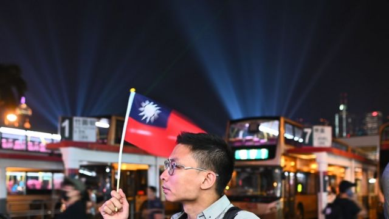
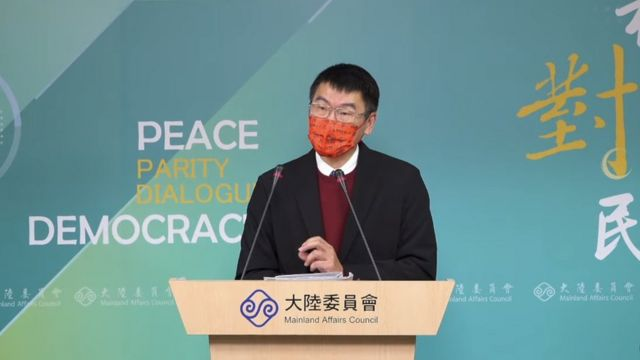

# [Chinese] 台湾时隔三年恢复港澳居民自由行 陈同佳案再惹关注

#  台湾时隔三年恢复港澳居民自由行 陈同佳案再惹关注

  * 李澄欣 
  * BBC中文记者 

> 图像来源，  PHILIP FONG
>
> 图像加注文字，港澳自由行因疫情暂停三年，图为2019年香港市民在尖沙咀庆祝台湾双十节。

**台湾陆委会周二（2月14日）公布，2月20日上午9时起恢复受理港澳居民网上办理临时停留许可（俗称入台证），意味着港澳自由行时隔三年后回归常态。**

陆委会副主委梁文杰在记者会上表示，港澳自由行“研议很久，但因为中间大陆完全解封，造成对疫情的不确定性”，现在宣布开放是因为香港疫情数字比较透明开放。

他说：“其实应该要早一点，但相关机制要做得更完备，抱歉让大家、很多香港朋友没办法来台湾过情人节，但是我们是选择在今天情人节宣布，让大家可以做申请。”

港澳居民赴台前办理入台证原本可以选择落地签或者事先网签，台湾在2020年2月初因疫情因素全面禁止港澳人士入境，至2022年11月才放宽至少5人的“团体观光”签证，现在进一步解禁。

疫情前，2019年港澳旅客赴台人次达175.8万，数量仅次于大陆的271.4万、日本的216.7万。

##  陈同佳案“不是签证问题”

> 图像来源，  Billy H.C. Kwok
>
> 图像加注文字，2019年10月23日陈同佳洗钱罪刑满出狱，由协助他的圣公会牧师管浩鸣（右）陪同见传媒。

外界关注陈同佳案能否随着边境政策松绑而解决，梁文杰重申台方立场无变，陈同佳来台投案“不是单纯签证批出的问题，还涉及双方管辖权及相关公权力的行使”，为确保案件后续侦察和审理顺利，希望港府务实回应司法互助请求，才能落实司法正义。

2018年2月17日香港男子陈同佳涉嫌在台谋杀女友后回港，因台港两地没有司法互助或逃犯条例，引发2019年反修例运动。协助陈同佳的香港立法会议员管浩鸣日前向港媒《星岛头条》指，现时居于香港深山的陈同佳赴台自首意愿不变，但死结在于台湾不批准他入境，“想去都无得去”。

管浩鸣2月14日再回应指，陈同佳愿到台湾就已免除於司法互助，且案发地点、法医等各方证据都在台湾，“不存在甚麽香港需要移交台湾所谓的公权力，会否拘捕他或甚麽”。他说只要台湾愿意向陈发签证就可圆满解决，呼吁台湾方面按人道立场让陈入境，死者家属也希望事件得到了结。

2019年，台湾曾提出要派员赴港押解陈同佳，遭港府强烈反对，称是“跨境执法，不尊重香港的司法管辖权”。总统蔡英文则指陈同佳“是一个受通缉的凶嫌，所以这个案子没有所谓自由行背包客问题，只有逮捕没有自首问题”。

台港关系议题近期升温，早前台湾移民署网站 “误植”港澳人士“九不得”文件  ，内容包括禁止港澳居民在台受访与游行等活动。梁文杰在记者会上回应称，港澳居民在台湾的活动"本来就应该与许可的目的相符”，也要遵守法律规范，强调“没有增加新的规定”。

另针对香港政府于2021年暂停在台“香港经济贸易文化办事处”运作，梁文杰回应指目前未接到港府提出重启的请求。

##  两岸关系“春暖花开”？

> 图像来源，  BBC Chinese
>
> 图像加注文字，陆委会副主委梁文杰

有媒体询问，此时恢复港澳自由行是否象征两岸春暖花开，梁文杰说“我们都希望能春暖花开，但不管是怎么希望，还是按照疫情”。

被问到何时开放大陆旅客到台湾时，他说大陆疫情“还是相对不确定”，未来将按照疫情指挥中心的判断做处理，并强调是大陆方面阻碍陆客赴台旅游。“大陆在1月20号公布试点出境旅游团，20个国家里面没有台湾，所以大陆没有开放旅行社到台湾来。自由行的部分，大陆在2019年8月1日就已经暂停了。”

他在记者会又提到，身在海外的大陆人可以专案申请赴台，但没有进一步说明。BBC中文向陆委会查询详情，当局晚间表示已陆续调整陆籍人士申请来台之入境管制，包括具人道与家庭伦常之探亲丶探病等社会交流丶台湾产业营运需要之商务活动、有助两岸良性互动之学位生及研修生等事由。

陆委会指目前尚未开放陆客来台观光，故旅居海外之陆籍人士亦无法以观光事由申请来台，“惟对於其他尚有入境管制之事由，陆籍人士无论是否旅居海外，如有申请来台之必要性丶急迫性丶不可替代性等需求，可经跨机关会商及评估後於指挥中心专案处理”。

大陆旅客赴台湾要回溯到2008年6月13日，海协会与海基会签署《海峡两岸关于大陆居民赴台湾旅游协议》，同年7月18日实施大陆居民以组团方式赴台旅游。2011年6月28日，赴台个人游开始，大陆居民可持台湾方面签发的“中华民国台湾地区入出境许可证”及中国大陆方面签发的“大陆居民往来台湾通行证”，前往台湾自由行。

但在2019年7月31日，中国大陆突然宣布暂停47个城市大陆居民赴台自由行，至今仍未恢复。中国文化和旅游部当时表示“鉴于当前两岸关系“，决定暂停大陆居民赴台个人游。外界解读北京此举是为了报复台湾官方表态支持香港反修例运动，并希望藉此影响台湾总统大选。

团客方面，中国大陆政府因应疫情自2020年1月24日起暂停出境团队旅游，直到2023年2月6日试点恢复相关业务，但只包括以下20国：泰国、印尼、柬埔寨、马尔代夫、斯里兰卡、菲律宾、马来西亚、新加坡、老挝、阿联酋、埃及、肯尼亚、南非、俄罗斯、瑞士、匈牙利、新西兰、斐济、古巴、阿根廷。

