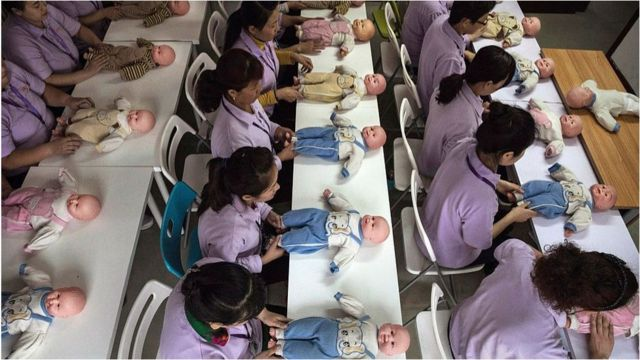
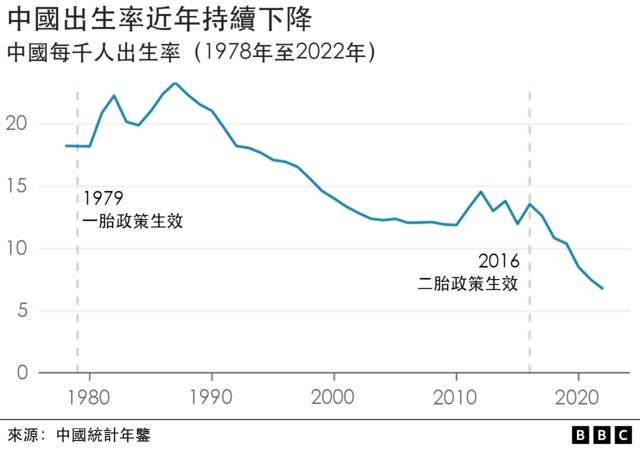
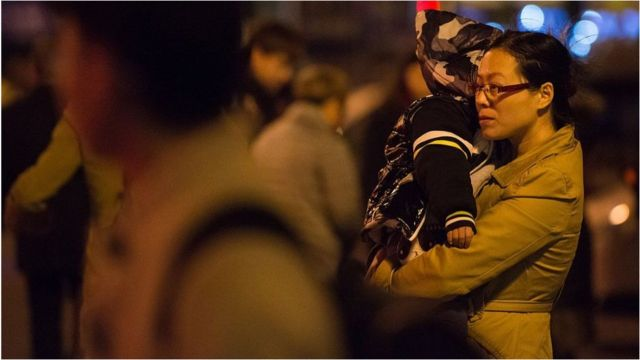

# [Chinese] 生育成本、职场歧视、婚姻恐惧：为何越来越多中国女性不想要孩子

#  生育成本、职场歧视、婚姻恐惧：为何越来越多中国女性不想要孩子

  * 常思颖 
  * BBC中文 

> 图像来源，  Getty Images
>
> 图像加注文字，调查显示，女性现有子女数由2019年的1.63下降到2022年的1.19。

**在广东生活的吴小姐算了一笔账：养一个孩子每月需要约1.6万元（1.8万港币，7万台币）开销。**

“我负担不起”，30多岁的吴小姐说。结婚已经十年，她决定不要孩子。

“上幼儿园每个月要2000左右；日常开销大约3000，包括吃的喝的；兼职托管的话至少要1000；早教课一套课程至少1万”。

吴小姐是自由职业，兼职做小学辅导老师。在广东，城镇私营单位从业人员的平均工资是每月6000元。

她是家里的独生女，每月除了要支付房贷，还要存钱为年迈的父母考虑养老问题。在中国，自1980年起实施的“一孩政策”持续了20多年，目前许多“80后”“90后”面临同样的问题。

GETTY

中國女性婚育趨勢

  **10%** 是2020年女性終身無孩率，五年內上升了約4%。 

  **1.64** 是2021年育齡女性平均打算生育子女數字，低於2017年的1.76。 

  **26** 是2020年女性平均初婚年齡，比20世紀80年代增加了約4歲。 

資料來源：中國人口與發展研究中心

中国正在经历人口大转变。中国国家统计局今年年初的数据显示，中国人口在60年来首次出现负增长。中国的人口出生率在过去六年不断下降，达到了每1000人中只有6.77个新生儿降生这一历史最低点。2019年，每1000人有10个新生儿。

这意味着，越来越多中国女性只想生育一个孩子，或者完全不要孩子。

中国国家卫健委下属中国人口与发展研究中心最近公布的调查显示，中国女性终生无孩率快速上升，从2015年的6%，增加到2020年的10%。

该调查还显示，中国育龄女性的生育意愿持续降低，2021年平均打算生育1.64个孩子，低于2017年的1.76个和2019年的1.73个。其中，作为生育主体的“90后”和“00后”仅为1.54个和1.48个。

另外，女性现有子女数由2019年的1.63下降到2022年的1.19。

有学者表示，在一些生育率低的亚洲国家，比如新加坡、日本和韩国，虽然实际生育率与中国一样，都低于两个孩子，但在这些国家，大部分女性仍然有生育两个孩子的意愿。

“从这个意义上讲，中国属于异类，因为不仅实际生育率低，生育意愿也很低”，伦敦政治经济学院（London School of Economics）社会政策学院助理教授陈双博士说。

##  “内卷”的社会

养育孩子需要一笔不小的费用，这是许多中国女性对生育望而生畏的一个主要原因。

在中国，许多家长从孩子一出生，就开始为他们接下来要迎接的激烈竞争做准备。从购买学区房，到送孩子参加各种兴趣班，家长们争先恐后地践行着“不让孩子输在起跑线上”的理念。

“我不想把一个生命带到这样的社会”，22岁的大学生米娅说。

米娅出生在中国东北地区的一个小城镇，从小接受应试教育。她在高考中取得了优异的成绩，来到首都北京一所不错的大学上学。

但很多时候，学业压力让她喘不过气。

> 图像来源，  Getty Images
>
> 图像加注文字，生育孩子不仅需要付出金钱，还要耗费很大精力。

“我身边有很多北京同学，他们的眼界和学识高于我们这些在应试教育中培养出来的学生。他们可能从小经历过兴趣培训，并且有了很好的成果，或者在成长过程中接受过博雅教育，培养了很高的综合素质”。

除此之外，毕业后她还要跟从海外留学归来的学生一起竞争就业岗位。

“我见过身边很多学习成绩不如我好，学习能力也一般，但家里很有钱，送他们到国外读本科和硕士，那么他们在就业市场上，确实比我们这些在国内读书的人更有优势。”

“这些被金钱加持的东西很现实，但确实很重要。”

米娅读文科相关专业，她认为凭借她的背景，未来无法赚到足够的钱，在上有老下有小的情况下，给孩子更好的教育和生活环境。

“我不想让孩子循环我们这一辈经历的事情”，米娅说。

##  职场歧视与婚姻恐惧

许多受访女性还担心，生养孩子可能对她们的职业发展带来负面影响。

比如在求职面试当中，有年轻女性被问到，未来几年有没有生育计划。如果有，成功应聘的机会可能变小。对于那些需要付出更多个人时间和精力的工作，尤其在私人企业中，养育孩子可能影响女性的晋升机会。

“在中国的城市中，受过高等教育的女性格外强调无法平衡工作和生活，她们尤其担心受到职场性别歧视，以及生育孩子影响事业发展”，美国密歇根大学（University of Michigan）社会学助理教授周韵说。

“对于她们来说，工作是对实现自我价值的一种追求，在这种背景下，如果面对充满歧视的劳动力市场或工作环境，自然会觉得生育和工作是一个难以两全的选择。”

一些人还提到，对婚姻的恐惧也令她们不愿意生育。

> 图像来源，  Yuan Xueping
>
> 图像加注文字，原雪萍在农村出生、长大，她的家庭不希望她多读书，而是早结婚生子。

今年30多岁的原雪萍在农村出生、长大，在她的印象里，结婚后女性大多是在家做家务、带孩子，做不了自己想做的事，也不知道外面的事，“婚姻是女性的枷锁”。

她曾经想走出这种枷锁，但父母经常告诉她，“女孩子上大学有什么用，你马上就要结婚生孩子了”。即便她的成绩在高中一直名列前茅，家里始终不愿意支付她和姐姐上大学的费用，只允许她的弟弟进入大学。

后来，当与她年龄相仿的小姨婚姻破裂，带着两个孩子回到娘家，原雪萍彻底抛弃了结婚生子的想法。

“小孩在哭，大人也在哭，全家人都感受到无望和痛苦”，她说，“我不再相信婚姻了。”

在城市长大的“00后”的米娅也认为，维持婚姻是一件复杂的事，涉及到很多现实层面的考虑，可能逐渐消耗两个人的感情，最后对孩子不利。

“在我看来，婚姻是一纸契约，是嫁妆、彩礼、婆媳关系，但唯独不是一段纯粹的感情”，米娅说，她称自己是坚定的不婚族，并且不要孩子。

米娅还说，生育对于女性的身体伤害巨大，包括产后漏尿、妊娠纹、子宫脱垂等，还容易得抑郁，这些都是在由男性主导的中国社会中无法得到共情的。

##  “当我说不生孩子，我遭遇了网络暴力”

> 图像来源，  Getty Images
>
> 图像加注文字，许多受访女性担心，生养孩子可能对她们的职业发展带来负面影响。

与许多喜欢在网络上分享自生活片段的年轻人一样，米娅把她不生孩子的理由拍成一段视频，放上了网络。

但她没想到的是，网络暴力随之而来。

她收到了数以千计的留言，其中许多评论带有侮辱性言语。一些人说她自私、推卸责任，还有人说她在20多岁就作出这样的决定，“感觉像是笑话”。

“你没资格这样说，等到40岁了再来说吧”，一条留言写道。“我赌一万块你会后悔”，另一条写道。

还有留言称她是“外部势力”，试图“煽动”中国女性抵制生育。

为了增加生育率、延缓老龄化趋势，中国政府在继2015年全面放开“二胎”后，于2021年推出“三孩”计划生育政策。该政策引发激烈讨论，一些人说，女性的子宫应该由女性自己做主；也有人认为，公开反对生孩子将令国家陷入危机，是与国家为敌。

“这只是我的个人选择，我并没有鼓吹放弃生育，也尊重那些决定生孩子的人”，米娅说。

在现实生活中，表达没有生育意愿可能遭到整个家庭的反对。“我是在夹缝中反抗”，原雪萍说，在她出生的地方，养儿防老、重男轻女的观念根深蒂固。

她在获得职业文凭后离开了家庭，现在一个人生活。

“我可以花更多的时间和金钱丰富自己，我觉得很自由”，她说。

