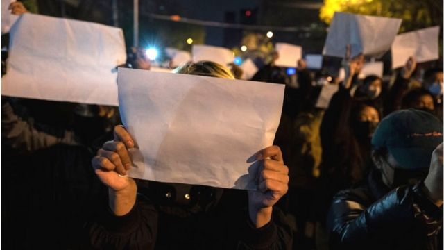
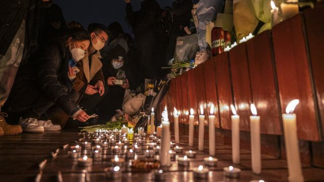

# [Chinese] 中国“白纸运动”抗议者遭秋后算账 多名参与者失踪或被捕

#  中国“白纸运动”抗议者遭秋后算账 多名参与者失踪或被捕

> 图像来源，  Getty Images
>
> 图像加注文字，许多参加去年11月抗议活动的人举着空白的A4打印纸表达人们对当局新冠封控政策的不满。

**随着中国宣布疫情防控取得胜利，去年11月反对“清零”政策的标志性抗议活动已经开始淡出人们的记忆。**

尽管整个国家已向前迈进，但许多参与示威活动的人却失踪了。他们在当局悄悄加强对异议人士的打击行动中被带走。

在所谓的“白纸运动”中，有数以千计的人在街头集会，在夜晚手举白纸反对新冠封控政策。这种对执政的中国共产党及其领导人习近平的批评相当罕见。

当时警方并未进行大规模拘留。但中国活动人士表示，在几个月后的现在，有众多抗议者被警方拘留。一家组织估计，已经有100多人身陷囹圄。

国际人权团体和外国大学呼吁当局释放抗议者。人权组织公布了据称是被拘留者的名单，包括那些在北京及上海、广州和南京等多个城市参与抗议的人。

中国当局尚未就有关拘留问题置评，但通过采访部分抗议者的朋友和律师，BBC得以核实在北京被捕的12人的姓名。

这些人中至少有5人已被取保候审。在仍被拘留的人中，四名女性——曹芷馨、李思琪、李元婧和翟登蕊——已因“寻衅滋事”被正式批捕。这是一项恶名远扬的模糊控罪，最高刑期为五年，批评者称这一指控经常被用来压制异见。

##  “他们不是活动人士”

> 图像来源，  Getty Images
>
> 图像加注文字，北京的抗议活动最初是为乌鲁木齐公寓火灾的遇难者举行的悼念活动。

许多被捕者受过良好教育，其中一些人曾就读于英国和美国的大学，他们的身份包括作家、记者、音乐家、教师和金融业专业人士。

北京的大多数被拘留者源自一个松散的朋友圈，他们都热爱艺术，经常在读书会、电影放映会和沙龙上见面。

其中的许多人是女性，有报道称，警方曾询问她们是否是女权主义者或参与过“女权活动”。近年来，中国当局对女权活动人士的打击或审查愈演愈烈。

虽然这些人具有社会意识，一些成员也对“#MeToo”运动的人物“弦子”表示过支持，但她们的朋友坚持认为，她们并非活动人士。

“她们只是一群关注社会的年轻人……我的朋友不仅对女权感兴趣，还对人权和弱势群体的权利感兴趣。这与女权相关的活动无关。”其中一名被拘留者的朋友说。

11月27日，这个圈子中的几名女性参加了在北京亮马河举行的公开悼念活动。

该活动是当天晚上中国多地民众自发举行的活动之一，以悼念震惊全国的乌鲁木齐公寓楼大火中的受害者。当时，许多人认为新冠封控措施是受害者没有能及时逃生的一部分原因，但当局否认了该说法。

当晚的悼念活动后来演变成一场和平抗议，人们举起表达沮丧的象征——白纸。

“这个环境压抑太久了。他们去的时候并不认为自己在参加一场运动。他们认为这只是一种情绪发泄的方式。”另一位朋友说。

“他们没有与警察发生冲突，也没有表达激进的观点。所以他们不认为这很严重。”

他们的朋友表示，鉴于中国通常会迅速压制抗议活动，他们几乎没有做任何事情来保护自己的身份。

目前尚不清楚警方如何找到这个圈子的参与者，但有报道称，警方利用了监控摄像头和面部识别软件追踪抗议者，并搜查了被捕者的手机。

其中一名被拘留者创建了一个Telegram群组，该群组从几个成员扩大到60多人。而他们中的许多人使用了实名登记的电话号码。两天后，他们中的一些人接受了警方的讯问。

“她被带走时，我们正在打电话。”一名被拘留者的男朋友说。“她告诉我，她的一些朋友被带走失联了。她正想从手机上删掉一些东西，但还没删完就被带走了。”

据活动人士称，在12月和1月，抓捕行动似乎在加速，因为有一个接一个的朋友被拘留。

曹芷馨在被捕之前，给她的朋友们发了一段自己面对镜头说话的影片。影片中还附带有解释，称该片将在她失踪时在网上公之于众。

“我们的同胞遇难时，（我们）有合理的情绪想要表达。”曹芷馨在这段已在海外社交媒体广为流传的影片中说道。“我们不想凭空被消失……如果仅仅是因为我们出于同情去了悼念现场，那么这个社会还有多少可以容纳我们情绪的空间？”

##  关注和谴责

> 图像来源，  Getty Images
>
> 图像加注文字，活动人士希望越来越多的国际谴责将导致被拘留的抗议者获释。

随着该事件在国际社会引起关注，多个人权团体和教育机构呼吁北京释放这些参与者。伦敦大学金史密斯学院（Goldsmiths）向BBC证实，李思琪曾是该校的学生，校方对她的福祉“深表关切”。

“我们对压制言论自由的行为表示最强烈的谴责，并呼吁中国当局立即释放所有与悼念活动有关的被拘留者。”一名金史密斯学院的发言人说。

她补充说，该校校长已经致信中国驻英国大使郑泽光。中国大使馆尚未回应BBC的查询申请。

芝加哥大学和新南威尔士大学也证实，有曾在该校就读的学生被捕。新南威尔士大学给BBC的一份声明呼吁，在“充分尊重法律原则和普遍人权”的情况下解决该问题。

无国界记者（Reporters Without Borders）组织指出，包括李思琪在内的四名被拘留者是记者，指她们的被捕是“向那些认为即使与官方说法相悖也应报道事实信息的人发出的又一个令人恐惧的信息”。

人权观察（Human Rights Watch）组织表示，这一事件表明"中国的年轻人正为敢于为自由和人权发声付出沉重的代价"。该组织补充说，中国当局还威胁了试图支持被拘留者的律师和朋友。

##  “杀鸡儆猴”

观察人士认为，北京希望通过抓捕行动释放一个信号。人权活动人士滕彪将其称之为“杀鸡儆猴”。

“他们希望抓到他们认为是领导者和组织者的人，那些起领导作用的人将受到严厉惩罚。”他说道，并补充称中国当局的本能是查明在抗议活动背后是否有“西方敌对势力”。

事实上，相当多的被拘留者是女性，据报道，她们还被讯问是否支持女权运动，这一事实也凸显了官员对女权运动的不信任。

近年来，几起备受关注的针对女性的暴力和性侵的案件在中国引发轩然大波，这引发了对当局的异常严厉的批评，并为女性权益争取了舆论支持。

但随着这场运动的发展，政府的反应也变得更加强硬。2015年，当局打击了一个被称为“女权五姐妹”的女性团体。活动人士表示，她们自那以后在网上受到越来越多的审查和攻击。中国共青团去年称，“极端女权已成网络毒瘤”。

“维护‘社会和谐’一直是政府的头等要务，而女权运动一直被认为对整个政治体制稳定带来威胁。”华威大学研究中国性别权力关系的助理教授彭雨竹说。

目前尚不清楚抗议者将面临怎样的未来命运。

那些取保候审的人仍有可能被起诉。人权活动人士滕彪表示，在检察官决定是否起诉他们时，仍被拘留的人可能会被拘留数周，但在政治案件中，这可能会延长到几个月，甚至数年。

他们的家人至今保持沉默，一些人还与被拘留者的朋友切断了联系。BBC获悉，有一个家庭还解雇了其为女儿辩护而聘请的律师，原因尚不清楚。

资深人权活动人士杨占青称，鉴于被拘留者的家人所面临的巨大压力，他们可能会保持沉默。

“警方采取了胡萝卜加大棒的做法。当局会告诉被捕者家属，如果他们保持沉默，被捕者会被提前释放。如果他们不服从，就会失去工作和养老金。”

但是，国际社会上越来越多的对该拘留行动的监督也可能有助于被拘留者。杨占青称，在这种政治敏感的案件中，由于外部压力，被拘留者可以提前获释或在狱中得到更好的待遇。

与此同时，被拘留者的朋友们对自己的人身安全感到焦虑和担忧，但他们继续密切关注情况并分享信息。

他们中的许多人住在海外，并未参加11月的抗议活动，但他们担心由于自己与被拘留者的联系，以及他们试图呼吁国际社会注意到这些人的困境，他们自己也将成为目标。

最近，他们经转述获得了一名被拘留者从狱中给他们的信息，她试图让她的朋友们放心，明确表示被拘留者依然振作。

“（审讯人员）一直让我们觉得我们周围的朋友都是叛徒，或者背叛了我们。”她说。“但我仍然相信我们站在一起。”

_（_ _出于保护受访者安全的考虑，一些受访者被匿名。_ _）_

