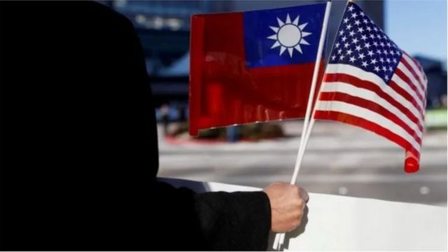
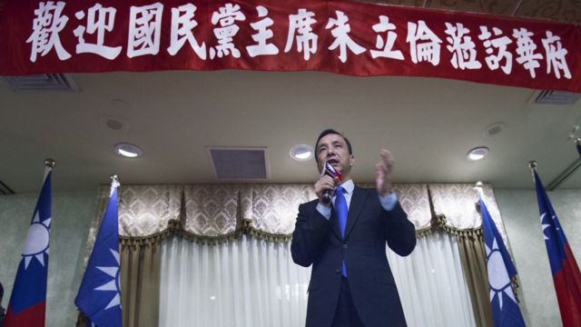
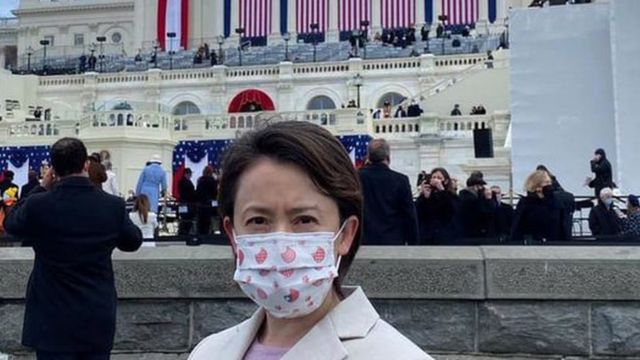
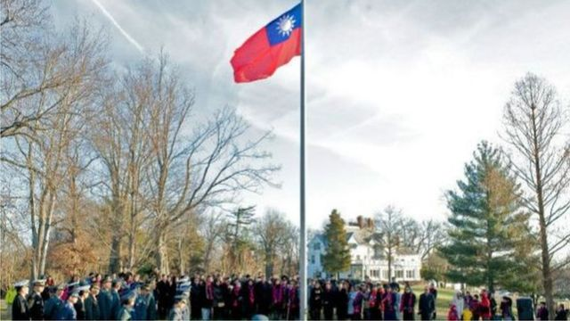
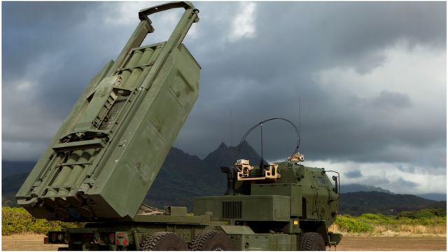
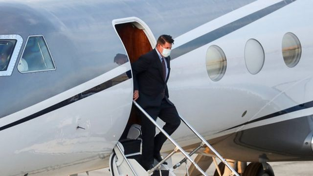

# [Chinese] 美台断交近半世纪后台湾外长首访AIT总部意味着什么

#  美台断交近半世纪后台湾外长首访AIT总部意味着什么

  * 吕嘉鸿 
  * BBC中文 

> 图像来源，  REUTERS

**过去一周以来，美中在国际外交的激烈竞逐，并没有因为中国气球被击落后有任何平复迹象。**

美国总统拜登秘密抵达基辅后，与泽连斯基（Volodymyr Zelensky）高调会面力撑乌克兰。中国最高层级外交官员王毅则在乌克兰战争周年之际到访莫斯科并会见俄罗斯总统普京（Vladimir Putin），称中俄关系“成熟坚韧”。在地球另一端，美中对垒再次以台湾问题展开。台湾外交部长吴钊燮踏入了美国在台协会（AIT）在大华盛顿地区的总部。

由于自1979年美国与台湾断交后，虽然没有明文规定，但台湾在任总统、副总统及外交部长等高层一直以来不被美方允许踏入大华盛顿地区。此次台湾外交部长与美国副国务卿雪蔓（Wendy R. Sherman 谢尔曼）首次在大华盛顿地区会面，美国在台湾问题上与中国的攻防，以及台湾在此情势下的自主性几何，都成为热议话题。

曾任美国在台协会前处长及美国驻香港总领事的杨甦棣（Stephen M. Young）接受BBC中文采访时称，此次吴钊燮及台湾国安会主席等人访美确实吸睛，但美方层级并不算高。他说，台湾官员与美国副国务卿会面，以前并非没有发生过，只是双方较为低调，会见地点也离大华盛地区比较远。杨甦棣认为，这是拜登政府回击北京的另一次尝试，展现对台北的持续支持。

台湾官方智库“国防安全研究院”鍾志东博士认为，此次会面基本上是一种美国“外交吓阻”的战略，目的是预防台海战争爆发。他告诉BBC说，白宫透过非军事的外交手段，展现了对台北的支持，也对北京发出警示的讯号，所以此次如此高调。亦是拜登惯用的外交战略。

目前为止，北京并未对此次吴钊燮踏入AIT美国总部有任何反应。但中国外交部发言人汪文斌上周在例行记者会强调称，美方需恪守一个中国原则及三个中美联合公报规定，“切实将美国领导人作出的不支持台独的承诺落到实处，停止任何形式的美台官方往来和军事联系，停止插手台湾问题。”

中国国防部新闻发言人谭克非则在2月23日的例行记者会上警告，若民进党当局执迷不悟，“勾连外部势力，不断进行谋独挑衅，一味推高两岸对立对抗，甚至不惜将台湾同胞置于危难境地，解放军将以行动说话，采取必要措施坚决挫败任何“台独”分裂行径和外部势力干涉。”

外界预计北京对于台湾持续在灰色地带，以切香肠（salami slicing）的外交手段一直进行紧密观察，何时会有所反应，并如何反制美台往来，会是下一波观察重点。

##  最新的突破是什么

据美媒报道，美东时间2月21日，吴钊燮与台湾国安会秘书长顾立雄等领衔的代表团，于美国在台协会总部，与美国副国务卿雪蔓、白宫印太事务协调官坎贝尔（Kurt Campbell）等涉台事务高阶官员针对安全议题举行了一场会谈，同行的还有台湾驻美代表萧美琴，以及传出将接任AIT主席的白宫国安会中国与台湾事务主任罗森柏格（Laura Rosenberger）。

上次台湾在任外交部长访美的时候是拉到距离美国首都华盛顿特区车程30分钟左右的城市会面，这次不仅进入了大华盛顿地区，还首次出现在AIT总部，其所在地是与华盛顿特区一河之隔的阿灵顿（Arlington），同时也是美国国防部五角大厦所在地。

有分析称，此次吴钊燮外访，美方打破了外交“惯例”。台湾政治评论者颜择雅评论称，虽然台湾两大党都称“维持现状”，但“现状”与“非现状”并非黑与白一刀切，“而是整片灰色光谱，北京也一直用力在挪移现状。要把现状推回几年前的样子，台湾必须出力，美国也会。台湾出力的主要方式是积极备战，美国的方式则非常多。”

> 图像来源，  Getty Images
>
> 图像加注文字，国民党主席朱立伦曾在2015年11月到访与美国首都华盛顿特区一河之隔的罗斯林，这里也属于阿灵顿地区。但朱当时并非台湾政府官员。

这些灰色地带的外交抗衡，在这几年台美关系升温，美中关系紧绷的背景下，越来越常见。

2020年9月月，台湾驻美代表萧美琴突然在私人推特帐号，将个人简介改为英文“Taiwan Ambassador to the US（台湾驻美国大使）。2021年，萧美琴又获邀出席拜登的就职典礼，是1979年华盛顿与台北断交、与北京建交以来的首次，一度引发北京抗议。

> 图像来源，  TECRO
>
> 图像加注文字，2021年萧美琴代表获邀出席美国总统就职典礼。

2021年，传出拜登政府将允许台湾驻美机构从“台北经济文化代表处”更名为“台湾代表处”（Taiwan Representative Office）。这件事情白宫至今都没有直接表达任何赞成或反对意见。2021年4月，美国国务院又发布了新的“对台交往准则”，允许美台官员自由会面，美官员也被允许与台湾官员在台湾驻美代表处会面，并出席美台断交前的台湾大使官邸双橡园（Twin Oaks）举办活动。不过，目前美方仍不同意萧美琴以双橡园为住所，台湾在双橡园的举办的双十国庆活动，也没有国务院官员出席。

针对美国对台战略变化，美国约翰斯·霍普金斯大学教授布兰德斯（Hal Brands）说，白宫近年来以“切香肠”战略等反复且细致的行动，盼能麻痹对方（指中国），令美台间一切行动往来变成外交惯例，或更能暗渡陈仓，在不过度触动中方神经下从事一些更敏感的外交行动，譬如高层军事互访。

布兰德斯认为，“切香肠”等灰色战略会持续数年，台湾的国际地位也会继续提升。但美方的“切香肠”动作若太大，绝对会遭致北京极大反弹，并在计算得失后先发制人。

不过，美国内华达大学拉斯维加斯分校政治系助理教授王宏恩则说，他认为从最大利益出发美国仍然会倾向于维持台海现状：“美国如何能够维持现状——这是当下美国一个中国政策（One China Policy）之核心。”

王宏恩告诉BBC，美方正在加强台湾的自卫能力，但并不意味着白宫会跳出战略模糊，因为美方不想给台湾一张空白支票。 “因此，我认为美国可能不会采用战略清晰，而是更接近于双重清晰——要求两岸不要改变现状。”

针对灰色地带的竞逐，杨甦棣则解释，所谓战略模糊一直没有被忽略。根据他的经验，多年来美国与台湾一直有有过相当高级别但低调的会谈，关键是对话层级一直在美方内阁官员以下，“台湾与雪蔓此次会面保留了这一原则。”

> 图像来源，  CNA
>
> 图像加注文字，2015年元旦台湾在前大使官邸双橡园举行升旗礼，引发一通口水战。

杨甦棣回覆BBC称，拜登与台湾互动升温可以说是因为美国在很多层面上对北京感到失望，尤其是中俄关系。他补充说，针对乌克兰战争，若北京未来向俄罗斯提供任何形式的军事支持，都会促使拜登政府加大对台湾的口头和物质支援。

##  军购议题

鍾志东告诉BBC，他认为长达7小时的会面应该聚焦在美国国会去年底的通过2023年度《国防授权法案》（National Defense Authorization Act，NDAA），讨论军购议题。

根据台媒报导，台湾陆军第542旅、第333旅联合兵种营（Combined Arms Battalion，CAB），今年将赴美受训。由于，过往台湾海军陆战队、陆军特种作战指挥部都是以“排级”或“连级”规模，此次交流即赴美受训达到“营级”规模是第一次。

此外，有消息称台湾总统蔡英文今年会循前总统李登辉模式访问美国，钟志东认为这也极有可能在这次会面中谈及。日媒《产经新闻》上周六（2月25日）引述多名消息来源称蔡英文很有可能在今年8月前再次访问美国，以何种方式尚未确定，但可以肯定的是北京绝对会有激烈的抗议及反制。鍾志东认为，这个议题应该也在上周的会谈中有提及。

> 图像来源，  Getty Images
>
> 图像加注文字，台湾证实一批美国军售，海马士火箭成焦点，预计将部署在台湾西岸。

##  台湾民众怎么看？

虽然美台关系持续升温，美方强调与台湾关系坚若磐石，但是台湾民众对于美国的立场似乎越来越复杂。

根据台湾中央研究院欧美研究所发布的民意调查，有56.6%的台湾人并不认为美国是个信守承诺的国家，不过又有66.5%的受访者非常支持美国对台军售。

> 图像来源，  Getty Images
>
> 图像加注文字，2020年，时任美副国务卿克拉奇(KeithKrach)飞抵台北。是台美断交41年以来，访台层级最高的在任美国国务院官员。

分析台湾疑美论，日本东京外国语大学教授小笠原欣幸今日在脸书评论称，美国内部对两岸持续发表不一致的看法，极可能强化了“疑美论”。他认为，自俄罗斯入侵乌克兰后，台湾民众的心理有很大改变，“对美军驻防的不信任度超过了信任度，且幅度很大。”他认为，台湾内部对美态度有很大的分化，美国对此需慎重思量，不能再摆出一个“高高在上”的态度，特别是要求台湾“自我防卫”这一点上，给外人一种“要让台湾去打仗”的感受。

政治学专家王宏恩则观察，台湾民众确实降低了对美国直接向台湾派兵的信心。不过，不少台湾人相信若台海战争爆发，美国仍会提供军援，而台湾人也汲取了乌克兰被入侵的教训——乌克兰人能自卫，我们为什么不能？因此，乌克兰危机后，台湾整体战斗意愿水平并没有下降。

针对中研院民调，王宏恩回覆BBC称，他会将其解释为台湾民众“感知策略”（perceived strategy）改变，而非战斗意愿改变：“多数民调显示，大部分台湾民众对台湾恢复较长的兵役期持欢迎态度，蔡英文宣布这项政策也没有影响她的支持率。”

