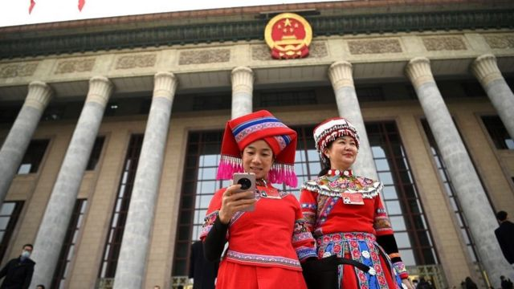
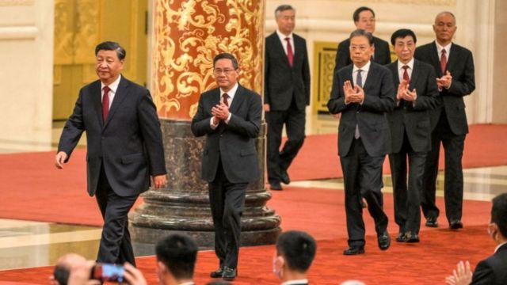
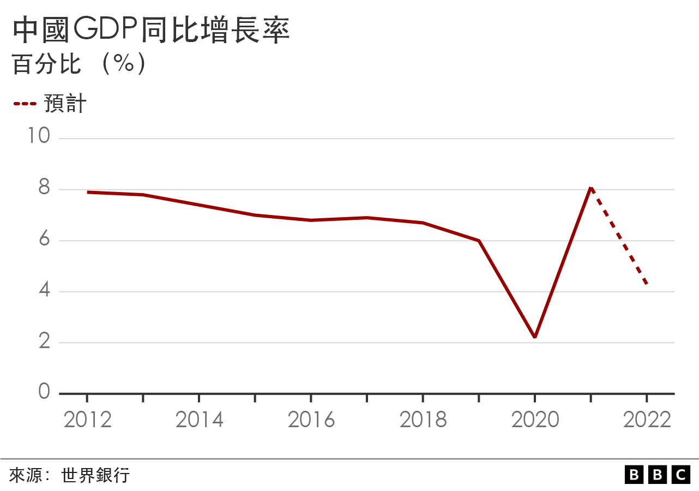
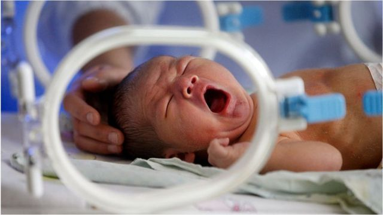

# [Chinese] 中国两会2023：政府换届、经济目标、人口政策等四个重要关注点

#  中国两会2023：政府换届、经济目标、人口政策等四个重要关注点

> 图像来源，  Getty Images
>
> 图像加注文字，5000多名中国人大代表和政协委员们每年需要从全国各地将议案提案带到北京。

**中国将在3月4日和5日召开全国政协十四届一次会议和十四届全国人大一次会议会议，即俗称的“两会”。**

与往年不同，今年将进行五年一次的中国国家机构和全国政协换届，包括总理在内的政府和政协领导人职位将产生重大调整。本次“两会”还是中国取消新冠“清零”政策之后的首次，外界预计会公布重大经济复苏计划。

两会通常是中国政治的橡皮图章会议，但从中可以窥见中国未来一年的一些政策走向。

##  政府换届

> 图像来源，  Getty Image
>
> 图像加注文字，新一届政治局七位常委出炉，除了李强被公认将担任总理外，其中一位将接任国务院常务副总理。

全国人大一次会议的一项重要议程是选举和任命国家机构组成人员。将产生新一届中国国家主席、副主席、国家军委主席、全国人大常委会委员长、副委员长等。

政协一次会议将选举新一届全国政协主席、副主席、秘书长和常务委员。

这些选举和投票通常是走过场，在中国最高权力集中的体制下，人选基本已经内定。

几乎毫无悬念，习近平将正式连任国家主席及国家军委主席。中共政治局常委排名第二的李强将接替李克强担任总理。他将在两会的最后一天首次亮相总理记者会，回答中外记者提问。

四名副总理的人选，依照惯例，常务副总理由一名中共政治局常委担任，目前外界普遍预测为丁薛祥，他在政治局常委中排名第六，仅高于已担任中纪委书记的李希。中共政治局委员何立峰、刘国中与张国清则是其他几个副总理职位的主要候选人。

除了政府机构外，根据新华社公布的一份2000多人的全国政协委员名单，政治局新常委中排名第四的王沪宁名列其中。预计他将接替汪洋，担任新一届政协主席。

备受关注的现任国务院副总理胡春华未能在中共二十大上进入政治局，但也在全国政协委员名单中。外界预计他可能成为全国政协副主席。

现任政协主席汪洋也没有进入政治局常委，面临彻底退休。

另外，按照惯例王岐山将卸任国家副主席，这一职位的人选也将在本届两会上产生。

##  经济目标

两会将出台怎样的经济目标和刺激手段，是另一个关注焦点。

过去三年，中国对新冠疫情实施了严格的限制措施，沉重打击了经济。自去年12月防控政策大转变以来，生产生活正逐渐恢复。短期可能拉动消费，但长期复苏并不乐观。

有专家表示，中国社会陷入了“流动性陷阱”，即居民不断把钱存进银行，但这些存款无法转化为实际投资。

人民银行近日披露的数据显示，1月份人民币存款增加6.87万亿元，同比多增3.05万亿元。其中，住户存款增加6.2万亿元，创历史同期新高，同比多增7900亿元。

新加坡国立大学李光耀公共政策学院助理教授陆曦对BBC中文说，这一部分是居民的“预防性储蓄”，由整个经济前景堪忧，投资机会少所导致，

“由于出现这种流动性陷阱，因此在整个经济大环境的预期没有改善的前提下，通过各种各样的货币政策来刺激经济，实际上未必能够达到预期效果。”陆曦说。

##  人口政策

> 图像来源，  Getty Images
>
> 图像加注文字，调查显示，女性现有子女数由2019年的1.63下降到2022年的1.19。

今年年初公布的官方数据显示，中国人口出现60年来首次负增长。与此同时，越来越多中国育龄女性不愿意生育，初婚、初育年龄在推迟。

中国受益于人口红利的时代已经过去，如何缓解人口急速减少，是中国面对的一个难题，也将成为本次两会探讨的一个重要话题。

北京女权倡导机构“为平”的负责人冯媛对BBC中文表示，为女性提供生育支持可能是本次两会的一个关注点，但她对于本次两会为女性权益提供保障并不乐观。

“如果没有妇女的有效参与，对妇女权益的保障不会有显著改善。上一届政府在2020年6月到2022年12月之间有两年半没有女部长，（其它时间）即使有也只有1至2名女部长，仅占4-8%，而全世界范围内到2019年女部长已经占部长的20%了。”

陆曦认为，中国在提升生育率上的主要问题是“钱不够”——由于过去三年中国经济严重下滑，基础公共支出减少，使得国家在生育率下降的趋势中，无力出手缓解。

伴随低生育率而来的是养老问题。调查显示，2020年中国65岁以上老龄人口达到1.91亿，占总人口比重为13.5%，全球每4个老年人中就有一个中国人。

陆曦认为，要解决养老问题，首先要解决中国医疗系统中的资源错配。

“大量私人资本进入医疗系统后，实际上成了高端医疗资源，比如高端私人医院、母婴中心、月子护理等；而在社区医院方面，中国的基础非常薄弱，没有很好的私人资本可以借用。”

##  外交路线

今年是中国新外长秦刚上任后，首次在两会亮相。

秦刚此前是中国驻美大使，外界将他的晋升视为北京试图稳定中美关系的一种努力。秦刚在上任之初也表示，美国人给他留下了“深刻的印象”，并承诺在新职位上继续推动中美两个世界大国之间的关系。

有分析认为，秦刚还是国务委员的热门候选人。

但美国巴克内尔大学（Bucknell University）国际关系系教授朱志群对BBC中文说，秦刚刚走马上任，今年两会上就提拔到国务委员的层级太快了， 两三年后提拔似乎更为合理。 “但中国政治不透明，爆冷门的可能性也是存在的。”

至于秦刚将如何亮相，朱志群说，他肯定会坚定执行中共高层的外交路线，在对外事务中不会示弱。

“他较年轻，英语流利，任驻美大使时身段较软，和蔼可亲，与各届广泛接触。如果在外长任上继续这么做，将会给中国外交带来一些新鲜感和积极变化。 ”

两会前夕，北京发表了“全球安全倡议概念文件”， 被认为是未来一段时间中国外交的指导性纲领。

朱志群说：“该文件强调多边主义和合作，遵守联合国宪章，提倡开放包容原则，共同发展和促进和平等等，这些都是中方一贯倡导的，所以两会上也会继续强调这些中方的原则立场。”

另外，今年还是“一带一路”倡议提出十周年，外界关注中国将如何进一步实施该倡议。

