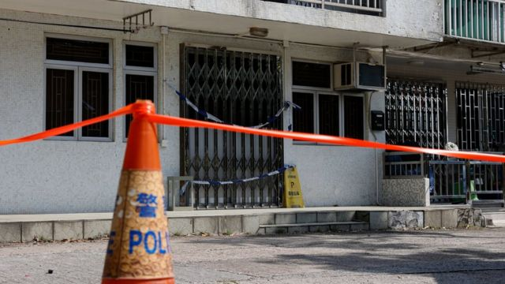
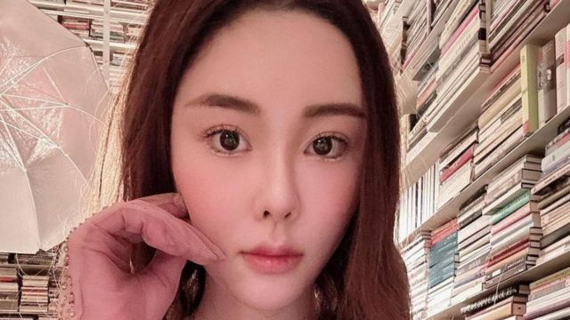
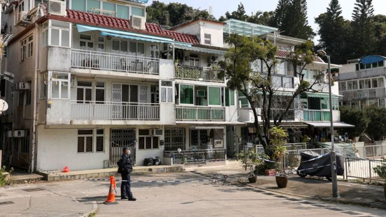
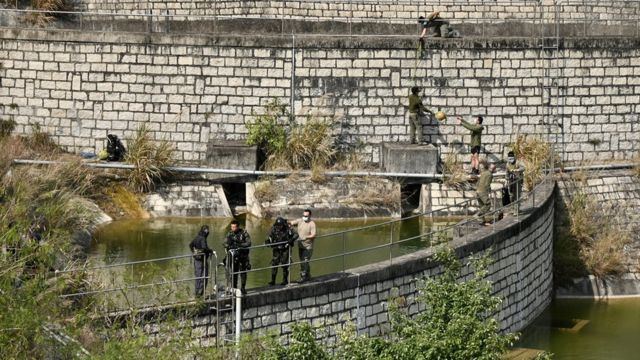
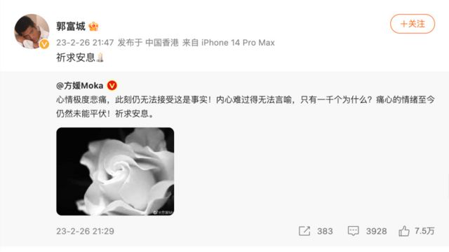

# [Chinese] 香港蔡天凤命案：疑凶一家提上法庭 我们目前都知道什么

#  香港蔡天凤命案：疑凶一家提上法庭 我们目前都知道什么

> 图像来源，  Reuters
>
> 图像加注文字，蔡天凤遗骸在大埔龙尾村一个村屋单元内被发现。

**香港28岁社交名媛暨模特蔡天凤（Abby Choi）被发现遭杀害，尸体遭肢解，消息迅速传遍两岸四地以至于东南亚华文媒体，连日来受重点报道。**

香港警察迄今拘捕了五名疑犯，星期一（2月27日）将蔡天凤前夫邝家四人带到法院提堂，分别控以谋杀与妨碍司法罪名。法庭下令将四人收押候审，待警察继续侦查案件。

警察相信这起命案涉及“巨额金钱纠纷”，香港媒体连日来陆续披露了受害人、其家庭与前夫家的复杂关系。

不少台湾媒体纷纷将香港这起命案与 韩国电影《寄生虫》  （台名《寄生上流》；港名《上流寄生族》）相提并论。

_**【以下报道内容或会引起不安，请斟酌阅读。】**_

##  蔡天凤遇害：从警察与法庭方面得知的信息

警察星期一将其中四名被落案控告的被捕人士带到九龙城裁判法院提堂。依照中国香港特区司法机构公布的庭审日志，四名被告人依次为31岁的邝港杰、65岁的邝球、63岁的李瑞香与28岁的邝港智。

邝港杰、邝球与邝港智各被控一项谋杀罪。控方指控三人于今年2月21日，在新界在大埔龙尾村一村屋住宅单元谋杀蔡天凤；李瑞香被控一项“作出倾向并意图妨碍司法公正的作为”罪，即俗称“妨碍司法公正”罪，控罪称她在2月23日销毁对其本人进行刑事调查的资料。

据报道，四人没有雇用律师，由法庭当值律师担任辩护律师。

> 图像来源，  Instagram/Reuters
>
> 图像加注文字，蔡天凤活跃于上流社会圈子。

邝港智是死者蔡天凤的前夫；邝球是死者的前家翁（公公）；李瑞香是死者的前家姑（婆婆）；邝港杰是死者的前大伯（大伯子），也是她的司机。其前夫向法庭报称无业，前家翁、家姑则报称为退休人士。多家媒体指出，邝球是前警察，离职前是侦缉警长。

控方在庭上申请被告人无须答辩——即回答认罪或不认罪——并押后案件，待警察继续侦查；辩方表示三名男被告并无申请保释，女被告则申请保释，最终裁判官裁定所有被告人不准保释，还押候审，延至5月8日再讯。

法庭同时得悉邝港智是一起盗窃案的被告人，涉及七项盗窃罪，原定于2015年在区域法院开审，但邝港智自同年8月起没有依令向警察定期报到，遭法庭通缉。裁判官批准控方申请，于2月28日就该案开庭提堂。

警察又在星期天（26日）拘捕了一名47岁伍姓女子，并称她是邝球的情妇，怀疑协助窝藏邝港智。她目前被警察以“协助罪犯”罪嫌扣查。

这起谋杀及碎尸案是在2月24日深夜曝光。香港警察西九龙总区刑事部警司钟雅伦25日凌晨表示，警察在22日凌晨时分接获报案，报案人称其一位28岁亲友——即蔡天凤——于之前一天失踪。警方调查期间先后会见了邝家各人，其中邝港杰声称是最后一个见到死者的人。

钟雅伦说：“经过调查，我们相信受害人与前夫一家人有许多巨额金钱纠纷……继而动杀机。”

> 图像来源，  EPA
>
> 图像加注文字，警方称案发现场村屋单位是在近期租入。

警察探员经调查后，锁定龙尾村单元，并在24日凌晨拘捕死者前家翁、前家姑和前大伯，继而在村屋内一台冰箱中发现人体残肢，以及蔡天凤的证件与财物，据此断定她已遇害。

至25日下午，死者前夫在香港国际机场附近的大屿山东涌发展码头被捕，警察方面相信他当时正试图乘船逃离香港。

龙尾村紧邻大美督（又称大尾笃），是热门郊游地点，与蔡天凤最后被发现的地点九龙城相距约27公里。有香港媒体声称掌握监控视频，拍下蔡天凤登上一辆七座车，以及该七座车开进龙尾村的过程。

26日晚，警察证实法医在村屋捡走的两锅汤内发现相信是死者的头颅，其右耳后方有相信由重物撞击造成的损伤。警察认为蔡天凤在轿车上已被弄晕。

警察还指出，他们相信龙尾村单元是由邝球与伍姓女子在近期租用。

虽然案件在裁判法院提讯，但按照香港刑事诉讼程序，谋杀罪必然由高等法院原讼法庭审理。至于案件何时转介高院、何时审理等，则要视乎调查进展与控方工作进度。

> 图像来源，  China News Service
>
> 图像加注文字，外号“水鬼队”的警察潜水人员被派往将军澳华人永远坟场内一座蓄水池搜索证据，警察怀疑这里是另一个蔡天凤残肢被弃置地点。

##  蔡天凤其人

综合香港媒体报道，蔡天凤家境富裕，经常出席时装名牌活动。她的最后一个Instagram帖文发表于2月15日，内容是有关她登上《巴黎时装公报》摩纳哥版（L'Officiel Monaco）。这本国际时装杂志创刊于1921年，一年前被香港金融管理企业尚乘（AMTD）收购。

蔡天凤18岁时与邝港智结婚，七年前离婚，2016年与现任丈夫结婚，并举办盛大婚宴，但据报道两人并未办理注册。她为前夫与现任丈夫各诞下两名子女。

蔡天凤现任家翁谭泽均为香港知名餐饮品牌“谭仔米线”创办人之一。2018年，日本餐饮企业东利多收购“谭仔米线”与同一家族另一方经营的“谭仔三哥米线”，整合成谭仔国际。

对于这起命案，谭仔国际称“深表难过”，但集团与案件无关，不便评论。

蔡天凤命案曝光后，一位名为“豹太太”的友人宣称与谭家共同悬赏200万港元（25万美元；177万元人民币）通缉邝港智， 台湾网红林若佳（Doris）公开宣布追加100万港元  。“豹太太”并表示，蔡天凤生前与她共同开办一家动物福利组织。 该组织也发文悼念蔡天凤  。

另一位知名模特方媛也在社交媒体上发文，对蔡天凤被杀感到“心情极度悲痛，无法接受”。方媛丈夫，名歌手兼演员郭富城也在微博上转发妻子的帖文，并评论称“祈求安息”。

> 图像来源，  Aaron Kwok/Sina Weibo

