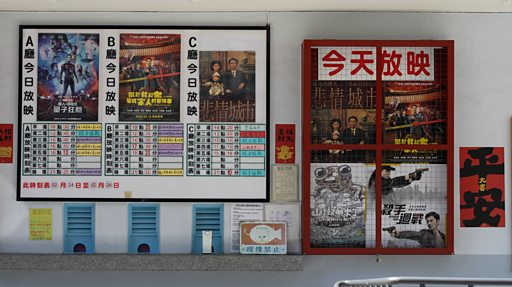

# [Chinese] “二二八事件”76周年：从《悲情城市》到《流麻沟十五号》，台湾电影讲述的威权历史

#  “二二八事件”76周年：从《悲情城市》到《流麻沟十五号》，台湾电影讲述的威权历史

**“二二八事件”76周年：从《悲情城市》到《流麻沟十五号》，台湾电影讲述的威权历史**

时隔33年，侯孝贤执导的《悲情城市》在二二八76周年前夕重新在台湾上映，这是台湾史上首部公开讲述“二二八事件”的电影。

台湾1940年代末进入超过30年的白色恐怖时期，数万名政治受难者遭到迫害、言论自由受到箝制，直到1987年戒严令解除后才陆续出现公开以过去威权历史——包括发生在1947年的“二二八事件”与之后的白色恐怖——为主题的影视作品。

2022年底上映的《流麻沟十五号》讲述1950年代关押于绿岛的女性政治犯，该片上映首周成为台湾新片冠军，最终获得将近4000万新台币的票房。导演周美玲表示电影的说故事策略是“温柔”：“因为我不希望在观众走出电影院之后心里面充满了仇恨，这不是我们要的，我们要的是和解。”

“二二八事件”发生在1947年，当时的中华民国政府下令镇压示威者。在近年台湾开启转型正义工程后，社会对如何处理威权时代的人权迫害仍有不同声音。

**影片** **制作** **：张友慈**

