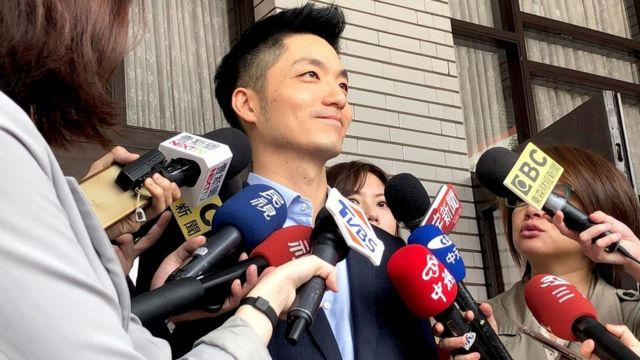
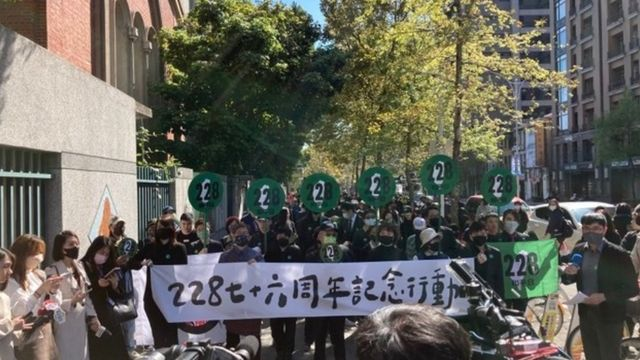
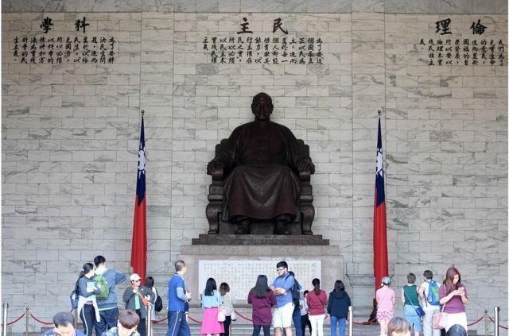
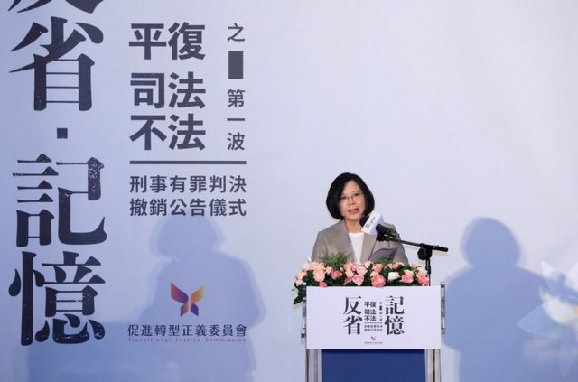

# [Chinese] 台湾228纪念日：台北新市长蒋万安面临从政后的首次大考

#  台湾228纪念日：台北新市长蒋万安面临从政后的首次大考

> 图像来源，  Chiang Wan-an Facebook
>
> 图像加注文字，身贴蒋家后代标签的蒋万安，在从政路上开始面对个人家庭的功过争议。（资料图片）

**每年2月28日是台湾官方确定的“228和平纪念日”，纪念1947年2月28日台湾发生的政治暴力事件，以及之后数十年“白色恐怖”下威权统治的受害者及家庭。**

根据台媒报导，台湾前任威权统治者蒋介石后人，现任台北市长蒋万安今日（2月28日）在出席市政府举办的“台北市二二八事件76周年纪念系列活动”时，突然有数名民众冲上致词台，并高喊“杀人凶手、凶手下跪道歉”，导致活动短暂中断。

在保安人员介入后，蒋万安继续致词并表示，身为台北市长，为76年前自台北市爆发并引爆全台的“二二八事件”致上诚挚歉意。

身贴蒋家后代标签的蒋万安，在从政路上，开始面对个人家庭的功过争议。228事件及后来长达数十年的白色恐怖历史，正在考验蒋万安作为民选市长的政治智慧。他面对的命题还包括台湾政府如何明确推动转型正义，台湾社会如何对话及和解。

台湾清华大学科技法律所李怡俐助理教授说，蒋万安市长并非一个孤立的例子。在亚洲，韩国前总统​​朴槿惠及现任菲律宾总统的小马可仕（小马科斯），都面对类似的命题，即独裁者后代如何面对该国白色恐怖历史及转型正义。但她强调，为避免转型正义一再陷入被工具化或政党化的困境，社会应该避免用“血缘原罪”等说法评断威权领导人后代，因为这些说法对促进社会和解与深化民主并无帮助。

> 图像来源，  Chiang Min-yen
>
> 图像加注文字，台北民众上街要求公布白色恐怖档案。

但李怡俐亦表示，从巩固民主与稳定社会发展的角度，独裁者后代借由其家庭背景获得政治资本与社会资源，“其对转型正义的推动负有更高的责任。”她举二战纳粹军官后代为例，称许多后代在历史反省的工作上反而更积极参与还原历史，推动社会对话，进行社会疗愈及和解的工程。

“台湾社会应是十分盼望蒋万安市长，在掌握丰沛的行政资源后，能够积极参与及推动转型正义，提出超越党派的对话及行动，而非仅在每年228表达意见。”李怡俐说。

##  蔡英文蒋万安今天说了什么？

事实上，过去台北市政府在国民党籍的马英九担任市长期间，同样的纪念活动也一直在台湾舆论及政坛有过激烈的争论。2008年，马英九当选总统后，曾多次代表台湾政府，向过去在威权时代被蒋家政权迫害的受难者及家属致歉。但今年民间团体将取消与台北市政府共同参与的活动，理由是不愿意与“蒋家后代”同台，不过也有政治受难者代表出面，接受蒋万安的致意慰问。

但在蒋万安致词时民众上台抗议，中断蒋万安的致词约十分钟。据台湾中央社报导，蒋万安致词说他第一次以台北市长身分，参加台北市228纪念活动，“心情非常复杂而肃穆”。

> 图像来源，  Getty Images
>
> 图像加注文字，蒋万安过去提到有关台湾自由广场（原中正纪念堂）的蒋介石巨型铜像是否移除的问题曾经表达可以讨论。

他又说，从228家属的爱心与宽容里学到很多，“感受很深”。他说一定会责成市政府对台北市228事件的历史材料，继续挖掘并对受害者家属的需要，尽全力照顾及帮忙。

此外，台湾总统蔡英文昨天（27日）深夜在社交媒体发文称，台湾人只有共同面对曾经的错误，才有机会和解、共生，并且走向团结的未来。但是蔡英文的发言表示，这一段和解之路，在台湾仍然漫长。不过，后来蔡英文政府上台后，推动的“转型正义”工作，包含清查或“解密”加害者资料及相关政府机关公文等等，在亦招致许多包含政府是否做得太慢或太少，或司法机关及相关人士仍阻扰档案公开等议论。

蒋万安过去提到有关台湾自由广场（原中正纪念堂）的蒋介石巨型铜像是否移除的问题曾经表示可以讨论。现在上任后，又提到将要尽量开放搜索台北市二二八资料的工程，再次将台湾转型正义的议题掀开。

##  转型正义

转型正义研究者、前台湾行政院“促进转型正义委员会”代理主委叶虹灵向BBC解释称，她同意在台湾，蒋万安的“双重身份”（蒋家后代及政治人物）在面对转型正义议题上“既敏感又责任重大”。她解释，蒋万安是否在具体处理转型正义议题的行动上有所展现，是台湾社会关心之重点，这包含怎么处理台湾法律已经明订的“移除威权象征”（譬如遍布台北市的蒋介石铜像），以及他一度提过的“中正纪念堂转型”等。

> 图像来源，  Getty Images
>
> 图像加注文字，台湾总统蔡英文在台北举行的仪式上发表讲话，赦免台湾“白色恐怖”清洗中的约1270人（2018年10月5日资料照片）。

“若他的作为只是维持过去蓝营人物作法，一边追思二二八、一边去桃园慈湖谒陵（蒋经国及蒋介石遗体暂时安置之处）哽咽，不会有人认为他是真正的面对历史跟反省。”

蒋万安及前总统马英九过去都曾到慈湖“谒陵”，并在镜头前哽咽，表示缅怀蒋经国；叶虹灵认为，国民党到现在为止给大家的印象，对于过往历史，从国民党党产到过去威权时期的公文档案公开的事情，“并未诚恳面对过去，更别说是反省。”

李怡俐教授则强调，转型正义其实不仅是个社会内部的议题，也是联合国长期以来推动与审视各国人权及民主发展的重要指标。她的研究发现，台湾转型正义在社会对话上仍显不足。为避免转型正义“政党化”发展，亦即发言权被单一政党主掌，其他政党插不上话，或消极面对，转型正义的推动需要更多社会对话与政治合作，借以获得更广泛公众的支持与形成共识。“如此，台湾社会才能朝向彼此理解，且更民主融合的方向前进。”

