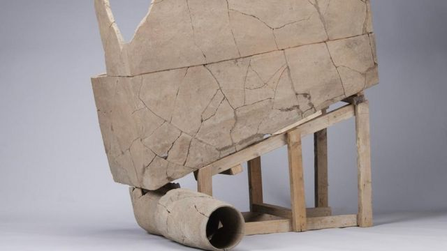
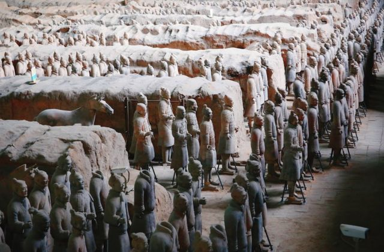
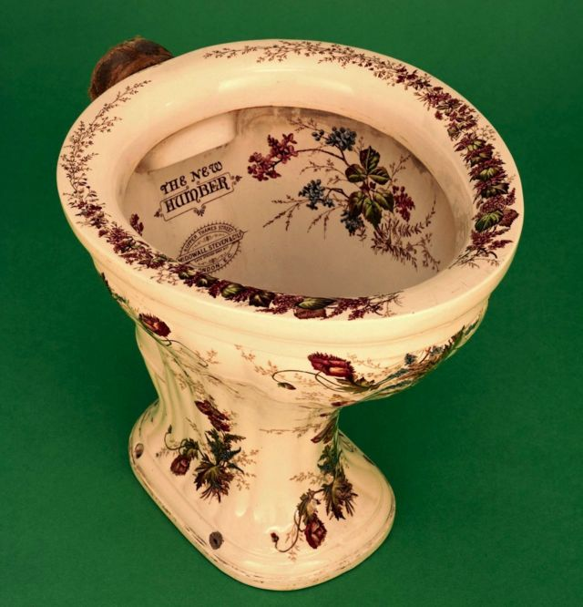
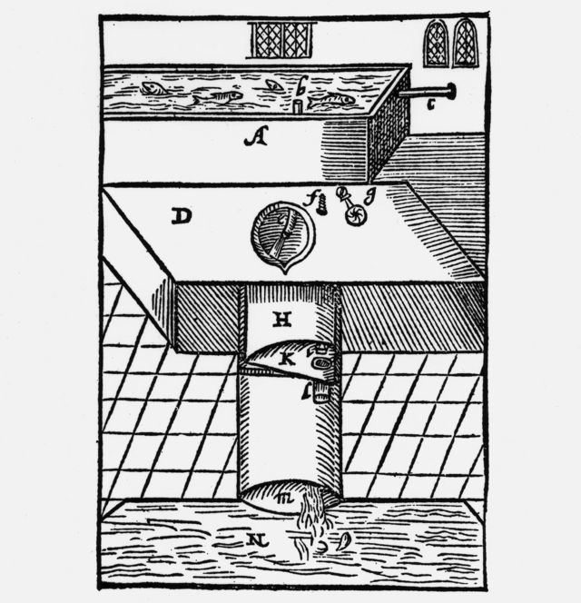
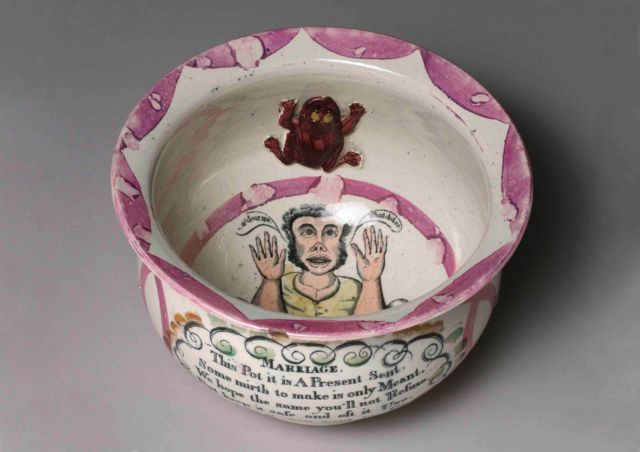
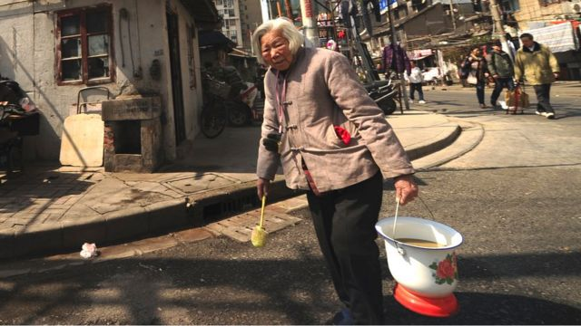
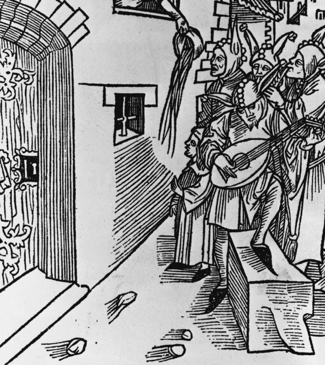

# [Chinese] 中国西安发现“世界最古老”的冲水马桶 盘点厕所的前世今生

#  中国西安发现“世界最古老”的冲水马桶 盘点厕所的前世今生

  * 阿赫曼·夸瓦加（Ahmen Khawaja） 
  * BBC国际台记者 

> 图像来源，  Chinese Academy of Social Sciences
>
> 图像加注文字，这是世界上最古老的冲水式厕所吗？

**中国的考古学家说，他们发现了据信是世界上最古老的冲水式厕所。**

这个冲水厕所的历史估计在2200年至2400年之间，可追溯到古代战国时期到汉朝初期。

科学家在陕西省西安市的考古挖掘中发现了厕所的便箱和下水管。

> 图像来源，  Getty Images
>
> 图像加注文字，陕西西安，是发现了兵马俑的古城。

据中国官方媒体报道，去年夏天，栎阳考古遗址的一个研究小组发现了厕所的破损部件和弯曲的冲水管。

中国社会科学院考古研究所研究员刘瑞告诉中国媒体说：“这是中国有史以来第一个也是唯一一个出土的冲水式马桶。”

学者们说，他们在栎阳古建筑群的一座宫殿废墟中挖掘两座大型建筑时发现了这个厕所。

> 图像来源，  Getty Images
>
> 图像加注文字，最新发现的冲水式厕所使用的时代可能是秦始皇统治中国的时代。考古学家认为这类马桶供帝王使用。

“现场的每个人都很惊讶，然后我们都大笑起来。”

##  “奢侈品”

这一发现的细节于上周公布，引发了广泛兴趣，并为了解中国古代统治精英相对先进的生活水平提供了难得的见解。

> 图像来源，  Getty Images
>
> 图像加注文字，英国维多利亚时代的社会因为建造了管道污水处理系统接受了华丽的厕所。

研究人员形容这一厕所是“奢侈品”，可能是高级官员甚至中国皇帝专用的。考古学家说，每次使用时，仆人可能会将水倒入其中。

##  厕所有什么秘密？

> 图像来源，  Getty Images
>
> 图像加注文字，约翰·哈灵顿（John Harington）在其1596年的讽刺小册子中首次描述的冲水马桶式样，展示了现代冲水马桶的两个元素：冲水系统和阀门

科学家们希望找到微小的粪便颗粒进行分析。

这可以让他们了解当时人们的饮食情况。

该研究所发表的公告表示，这项研究是了解中国古代考古工作的一部分，包括了解古代人们如何生活以及如何建造城市。

##  重写历史

这一发现很有趣，因为现代抽水马桶的发明通常归功于1860年代英格兰的托马斯·克拉珀（Thomas Crapper）。

> 图像来源，  Getty Images
>
> 图像加注文字，在冲水式厕所问世之前，家家户户使用这种便盂。盂身外题为"婚姻"的打油诗写道："这个送你们的新婚礼物，目的是让你们开心，希望你们不会拒绝，敬请保它安全并经常使用"。

然而，历史学家记录说，几个世纪前，英国女王伊丽莎白一世是第一个使用冲水式厕所的人。

她的教子约翰·哈灵顿爵士于1592年为她发明了座便器（WC）。它有一个凸起的水箱，用杠杆将水倒入便池中。排泄物通过下水管冲洗冲走。

1775年，制表师亚历山大·卡明斯（Alexander Cummings）研发出在便池下装一种S形管。这样扭曲的管道可以利用其中的水阻止下水道中的恶臭弥漫至室内。

现在许多地方使用的马桶确实采用的是克拉珀的设计， 他使用的是更简单但非常有效的U形弯管来取代S形弯管。

##  现代中国厕所

> 图像来源，  Getty Images
>
> 图像加注文字，2013年，习近平成为中国主席的那一年，一位上海老人将自家的便桶提到公共厕所去。

在现代中国的许多地方，人们要用上冲水式厕所仍然是一个问题。

在上任初期，中国领导人习近平曾承诺要让中国发生“厕所革命”，改善农村的卫生状况。

##  厕所出现之前的日子

在管道和冲水式厕所出现之前，全世界人们要解决如厕问题要么走到室外找个方便之处，要么找个容器，如马桶、便盆、便盂等等。

> 图像来源，  Getty Images
>
> 图像加注文字，“小心粪从天降”：粪便从便盂中扔到一个试图在窗外唱小夜曲来吸引女孩的追求者身上。

在那些后来设计出现代坐式马桶的国家，曾几何时，许多人常常把马桶中的粪便从窗户倒出去，并大声发出警告......所以要小心粪从天降！

