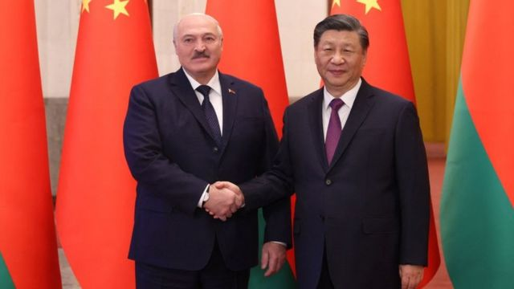
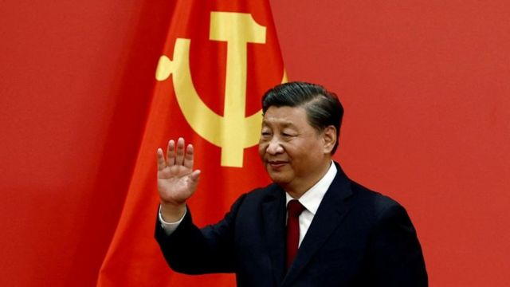

# [Chinese] 卢卡申科访华：中国和白俄罗斯对和平解决乌克兰问题“极感兴趣”

#  卢卡申科访华：中国和白俄罗斯对和平解决乌克兰问题“极感兴趣”

  * 黄晓恩（Tessa Wong）和乔治·赖特（George Wright） 
  * BBC记者 

> 图像来源，  AFP via Getty Images

**中国和白俄罗斯两位领导人表示他们对和平解决乌克兰问题“极感兴趣”。**

中国国家主席习近平和白俄罗斯总统亚卢卡申科（Alexander Lukashenko）是俄罗斯总统普京（Vladimir Putin，普丁）的亲密盟友，他们在北京会谈后共同发表了这一声明。

卢卡申科说，白俄罗斯“完全支持”北京关于停止乌克兰战争的计划。

中国上周宣布了一项和平谈判的计划，呼吁尊重国家主权。

卢卡申科此次访问北京，是在中国最高外交官员王毅会见俄罗斯总统普京后的几天。

卢卡申科和习近平的会晤也恰逢美国国务卿布林肯（Antony Blinken）在中亚国家展开访问之际，布林肯也与这些国家在讨论乌克兰战争的情势。

##  “对和平方案极感兴趣”

白俄罗斯国家通讯社贝尔塔（BelTa）报道，中国和白俄罗斯周三（3月1日）就乌俄冲突表示“深表关切”，并称对“尽快在乌克兰建立和平极感兴趣”。

但卢卡申科在为俄罗斯入侵乌克兰提供协助，观察家们认为他的此次北京之行是中国向俄罗斯及其盟友靠拢的另一个迹象。

此外，白俄罗斯领导人赞扬了中国的和平计划。

北京公布的这份“十二点文件”敦促尊重“所有国家的主权”。但它没有明确表态称莫斯科必须从乌克兰撤军。文件并谴责使用“单边制裁”，这亦被分析为对乌克兰的西方盟友们的含蓄批评。

卢卡申科说他完全支持关于全球安全的这份倡议。他还告诉习近平，政治决策“首先应着眼于防止滑向没有赢家的全球对抗”。

不过，中国的这份和平计划在西方普遍不被信任。

乌克兰总统泽连斯基（Volodymyr Zelensky）说他同意该计划的部分内容，并说这是中国愿意参与峰会的一个信号。到目前为止，北京尚未公开回应泽连斯基关于召开有关峰会的呼吁。

根据中国公布的有关习近平与卢卡申科会晤的官方资料，习近平呼吁摒弃“所有冷战思维”; 他还说，各国“应该停止将全球经济政治化”，并“做有助于停火、停止战争以及和平解决的事情。”

卢卡申科为期3天的访问，发生在去年北京9月提升了与白俄罗斯关系的地位之后，彼时在乌克兰的战争已经开打好几个月了。

中国外交部的声明将两国的关系描述为“全天候全面战略伙伴关系”，这是北京一个罕见的外交词语，目前它只用于另一个国家——巴基斯坦。

根据BBC国际媒体观察部（BBC Monitoring）的分析，这意味着现在白俄罗斯在中国对外国际关系盟友中，排名很靠前，仅次于俄罗斯。

##  俄罗斯的重要盟友

事实上，从冲突一开始，白俄罗斯就一直是俄罗斯的重要盟友，当时白俄罗斯还允许莫斯科利用白俄罗斯与乌克兰的边界作为攻击基辅的平台，但最终失败。

与此同时，中国试图通过声明支持乌克兰和俄罗斯各自的国家主权利益和安全，表现出中立。

> 图像加注文字，习近平呼吁“摒弃所有冷战思维”。

但北京也拒绝谴责莫斯科，并以间接方式支持俄罗斯。根据多项分析，中国官方媒体积极宣传莫斯科发动这场战争的观点。

此外，中国政府强烈否认美国上周提出的有关北京“正在考虑”提供武器弹药给俄罗斯的说法。

当中国外交部发言人汪文斌在被问及这些指控时说：“从不接受美国对中俄关系指手画脚，甚至胁迫施压。”

美国还指控一些中国公司向俄罗斯提供两用技术——包含可用于民用和军用的物品，例如无人机和半导体晶片。

周三的访华之行是在美国做出自己的外交努力之际展开的，布林肯访问了哈萨克斯坦和乌兹别克斯坦。在乌兹别克斯坦的一次演讲中，他指出这场战争“引起了整个地区的深切关注”，并强调了美国对主权的承诺。

“毕竟，如果一个强国愿意用武力抹去主权邻国的边界，有什么能阻止它对其他国家做同样的事情呢？中亚各国都明白这一点，”布林肯说。

中亚五国（哈萨克斯坦、吉尔吉斯斯坦、塔吉克斯坦、土库曼斯坦和乌兹别克斯坦）都是前苏联加盟共和国，与俄罗斯和中国有贸易往来。但他们在战争期间基本保持中立，遵守西方制裁，并对俄罗斯入侵同样属于前苏联加盟共和国的乌克兰表示不安。

