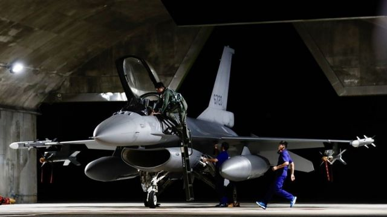
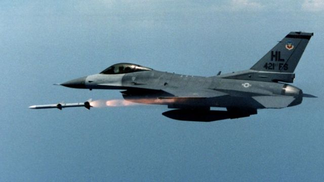
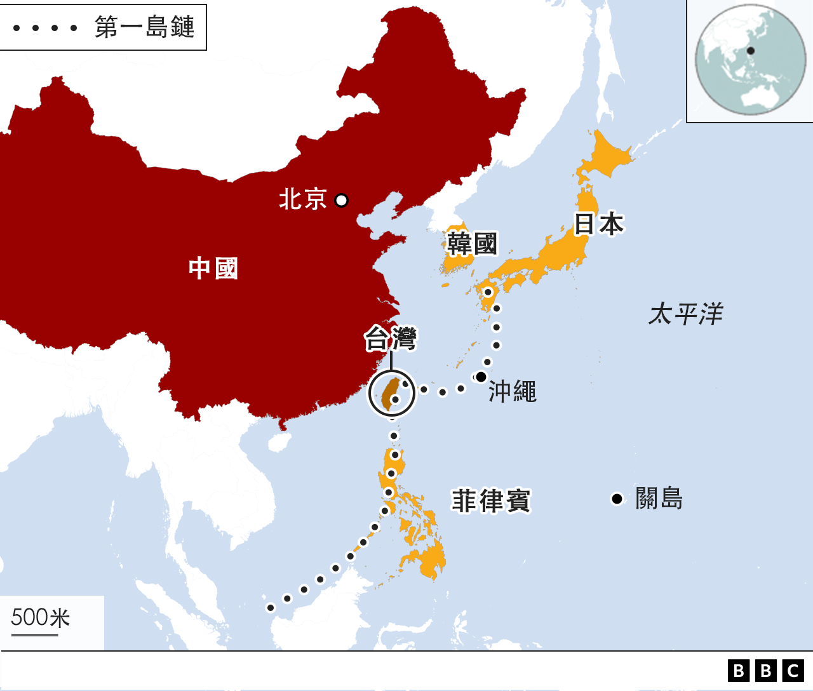
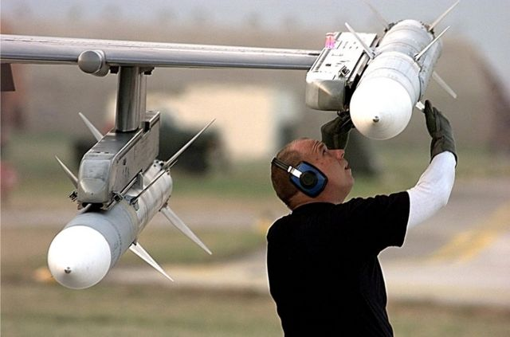

# [Chinese] 台海情势： 拜登第九度对台军售 “F-16”战机导弹有何战略意义

#  台海情势： 拜登第九度对台军售 “F-16”战机导弹有何战略意义

  * 吕嘉鸿 
  * BBC中文 

> 图像来源，  EPA
>
> 图像加注文字，台湾花莲空军基地内，台湾空军一架“F-16V”战机准备执行夜间起飞任务。

**美国国务院批准了一笔总值6.19亿美元（约新台币189.5亿）的对台军售，其中包括供美式“F-16”战机使用的“AGM-88B”等两款导弹，数量上百枚，引人瞩目。这是美国总统拜登就任以来，第九笔对台军售。**

此笔提议已进入知会美国国会的程序，路透社 报导  ，此案可能进一步加剧中美之间的紧张关系。

中国外交部发言人毛宁在周四（3月2日）记者会上回应称，中方“敦促美方停止对台售武及相关军事联系，停止为台海局势制造紧张因素。”

中国国防部新闻发言人谭克非周五在回应美对台军售案时表示，“美方行径粗暴干涉中国内政”，“严重违反‘一个中国’原则和中美三个联合公报特别是‘八一七公报’规定，严重损害中国主权和安全利益”。

谭克非还表示，中国军方“始终严阵以待，随时回击一切谋‘独’挑衅和外部势力干涉，坚决捍卫国家主权和领土完整”。

台湾智库“国防安全研究院”苏紫云博士对BBC中文表示，以台湾的立场分析，这笔订单中的“AGM-88B”、“AIM-120-C8”导弹都是美国空军现役“第一线装备”，甚至美军自身也正在逐步升级中，技术先进。

他认为，白宫同意将此类精密武器出售给台湾，应当是为了落实美国《国防授权法》将台湾视为“非北约主要盟友”的精神，“因此，才能依照美国《武器出口法》将敏感科技武器给台湾。”

##  军售内容

> 图像来源，  USAF/Getty Images
>
> 图像加注文字，美国犹他州希尔空军基地第421战斗机中队的一架“F-16”在空中发射“AIM-120”先进中程空对空导弹（美国空军资料照片）。

根据美国国防部周四（3月2日）发布的新闻稿，美国政府于当地时间3月1日就“AGM-88B”、“AIM-120C”等二型飞弹、金额达6.19亿美元的对台军售案，进行“知会国会”程序，可望1个月后正式生效。

根据路透社，订单中“AIM-120C-8”导弹是美国空军现役中最先进的中程空对空导弹，射程达160公里，这是首次售予台湾，将是台湾射程最远的空对空导弹。

苏紫云博士告诉BBC中文，从技术层面来看，“AIM-120C8”具备更敏锐的“寻标头”用以对抗高速巡弋飞弹或匿踪战机等低雷达截面积（Radar Cross- Section）目标，同时进行离轴攻击模式。

他说，该导弹具备更强大的电子“反反制能力”，在高强度的电子战场中能辨别诱饵并攻击目标。

而“AGM-88B”是美国空军最新款反辐射飞弹。根据公开资料，此款导弹的控制段除了全球定位系统（GPS）、先进惯性导航系统外，也同步升级任务电脑的性能，用于整合导航与寻标器，撷取敌方电磁讯号资料等。

苏紫云说，该导弹延伸射程达180公里，具备最先进的广频域搜寻能力，可有效对抗各类相位阵列雷达。

不过，两款导弹的主要军火商——美国雷神技术公司（Raytheon Technologies Corp.）和洛克希德马丁公司（Lockheed Martin Corp）不久前被中国商务部宣布列入不可靠商业实体清单，该公司在中国的相关业务遭到制裁。

##  台湾空军“F-16”战机

据美国媒体报导，至2022年，台湾空军在役的“F-16V”（Block 20）战机总计141架。2026年，等从美国采购的订单全部交付，台湾将拥有207架“F-16V”（Block 70）战机，将是全球拥有此款战机数量最多的一支空军。

根据过往军购资料，“F-16”战机一直是台湾的美军购案中经费及重要性最高的部分。2019年，台湾国防部称，台湾购买的“F-16V”单机价格为1.217亿美元，合约新台币37亿元。

> 图像来源，  USAF/Getty Images
>
> 图像加注文字，美国空军“F-16”战机在安装“Aim-120”先进中程空对空导弹（美国空军资料照片）。

针对此次购买的“F-16”导弹，苏紫云分析，对台湾军方而言，此次美国对台军售百枚反辐射飞弹，可使台湾军队在执行防卫任务时得到更多战略弹性。他告诉BBC中文说，这种反辐射飞弹搭配各类长程反制武器可用于反制敌军地面、甚至水面船舰的雷达。

他还举例说，200枚“AIM-120-C8”搭配“F-16V”的“AESR”主动相位雷达，或可更有效压制中具有匿踪能力的解放军“歼-20”战机，或是可压制敌方自动化指挥系统（C4ISR）的战场管理能力，打乱敌军作战节奏，维持战场纵深。

台湾国防部则说，这次美方同意供售的这两型飞弹，均为台湾空军“已完备作战能力”的弹种，并针对部分功能强化升级——目的是“备战而不求战，自助而助人”。

但是，美媒《华盛顿邮报》3月1日刊出一篇 报导  称，美国批准洛克希德马丁公司承包的66架“F-16”战机订单，将在2026年全部交付，届时台湾将有200多架“F-16”第四代战机，数量在印太地区数一数二。

但该报强调，台湾空军目前飞行员人数面临严重短缺，需补进约100名飞行员来驾驶新交付的“F-16”战机。但根据台湾立法院数据，台湾空军2011至2019年共新增21名飞行员。

台湾淡江大学战略研究所揭仲教授告诉该报说，台湾军方的高级飞行员，还需负责训练新兵和拦截解放军军机，未来三年很难弥补飞行员的短缺，因此飞行员的负担会更重。

此外，近来在乌克兰战争中，基辅”以小博大“的不对称战略抵御俄罗斯奏效，台湾军事界也开始有声音传出，是否要转向购买更便宜更精准的小规模武器，而非将军费花费在昂贵的军武，譬如“F-16”战机等。

无论如何，一笔接着一笔的美台军售，象征着台海情势持续紧绷。

根据日本媒体《日经亚洲》（Nikkei Asia）上周刊出的 报导  ，继美国智库后，日本“笹川和平基金会”（Sasakawa Peace Foundation）智库发表兵推结果，称如果日本和美国介入台海战争，或许能防止北京占领台湾，但也要付出兵力和设备等十分惨重的代价。

兵推结果显示，胜败关键在于中国解放军的军事物资补给中断，美日将最终取得台海制空权。兵推设定为北京试图在2026年发起两栖作战入侵台湾，参与兵推的人员包括前日本自卫队军官及日本和美国的相关研究人员。

