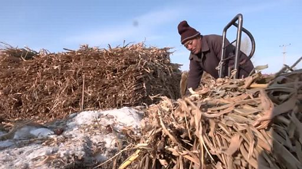

# [Chinese] 中国东北“锈带”陷养老金危机

#  中国东北“锈带”陷养老金危机

**中国东北“锈带”陷养老金危机**

70岁的退休农民王凤琴（音译）住在黑龙江省鹤岗。过去几个月，为了节省费用，患有糖尿病的她一直避免去医院治疗。尽管生活并不富裕，每月她和丈夫仍然将养老金中的大部分存下来留给两个儿子。

71岁的王占凌（音译）住在黑龙江省佳木斯市，尽管已超过国家法定退休年龄10年，他每日仍要工作10个小时。每月100元不到的养老金，让他不得不打零工维持生计。

黑龙江是中国东北“锈带”的一部分，这里曾是中国最重要的工业基地。但上世纪90年代，一场市场改革改变了这里的命运。年轻人纷纷涌向南方寻找工作机会，留下的人不足以为当地政府的养老金提供支持。近年来当地老龄化问题严重，新生儿出生率持续走低，一场经济和人口危机正在来临。

影片来源：路透社Reuters

