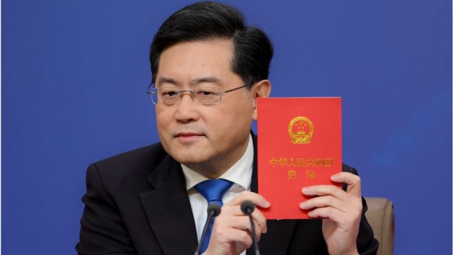
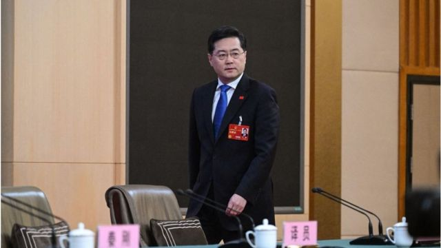
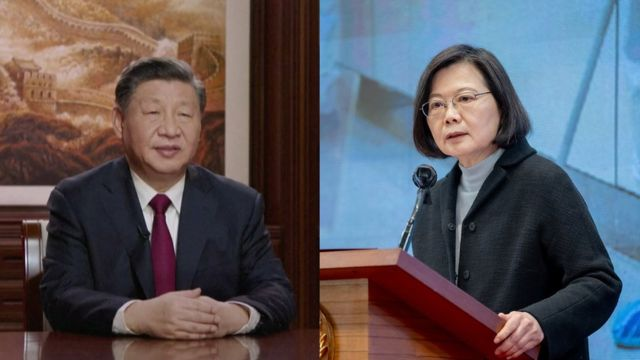
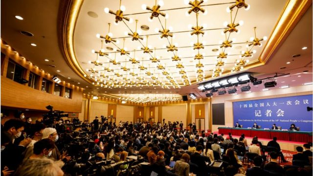

# [Chinese] 中国两会：新任外长秦刚强硬回应中美气球事件，称中俄关系是典范

#  中国两会：新任外长秦刚强硬回应中美气球事件，称中俄关系是典范

**中国一年一度两会召开，新外长秦刚首次亮相记者会。作为60后中国外交高官的他在去年年底由中国驻美大使升任为外长。**

这次记者会持续近两个小时，秦刚回答了14个问题，涉及近期热点，如中美气球风波、俄罗斯入侵乌克兰、台湾问题、战狼外交等。

> 图像来源，  Getty Images
>
> 图像加注文字，秦刚

##  中俄关系

俄罗斯入侵乌克兰已超过一年。近日，中共中央政治局委员、中央外办主任王毅访俄并与俄罗斯总统普京会面。普京提到期盼中国领导人习近平访俄，再度引发外界对中俄关系深化的猜想。而中国在俄罗斯入侵乌克兰一周年前夕发布《全球安全倡议概念文件》，并在周年纪念日当天发布解决乌克兰危机的中国立场文件，一系列动作让外界关注。

这次记者会上，中俄关系自然是中外记者关注的焦点。

秦刚在回应两国关系发展走向时称，中俄成功走出了一条大国战略互信、邻里友好的相处之道，树立了国际关系的典范，“有的国家习惯用冷战结盟的滤镜看中俄关系，看到的不过是自己的倒影。”

他还指出，中俄关系建立在不结盟、不对抗、不针对第三方基础上，既不对世界上任何国家构成威胁，也不受任何第三方的干扰和挑拨。

“中俄携手，世界多极化和国际关系民主化就有了动力，全球战略平衡与稳定就有了保障。世界越是动荡不安，中俄关系越应稳步向前。”他说。

秦刚没有回应习近平访俄的问题。

##  中美关系

今年2月，中国气球出现在美国领空，中国方面强调气球是民用性质，但美国认为气球是用来进行情报活动。

秦刚在回应气球事件时强硬指责美国违反国际法精神和国际惯例，“有罪推断，过度反应，滥用武力，借题发挥”。

他认为，美国对华认知和定位出现了严重偏差，把中国当成最主要对手和最大地缘政治挑战。“美方声称要‘竞赢’中国但不寻求冲突。但实际上，美方的所谓‘竞争’，就是全方位遏制打压，就是你死我活的零和博弈。”

> 图像来源，  Getty Images

“美方所谓要给中美关系‘加装护栏’、‘不冲突’，实际上就是要中国打不还手，骂不还口，但这办不到！如果美方不踩刹车，继续沿着错误道路狂飙下去，再多的护栏也挡不住脱轨翻车，必然陷入冲突对抗。”秦刚说。

秦刚希望，美国政府消除“威胁膨胀”的战略焦虑，摒弃零和博弈的冷战思维，拒绝“政治正确”的无端绑架。

##  台湾问题

在谈到台湾问题时，秦刚拿出了一本《中华人民共和国宪法》。他说，知道今天肯定要谈台湾问题，特别带来这本宪法。

他引用该宪法序言中的两句话：“台湾是中华人民共和国的神圣领土的一部分。完成统一祖国的大业是包括台湾同胞在内的全中国人民的神圣职责。”

> 图像来源，  CCTV, Taiwan's Presidential Office

他指出，台湾问题是中国核心利益中的核心，是中美关系政治基础中的基础，是中美关系第一条不可跨越的红线。“台湾问题之所以产生，美国负有不可推卸的责任。我们之所以同美国谈台湾问题，是要求美方不要干涉中国内政。”

秦刚还拿乌克兰与台湾对比：“中国人民有权问：为什么美方在乌克兰问题上大谈尊重主权和领土完整，却在中国的台湾问题上不尊重中国的主权和领土完整？为什么一边要求中国不向俄罗斯提供武器，一边却长期违反《八一七公报》向台湾售武？”

此前， 美国国务卿布林肯警告说  ，中国公司已经向俄罗斯提供“非致命性支持”（non- lethal support）。而且最新的信息表明北京也在“考虑”提供“致命性支持”（lethal support）。

《八一七公报》指1982年两国签署的一份联合公报，但其中没有美国完全停止向台湾售武的内容。

##  战狼外交

> 图像来源，  Getty Images

近年来，由于中国外交言论举措开始从谨慎保守的风格转变为更强硬地主动对抗，被外界形容为“战狼外交”。这次记者会上，秦刚回答《海峡时报》记者提问时表示，所谓“战狼外交”就是一个话语陷阱，制造这个话语陷阱的人，要么不懂中国和中国外交，要么无视事实，别有用心。

“中国外交有足够的厚道与善意，但当豺狼挡道、恶狼来袭，中国的外交官必须‘与狼共舞’，保家卫国。”秦刚说。

