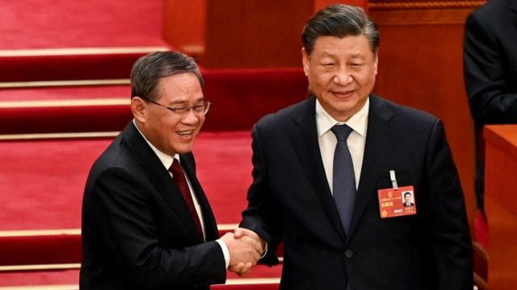
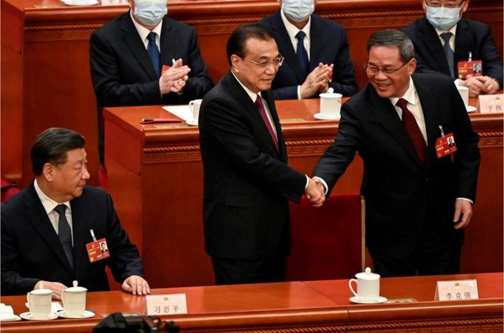
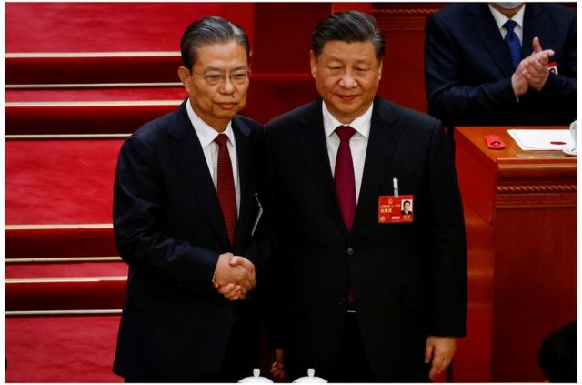
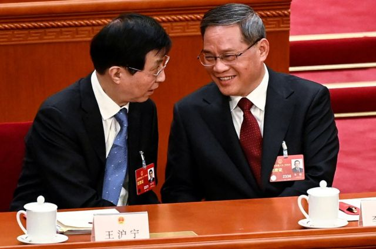
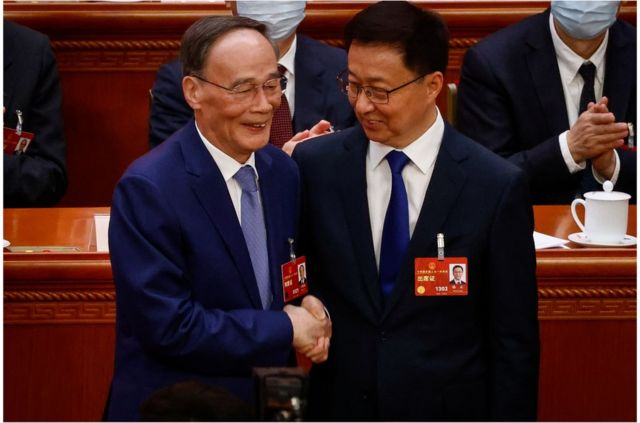
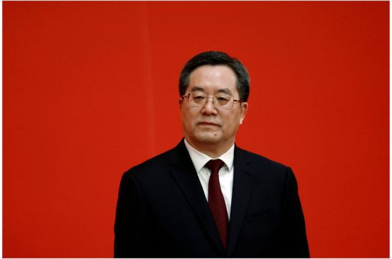
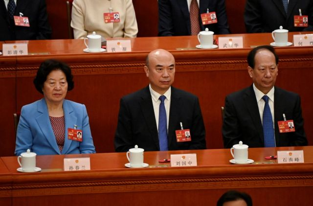
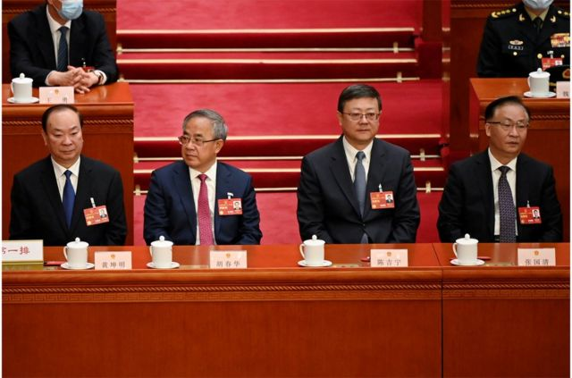
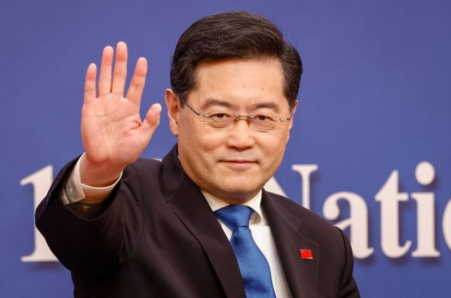
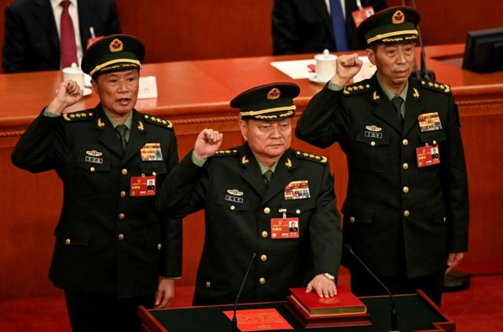

# [Chinese] 中国新一届政府领导班子的新老面孔

#  中国新一届政府领导班子的新老面孔

> 图像来源，  AFP via Getty Images
>
> 图像加注文字，中国国家主席习近平（右）与新任总理李强（左）握手。

**随着中国“两会”走向尾声，中国在政府层面完成了领导层换届。习近平继续担任国家主席，而他在去年“二十大”上提拔的亲信李强不出意外地接替李克强，担任国务院总理。**

在周日（3月12日）举行的人大会议中，副总理、部长和国务委员的人选也尘埃落定。

让我们来看看大权在握的习近平如何安排国防、安全和外交等重要方面的人事，新执政团队中又有哪些新、老面孔？

點擊此處展開

##  習近平的新班底有哪些人

點擊照片查看更多信息

  *  

李強

李強成為中國第八任國務院總理。63歲的他是習近平團隊的核心幕僚之一，2000年代初， 習近平主政浙江時李強擔任其秘書長。他後來主政江蘇和上海。 儘管去年上海因新冠疫情封城期間頻發的民生危機讓其領導力廣受質疑，但這仍無阻他在去年中共「二十大」上晉升為中共黨內排名第二的常委，緊隨習近平之後。

  *  

趙樂際

中共「二十大」後留任政治局常委的趙樂際，擔任全國人大常委會委員長。 65歲的趙樂際仕途開始於中國西部的青海和陝西省。在習近平的第一個任期內（2012-2017），他擔任中央組織部部長，負責幫助處理黨政高層人事任免，包括填補當時因反腐運動而導致的大批幹部空缺。2017年，他接任王岐山擔任中紀委書記，輔佐習近平查處孫力軍、傅政華等人。

  *  

王滬寧

王滬寧是 「二十大」上留任的另一位常委，他出任全國政協主席。 學者出身的王滬寧被認為是中共多代領導人的撰稿人和理論智囊，2017年晉升常委後擔任中央書記處第一書記兼中央精神文明建設指導委員會主任，是習近平的國家政策顧問，並主管意識形態工作。

  *  

韓正

68歲的韓正沒有留任常委，但深受習近平信任的他接替王岐山，出任更多是禮儀性的職位——中國國家副主席。 韓正曾長期在上海工作，被視為是一位務實派官員。他在2017年躋身政治局常委，隨後擔任常務副總理，主要協助習近平主管港澳事務。在此期間，他督導鎮壓了香港聲勢浩大的「反送中」抗議，推動設立港區《國安法》。

  *  

丁薛祥

60歲的丁薛祥是習近平的親密助手。在「二十大」後晉升常委的他出任國務院常務副總理，儘管他從未主政過任何一個省市。 早在2007年，丁薛祥曾與習近平在上海短暫共事，2013年被調任中共中央辦公廳副主任，2017年升任主任，成為習近平的首席幕僚長。他曾多次陪同習近平在國內外訪問。

  *  

何立峰

在中共「二十大」上進入政治局委員行列的國家發改委主任何立峰出任國務院副總理，接棒劉鶴成為下一任「經濟沙皇」，處理中國的經濟、金融和工業事務。 68歲的他曾在福建長期工作，1980年代他曾是習近平的屬下。2014年，他成為負責規劃中國經濟運行的國家發展改革委的副主任，2017年升任主任。

  *  

秦剛

前中國駐美大使秦剛在去年12月底突然被任命為外交部長，他與已升任中央外事辦主任的前外長王毅共同處理中國的外交事務。他在此次「兩會」上兼任國務委員。 秦剛曾擔任過外交部新聞發言人，熟悉國外媒體運作，他還曾負責禮賓事務，多次陪同習近平出訪，被視為是深得習近平信任的幕僚之一。

  *  

王小洪

65歲的王小洪於去年6月接任公安部長。在此次「兩會」上，他兼任國務委員。 王小洪曾是習近平在福建的舊部，兩人相識近20年。2015年，王小洪轉任北京公安局局長。去年中共「二十大」上，他兼任中央書記處書記，標誌著他權力的進一步鞏固。

  *  

李尚福

「二十大」上公佈的中央軍委四名委員中，65歲的李尚福排名第一。他接替魏鳳和擔任國務委員兼國防部長。 值得注意的是，2018年，美國曾因中國軍隊向俄羅斯購買武器，對當時主管裝備工作的李尚福實施制裁，有分析認為，北京讓李尚福接任防長，有向華盛頓「示威」之意。

  *  

劉國中

60歲的劉國中在此次「兩會」上晉升副總理。他預計將接替孫春蘭，主管衛生工作。劉國中出身軍工。1990年代進入政界後，他的仕途從中國東北的黑龍江開始。2013年，他調任全國總工會任副主任。 2016年至2022年，他分別在四川、吉林和陝西擔任地方大員。2022年的「二十大」上，他以陝西省委書記的身份躋身中共中央政治局委員。

  *  

張國清

張國清在此次「兩會」上晉升副總理。這名58歲的官員曾是中國最大的武器製造商之一中國兵器工業集團總經理，被稱為「兵工少帥」。 在2012年薄熙來事件爆發後不久，他突然「空降」重慶，擔任重慶市委副書記，2017年擔任市長，幾個月後調任天津市長。2020年他開始主政遼寧 ，並在去年「二十大」上進入中共中央政治局。

##  李强

> 图像来源，  Reuters
>
> 图像加注文字，3月11，在北京举行的中国全国人民代表大会第四次全体会议期间，在习近平的注视下，中国前总理李克强（中）与新当选的总理李强（右）握手。

李强成为中国第八任国务院总理。63岁的他是习近平团队的核心幕僚之一，2000年代初， 习近平主政浙江时李强担任其秘书长。他后来主政江苏和上海。

尽管去年上海因新冠疫情封城期间频发的民生危机让其领导力广受质疑，但这仍无阻他在去年中共“二十大”上晋升为中共党内排名第二的常委，紧随习近平之后。

##  赵乐际

> 图像来源，  Reuters
>
> 图像加注文字，赵乐际（左）与习近平（右）握手。

中共“二十大”后留任政治局常委的赵乐际，担任全国人大常委会委员长。

65岁的赵乐际仕途开始于中国西部的青海和陕西省。在习近平的第一个任期内（2012-2017），他担任中央组织部部长，负责帮助处理党政高层人事任免，包括填补当时因反腐运动而导致的大批干部空缺。2017年，他接任王岐山担任中纪委书记，辅佐习近平查处孙力军、傅政华等人。

##  王沪宁

> 图像来源，  Reuters
>
> 图像加注文字，王沪宁（左）与李强（右）交谈。

王沪宁是 “二十大”上留任的另一位常委，他出任全国政协主席。

学者出身的王沪宁被认为是中共多代领导人的撰稿人和理论智囊，2017年晋升常委后担任中央书记处第一书记兼中央精神文明建设指导委员会主任，是习近平的国家政策顾问，并主管意识形态工作。

##  韩正

> 图像来源，  EPA
>
> 图像加注文字，王岐山（左）与韩正（右）握手。

68岁的韩正没有留任常委，但深受习近平信任的他接替王岐山，出任更多是礼仪性的职位——中国国家副主席。

韩正曾长期在上海工作，被视为是一位务实派官员。他在2017年跻身政治局常委，随后担任常务副总理，主要协助习近平主管港澳事务。在此期间，他督导镇压了香港声势浩大的“反送中”抗议，推动设立港区《国安法》。

##  丁薛祥

> 图像来源，  Reuters

60岁的丁薛祥是习近平的亲密助手。在“二十大”后晋升常委的他出任国务院常务副总理，尽管他从未主政过任何一个省市。

早在2007年，丁薛祥曾与习近平在上海短暂共事，2013年被调任中共中央办公厅副主任，2017年升任主任，成为习近平的首席幕僚长。他曾多次陪同习近平在国内外访问。

##  何立峰

在中共“二十大”上进入政治局委员行列的国家发改委主任何立峰出任国务院副总理，接棒刘鹤成为下一任“经济沙皇”，处理中国的经济、金融和工业事务。

68岁的他曾在福建长期工作，1980年代他曾是习近平的属下。2014年，他成为负责规划中国经济运行的国家发展改革委的副主任，2017年升任主任。

##  刘国中

> 图像来源，  Reuters
>
> 图像加注文字，60岁的刘国中（中）在此次“两会”上晋升副总理。他预计将接替孙春兰（左），主管卫生工作。

60岁的刘国中在此次“两会”上晋升副总理。他预计将接替孙春兰，主管卫生工作。刘国中出身军工。1990年代进入政界后，他的仕途从中国东北的黑龙江开始。2013年，他调任全国总工会任副主任。

2016年至2022年，他分别在四川、吉林和陕西担任地方大员。2022年的“二十大”上，他以陕西省委书记的身份跻身中共中央政治局委员。

##  张国清

> 图像来源，  Reuters
>
> 图像加注文字，张国清（右一）在此次"两会"上晋升副总理。

张国清在此次“两会”上晋升副总理。这名58岁的官员曾是中国最大的武器制造商之一中国兵器工业集团总经理，被称为“兵工少帅”。

在2012年薄熙来事件爆发后不久，他突然“空降”重庆，担任重庆市委副书记，2017年担任市长，几个月后调任天津市长。2020年他开始主政辽宁，并在去年“二十大”上进入中共中央政治局。

##  秦刚

> 图像来源，  EPA
>
> 图像加注文字，秦刚在去年12月底突然被任命为外交部长，并在此次“两会”上兼任国务委员。

前中国驻美大使秦刚在去年12月底突然被任命为外交部长，他与已升任中央外事办主任的前外长王毅共同处理中国的外交事务。他在此次“两会”上兼任国务委员。

秦刚曾担任过外交部新闻发言人，熟悉国外媒体运作，他还曾负责礼宾事务，多次陪同习近平出访，被视为是深得习近平信任的幕僚之一。

##  王小洪

65岁的王小洪于去年6月接任公安部长。在此次“两会”上，他兼任国务委员。

王小洪曾是习近平在福建的旧部，两人相识近20年。2015年，王小洪转任北京公安局局长。去年中共“二十大”上，他兼任中央书记处书记，标志着他权力的进一步巩固。

##  李尚福

> 图像来源，  Reuters
>
> 图像加注文字，3月11日，中国第十四届全国人大一次会议在北京举行第四次全体会议。经投票表决，决定张又侠（中）、何卫东（左）为中央军委副主席。图右为李尚福。

“二十大”上公布的中央军委四名委员中，65岁的李尚福排名第一。他已接替魏凤和担任国务委员兼国防部长。

值得注意的是，2018年，美国曾因中国军队向俄罗斯购买武器，对当时主管装备工作的李尚福实施制裁，有分析认为，北京让李尚福接任防长，有向华盛顿“示威”之意。

