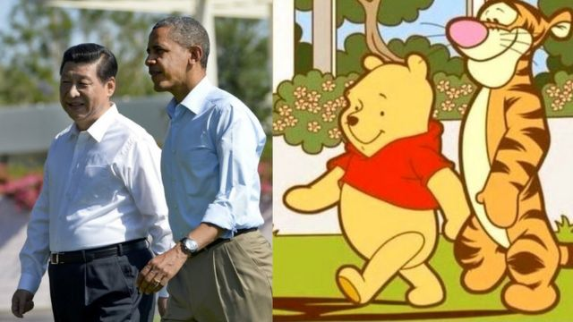

# [Chinese] 《小熊维尼：血与蜜》突取消香港和澳门公映

#  《小熊维尼：血与蜜》突取消香港和澳门公映

> 图像来源，  AFP/Weibo
>
> 图像加注文字，2013年，习近平和奥巴马一起走路的照片广为流传，很多网友创作了表情包。

电影《小熊维尼：血与蜜》的发行商“七柱娱乐”（VII Pillars Entertainment）表示，这部最新《小熊维尼》恐怖电影将不会在香港和澳门上映。

该公司对因此导致的“失望和不便”向香港和澳门观众致歉。

《小熊维尼：血与蜜》（Winnie the Pooh: Blood and Honey）于2月在美国上映，3月在英国上映。

近年来，小熊维尼的原始卡通形象曾被一些人用来表达对中国国家主席习近平的不满。

这一隐喻最早源于2013年。当时，一张中国领导人习近平和美国时任总统奥巴马（Barack Obama）在加州安纳伯格庄园会晤的图片广为流传，很多网友创作了表情包，将他们比喻为动画人物“小熊维尼”和好友“跳跳虎”。

自那以后，中国的审查人员开始对A·A·米尔恩（A. A. Milne）创作的这个角色进行审查。2018年，电影《挚友维尼》（又译：《维尼与我》；Christopher Robin）在中国被禁。

香港电影、报刊及物品管理办事处否认该电影受到审查，表示已经为这部恐怖片颁发了许可证。

该部门对路透社表示，它不会对有关这部电影的商业决定发表评论。

然而，该片导演里斯·弗拉克-沃特菲尔德（Rhys Frake- Waterfield）告诉路透社：“电影院之前同意放映它，然后一夜之间所有独立的电影院都做出了同样的决定，这不会是一个巧合。”

“他们声称是出于技术原因，但并不是。这部电影已经在全球4000多家影院银幕上放映。只有香港的这三十多块银幕出现了这种问题。”

这部恐怖片在电影评级网站“烂番茄”（Rotten Tomatoes）上仅得到4%的评分。它把以善良和诚实著称的熊描绘成一个挥舞着复仇之斧的半人半熊的角色。

此前，当其预告片一经发布，就在网上引起热议。

去年1月，当米尔恩创作的首个小熊维尼故事在美国的95年版权到期，进入公有领域，弗拉克-沃特菲尔德得以拍摄这部电影。

但在20世纪60年代拥有该角色卡通版权的迪斯尼（Disney）公司仍然拥有部分权利。在商标法下，这只小熊不能在恐怖片中穿上标志性的红色T恤。

“我们也不允许让他说‘噢，好烦’之类的话，”弗拉克-沃特菲尔德上个月告诉BBC。

“在这些方面，我们需要注意不要侵犯他们的品牌和领地，因为这不是我们的意图。”

“我们的目的并不是窃取他们的版权并将其占为己有。而是从它本身就是公开可用的这一点出发，进行无厘头的改编，做出这个可怕的替代版本。”

