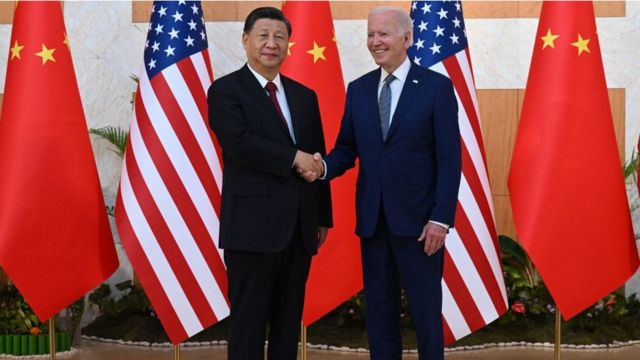
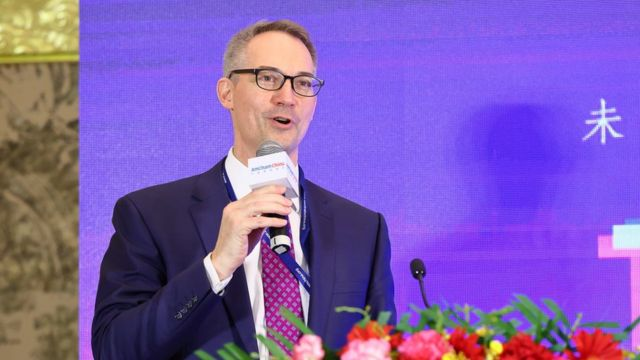
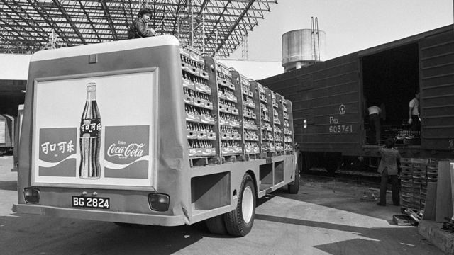
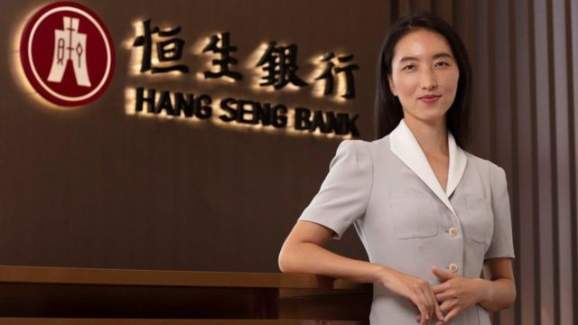

# [Chinese] 美国企业对在中国开展业务“更加消极”

#  美国企业对在中国开展业务“更加消极”

  * 乔纳森·约瑟夫斯（Jonathan Josephs） 
  * BBC商业记者 

> 图像来源，  AFP
>
> 图像加注文字，美国总统拜登和中国国家主席习近平于去年11月在印度尼西亚举行的G20峰会上会面，但两国仍存在诸多分歧。

**中国美国商会（AmCham China）总裁表示，美国企业对在中国开展业务的态度“比过去很长一段时间都更加消极”。**

随着世界上最大的两个经济体之间的紧张关系继续加剧，中国美国商会总裁何迈可（Michael Hart）表示，这种较量“使商业变得非常具有挑战性”。

习近平主席和拜登总统的政府似乎在越来越多的问题上存在分歧，从乌克兰到新冠疫情，从台湾到Tiktok，以及半导体。

这反映在中国美国商会对其900多家会员企业的最新年度调查中。该调查首次显示，55%的多数企业不再将中国视为前三大投资重点之一，即它们应投资发展业务的地方。

去年，认为“双边关系的不确定性”是其在中国面临的主要挑战的企业上升了10%，达到66%。与此同时，认为中国对外国公司的欢迎程度降低的企业也增加到49%。

> 图像来源，  AmCham China
>
> 图像加注文字，何迈可表示，美国企业对在中国开展业务的态度“比过去很长一段时间都更加消极”。

五年前，时任美国总统特朗普（Donald Trump）以知识产权盗窃和贸易逆差在内的“不公平贸易行为”为由开启贸易战，对600亿美元的中国商品加征关税。

中国兑现了其承诺，同样加征关税进行报复。

##  建立在贸易基础上的关系

中国美国商会的成员包括耐克（Nike）、英特尔（Intel）、辉瑞（Pfizer）和可口可乐（Coca-Cola）等美国最成功的企业。

1978年12月，时任领导人邓小平宣布对外开放，可口可乐成为首家进军共产主义中国销售其产品的美国消费企业。从那时起，贸易一直是两国关系的核心。

> 图像来源，  Getty Images
>
> 图像加注文字，自1979年1月可口可乐的第一批饮料从香港运往中国大陆以来，可口可乐一直是在中国的美国公司的先驱。

何迈可表示，美国企业对当前美中关系的悲观情绪反映了这几年的动荡不安。

“在经历了三年的新冠疫情后，企业真的很累。”他补充说。他还强调了其他一些问题，包括差旅变得更加困难、劳动力成本上升、高管们“不愿意”接受前往中国的委派、政治压力，以及中国对于经商来说变得更不可预测。

尽管存在这些困难，但数据显示，两国之间的贸易去年创下6906亿美元的历史新高。

康奈尔大学（Cornell University）全球贸易政策教授、国际货币基金组织（IMF）中国区前负责人埃斯瓦尔·普拉萨德（Eswar Prasad）认为，这种相互依赖对全球经济的健康构成重要意义。

> 图像来源，  Getty Images
>
> 图像加注文字，康奈尔大学全球贸易政策教授普拉萨德教授表示，美中贸易关系对更广泛的全球经济至关重要。

“现实情况是，中国确实需要大量产品，尤其是来自美国的技术产品，而美国确实有很多公司的供应链涉及中国。”他说道。

“这对全球经济很重要，因为这两个国家不仅对供应链至关重要。全球贸易的基调也是由这两国之间的关系决定的。”

世界贸易组织（WTO）本应通过维护全球贸易规则来保持这一基调的和谐。

然而，去年12月，拜登政府强硬地拒绝了世贸组织两项对中国有利的裁决，其涉及前总统特朗普作为其贸易战的一部分征收的关税。美国表示，这些关税是基于国家安全而征收的，世贸无权就这些问题作出裁决。

根据彼得森国际经济研究所的数据，总体而言，66.4%的美国自中国进口商品和58.3%的中国自美国进口商品仍需缴纳关税，几乎没有迹象显示双方会降低关税。

普拉萨德教授表示：“美国处理与中国关系的方式，可能导致美国和中国同意的基于规则的全球贸易体系恶化。”

他补充称：“如果美国开始退出与多边机构的接触，这对全球治理来说不是好兆头。”

##  供应链困难

美中关系恶化还意味着越来越多的美国公司正考虑将供应链转移到中国境外。苹果通过在中国生产大量iPhone，已成为全球最赚钱的公司之一，但它现在越来越多地在印度等国生产。

然而，上海的恒生银行（中国）首席经济学家王丹表示，这对解决中美紧张关系的影响有限。

“即使美国成功地建立了一条替代供应链，这条替代供应链仍将在很大程度上依赖于中国。”她说。

> 图像来源，  Dan Wang
>
> 图像加注文字，王丹认为，即使西方公司将供应链从中国转移出去，它们仍无法摆脱对中国的依赖。

王丹解释说，其他国家仍将依赖中国的零部件，尤其是在绿色能源、医疗技术和电子产品等行业。

虽然美国企业并没有完全回避中国，但何迈可表示，“它们正试图降低其供应链风险”。他补充称：“因此，它们正在采取更多的‘中国+1’战略，它们意识到不能再依赖中国。”

由于新冠疫情限制措施影响了商业活动，中国去年经济增长率已放缓至3%。在最近的中国全国人大上，新总理李强表示现在这些措施已经取消，今年的目标是5%的增长，但实现该目标依然不易。

王丹表示：“北京方面仍希望美企在中国投资，我认为这种态度短期内不会改变。”

何迈可补充道，庞大的中国消费市场可能仍是美国企业“最乐观”的地方。麦当劳（McDonald's）、星巴克（Starbucks）和拉尔夫·劳伦（Ralph Lauren）等公司都有在华扩张的重大计划在进行。

##  国家安全问题

然而，所有的这一切都是在两国对国家安全的担忧（主要集中在技术方面）的背景下发生的。

国安担忧导致拜登政府采取越来越多的措施，试图阻止中国获取美国技术，其中包括试图限制美国半导体制造商在中国的新投资。

两国都在努力增加当局认为的对全球经济未来至关重要的技术的支持。

拜登总统在上月的国情咨文演讲中说：“我已经向习近平主席明确表示，我们寻求竞争，而不是冲突。”

“我不会为我们投资让美国更强大而道歉。投资于美国的创新，投资于将界定未来而且中国政府意图主导的产业。”

然而，这种做法在北京并不受欢迎，习近平主席最近表示，“以美国为首的西方国家对我实施了全方位的遏制、围堵、打压，给我国发展带来前所未有的严峻挑战”。

这种较量正越来越多地影响到独立的公司个体，并蔓延到全世界。

由于美国压力，中国电信巨头华为已经在多国受到限制，德国是最新考虑采取行动的国家。与此同时，社交媒体平台Tiktok在美国受到全面禁用的威胁，在英国也面临限制。

普拉萨德教授表示，美中之间的所有这些摩擦意味着“紧张氛围肯定高涨”，而其代价可能远远超出美国和中国的范畴。

“世界上最大的两个经济体加起来约占全球GDP的40%，它们之间不断升级的敌意可能会带来更多的波动和不确定性，这是已经脆弱的世界经济现在最不需要的东西。”他说道。

