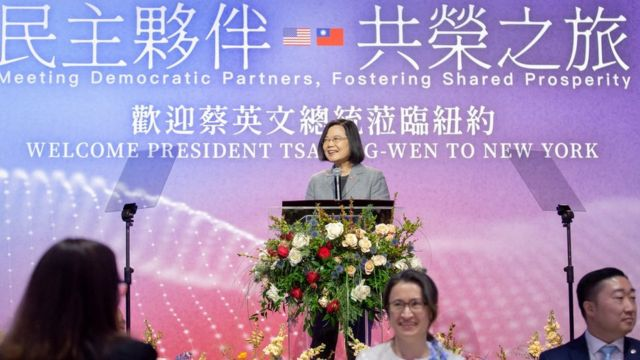
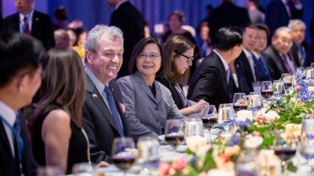
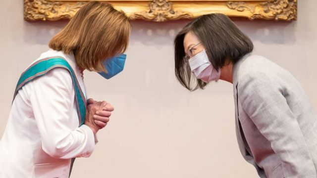

# [Chinese] 台湾总统蔡英文过境美国：有望突破惯例晤麦卡锡，但为何美台都“保持低调”

#  台湾总统蔡英文过境美国：有望突破惯例晤麦卡锡，但为何美台都“保持低调”

  * 李澄欣 
  * BBC中文记者 

> 图像来源，  Reuters

**台湾总统蔡英文3月29日展开疫情后首次、为期10天的外访行程，到中美洲邦交国危地马拉和伯利兹，去程和回程分别过境美国纽约和洛杉矶。这是她三年多以来首次到访美国，也是连任台湾总统后的首次。台湾即将在明年进行下一任总统大选。**

她预计将在洛杉矶与麦卡锡（Kevin McCarthy）会面，为台湾总统首次在美国国土与美国众议长会面，也将是中美1979年建交以来，台湾领导人在美国进行的最高级别面对面会晤。

北京对此强烈抗议，而美方一直没有证实“蔡麦会”的相关安排，都引发各方解读。

##  拜登政府保持低调

美国国务院亚太事务助理国务卿康达（Daniel Kritenbrink）29日原本要对蔡英文过境事宜进行简报，但简报会开始前不到40分钟通知传媒延后，其后宣布取消。白宫国安会战略沟通协调官柯比稍早也表示，这次不会安排行政部门官员与蔡碰面。

> 图像来源，  Reuters
>
> 图像加注文字，蔡英文在纽约与新泽西州州长墨菲共同出席活动。蔡此次过境美国的重头戏可能是在返程时经过洛杉矶的时候。

而在蔡英文出访前，美国国家安全顾问苏利文（Jake Sullivan）和美国国务卿布林肯（Antony Blinken），分别于24日及30日与中共中央政治局委员、中央外事工作委员会办公室主任王毅通电话。

“这反映美国的行政部门非常谨慎地玩这个游戏，”澳洲国立大学亚太学院讲师宋文笛对BBC中文说，“美国行政、立法分权，拜登政府不希望（蔡英文见麦卡锡）牵扯到白宫，尤其是美中两国正研究让布林肯重启访华行程的可能性。”

布林肯2月初因气球事件推迟访华，美中关系被认为陷入低谷，3月底传出美国国务院中国事务协调办公室的副助理国务卿华自强（Rick Waters）低调访问香港、上海及北京等地，与学术界及商界人士会面，外界解读是为布林肯重启访华行程铺路。

美国德州的山姆休士顿州立大学政治系副教授翁履中对BBC中文表示，民主党政府面对经济挑战，不能不考虑中美贸易和债务问题，拜登政府不想刺激中国，仍希望通过外交手段解决中美问题，“在美中角力下，台美关系已经逼近美国支持台湾的极限。”

他续指，美国鹰派为了抗中而全力支持台湾，共和党高调安排议长会见蔡英文，“如果到时出现变数就比较需要担心，代表连共和党都担心操作过头。”

台湾淡江大学国际事务与战略研究所教授黄介正指出，美国很愿意强化与台湾的交流，也愿意给予蔡英文相当的礼遇，“但想要彰显美台关系良好的这种想法，很可能还是要从属于美国自己估算大国竞争，还有如何控管与中国关系的风险。”

他认为，在美中竞争和俄乌战争下，美国目前更关注中俄关系走向，担心美国国家安全受到挑战，“这方面的重要性，会远高于政治人物的象征性会面。”

##  蔡英文的折衷

蔡英文此次访问行程名为“民主伙伴共荣之旅”，是她自2016年上任台湾总统以来，第七次过境美国。她在纽约曼哈顿出席侨宴时指，台湾遇到国际压力不挑衅、不屈服，展现自我防卫的决心。她感谢拜登政府九度宣布对台军售，依据《台湾关系法》及“六项保证”落实对台湾的安全承诺。

根据行程，她30日受华府保守派智库哈德逊研究所之邀，获颁“全球领导力奖”，4月5日回程时将停留加州洛杉矶，在雷根（里根）总统图书馆演讲，预料与美国众议院议长麦卡锡和至少20名国会议员见面。

今年一月传出麦卡锡拟春季访问台湾，曾引起北京强烈反弹。《金融时报》3月初引述台湾官员称，蔡英文说服麦卡锡改为在加州会晤，而不是台北，以免过度刺激北京，重演去年8月美国时任众议长佩洛西（Nancy Pelosi）访台时解放军大规模军演的局面。

台湾东海大学政治系教授邱师仪向BBC中文表示，中共军演导致台海局势紧张，间接导致主打“抗中保台”牌的民进党在去年11月“九合一”地方选举中惨败，如果麦卡锡访台引起更大规模军演，恐不利民进党在2024年总统大选的选情，因此蔡政府提出在美会晤麦卡锡的折衷方案。

学者黄介正也认为，两人在美会面是“变通的做法”，但即使如此也不代表麦卡锡往后不会访问台湾，“中间很多高层谈判的细节外界都不清楚，只能用猜的。”

##  会晤麦卡锡会不会再次激怒北京？

尽管“蔡麦会”可能采取折衷方案进行，北京还是强烈抗议，日前洪都拉斯（宏都拉斯）与台湾断交、改与中国建交，就被视为一种惩罚手段。

中国政府已多次发出严正抗议，外交部发言人毛宁30日在例行记者会上表示，坚决反对台湾地区领导人以任何名义和理由“窜美”，批评台美相互勾连，以过境为幌子“安排蔡英文在美从事政治活动”，妄图借此提升美台官方往来和实质关系。

中国国台办此前警告，蔡英文如果与麦卡锡接触，将是又一次严重违反“一个中国”原则，破坏台海和平稳定的挑衅，中方必将采取措施坚决回击。

不过分析普遍预料，北京这次的反制行动可能集中在外交及经济层面，军事回应将有限度，后果不及去年8月裴洛西访台严重。

> 图像来源，  Getty Images
>
> 图像加注文字，外界预计，即使蔡英文此次过境与众议长麦卡锡会面，中方的反应可能也不会像前议长佩洛西访问台湾时那样激烈。

台湾国安局长蔡明彦在立法院表示，美中台共同利益是防止意外事件发生，三方都有紧密交流，包含台美之间、美中之间，来控管不必要的危机爆发，加上蔡英文过境美国期间与麦卡锡会晤，相比两人在台见面的政治复杂性低。

他还表示，多国领导人正在中国访问，包含马来西亚、新加坡、西班牙、法国元首和欧盟执委会主席，北京此时展开激烈军事动作并不恰当，但他不排除解放军会在蔡英文返台期间在台海集结，“他现在就正在南海进行兵力集结跟演训。”

政治学者宋文笛指出，北京要考虑战略利益，包括“第三方受众”（third party audience）如欧洲，现时欧洲各国忙于处理乌克兰危机和疫情后的经济复苏，不乐见台海局势升温，而在美台降低挑衅性、“蔡麦会”在美进行的情况下，“如果北京仍选择相当于甚至超过佩洛西访台时的报复，那么美国和台湾将引用北京的反应，来抢占其他政府眼中的道德高地，并描绘北京为贪得无厌、难以合作的政权。”

另一方面，蔡英文过境美国，正值台湾前总统马英九在中国大陆进行历史性“祭祖”访问行程期间，“如果北京军事升级，会浪费掉这个强调两岸友谊的难得机会，换来的却只是稍微削弱蔡英文访美的效果。”

学者翁履中亦指出，基于马英九访问大陆，北京即使有军事动作也可能等蔡英文返台之后。“如果现在就采取行动，等于直接打脸马先生和呼吁两岸和平共处的国民党，代表北京认为：在野党没机会也没能力改变台湾抗中的趋势。”

