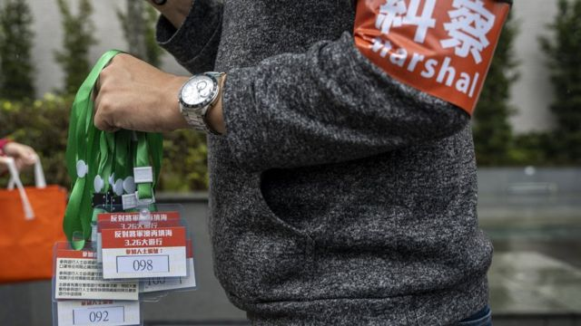
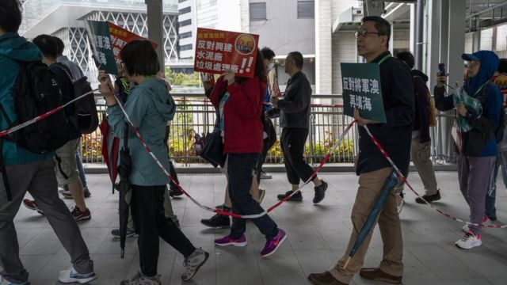
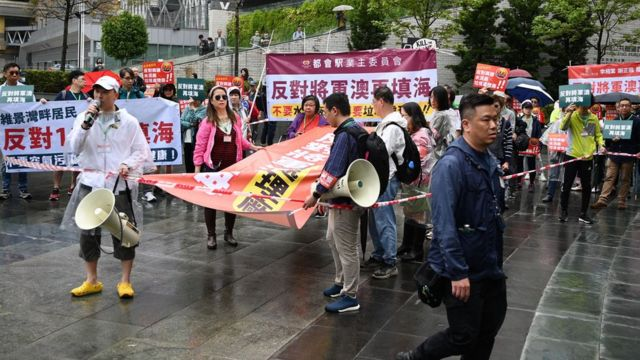
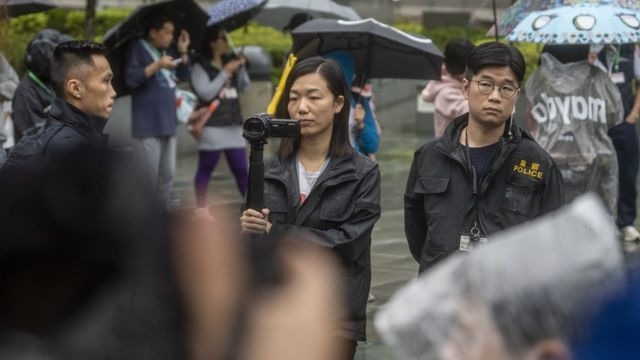

# [Chinese] 香港“挂绳游行”成新常态 《国安法》下“游行之都”的殒落

#  香港“挂绳游行”成新常态 《国安法》下“游行之都”的殒落

  * 李澄欣 
  * BBC中文记者 

> 图像来源，  NurPhoto

**一行人被封锁线围着，颈项挂上号码牌，每个参加者都有一个独立编号。他们在众多警察监督之下游行，高喊着预先批准的口号。**

这些并不是游街示众的罪犯，而是正在行使“集会自由”的香港市民。此情此景出现在昔日有“游行之都”之称的香港，引起各界哗然。

在过去两个周末，香港接连有超过十场集会游行活动，是疫情“限聚令”解除后首批，也是《国安法》自2020年6月实施后的首批获警方批出"不反对通知书”的活动。

警方施加了前所未见的要求，包括严格规定参加者的服饰及加入《国安法》条款。有主办方形容相关限制荒谬和极度侮辱，挂牌如同“犹太人戴臂章”。

港府保安局局长邓炳强回应称，有关识别不带有贬义或歧视，强调不会秋后算账。他批评有人把挂牌做法形容为“挂狗绳”，是“刻意抹黑警方”，目的是要挑动市民对特区政府的不满和仇恨，危害国家安全。

有学者预料，警方的限制措施会常态化，长远改变香港游行文化。

##  “游行之都”有了新规

> 图像来源，  Getty Images
>
> 图像加注文字，警方要求游行人士拉着封锁线自我围封，参加者说感到极大侮辱

4月2日的多场集会游行多数是宗教性质、庆祝和筹款活动。警方对每一个活动均施加国安条款，列明必须符合《香港国安法》，确保不会构成不利国家安全。

当局对部份活动施加服饰限制，如在杭州旅港同乡会主办的“喜迎杭州第19届亚运会”集会及游行，以及发展局海滨事务委员会主办的庆祝复活节游行，都要求所有参加者穿着大会上衣、贴上识别贴纸，或戴上主办方提供的帽子及襟章。

多家教会举办“棕枝主日”巡游，活动中参加者必须手持棕枝。另外，有至少5个活动被警方要求参加者遵从《禁止蒙面规例》，不准戴口罩。

一星期前的3月26日，有新界将军澳居民发起反对填海的游行，警方要求所有参加者佩戴号码牌，禁止佩戴口罩和穿黑衣，并压低人数上限在100人。过程中，整条游行队伍被包围着，市民不能够中途插队加入，传媒也不能在游行队伍当中采访。

主办人陈展浚事后在电台节目批评有关做法不合理，参加者感到被标签，好像“被人圈养的猪”、“犹太人戴臂章”，沿途有些队伍外的居民想加入声援，却不敢参与。

陈透露，警方事前检视所有游行相关的屋苑通告、脸书帖文和标语，“每一条banner（横额）都要看过”。他反问：“要做那么多才批准游行，究竟《基本法》赋予我们的权利是不是已经有一个新的解释？”

##  “挂牌游行”会否常态化

> 图像来源，  Getty Images
>
> 图像加注文字，主办方原本申请300人游行，警方把人数限制在100人，不让队伍外的市民中途加入

根据《基本法》第27条，香港居民享有结社、集会、游行、示威的自由。

保安局长邓炳强被问到“挂牌”等游行条件会否常态化时表示，现时社会表面上平静 ，但仍有人想趁有活动举办时“挑动乱子”，作危害公众安全的行为。他说当局会因应新的社会环境作风险评估，如有需要会采取有效措施。

香港社会政策及公共行政学者钟剑华对BBC中文分析指，以往香港公民社会百花齐放，市民可以充分表达意见，现时警方扩大权力并没有法律基础，而且“比中国大陆去得更尽”，但当局以“国安”帽子压下批评声音。

他预料有关限制措施会变成常态，长远是为了改变香港的游行文化。“想慢慢培养一种认知，就是你要接受警察是会看你的口号、要挂牌，甚至要你实名制。这样，政治诉求就不能毫无顾虑地表达，不会有反对政府的游行，只剩下那些呼应政府的活动——到时候他（港府）可以向全世界说，香港仍然有集会自由啊，只不过是那些（反对政府的）人自己不搞罢了。”

在邓炳强开腔定调前的一周，香港主流媒体都曾对警方安排提出质疑。

> 图像来源，  NurPhoto
>
> 图像加注文字，游行在警察录影监督下进行

香港《信报》政治专栏“余锦贤”指出，警方施加的限制忽视了“相称性”，文章引述民主派人士称，担心“挂牌”只是第一步，游行实名制才是警方的最终目标，并指相关针对性条款等同对“游行”两字添上负面标签，剥夺参加者“免于恐惧的自由”。

《明报》社论指警方矫枉过正、做法奇特，游行挂牌观瞻很差，参与者如有被侮辱之感，完全可以理解，“倘若‘挂牌游行’成为新常态，只会有损香港作为开放社会的形象，为他人所窃笑”。

网媒《香港01》评论文章也批评，客观上挂牌和拉封锁线的观感很不理想，“对集会游行的过度规管或许很稳妥，安全系数最高，但完全无助社会化解怨气”，呼吁官员面对民怨时应“直视问题，回答社会”。

中国官媒香港中通社则刊出建制派人士高松杰文章指，“上班要挂员工证、出席活动戴名牌”，一个人如果是光明正大，根本不用怕遵守任何规则，因此“绝对支持香港警方合情合理合法的决定”。

