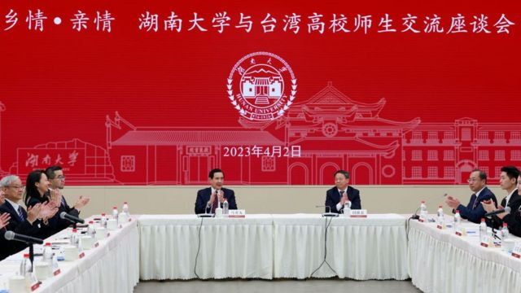
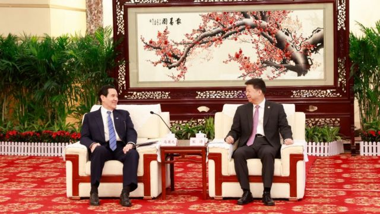
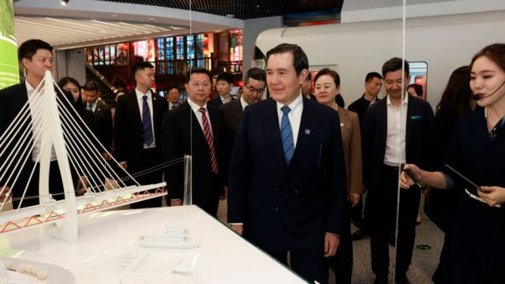

# [Chinese] 马英九大陆之行接近尾声 他的新角色和引发的口水战

#  马英九大陆之行接近尾声 他的新角色和引发的口水战

> 图像来源，  Getty Images
>
> 图像加注文字，马英九在湖南大学说，在中华民国宪法上两岸都是属于一个中国。“我们是台湾地区，你们是大陆地区。”

**台湾与洪都拉斯断交后，台湾前总统马英九3月底开始在大陆访问，一连到访上海、南京、武汉及重庆等地。他与中国国台办主任宋涛会面，也在湖南卫视高唱《月亮代表我的心》。不过他在长沙大谈“中华民国”和”一个中国“，引发与台湾陆委会的口水战。**

尽管马英九是1949年两岸分治以来首位访问大陆的台湾在任或卸任领导人，被视为历史性突破。但关注两岸局势的学者对BBC表示，这次访问大陆对两岸关系与明年台湾大选不会有太大影响，他能否接替连战成为“两岸新桥梁”，在如今的内外情势下仍有待观察。

##  与陆委会的口水战

马英九12日的行程涵盖上海、南京、武汉、长沙、重庆，除了在湖南有部分返乡祭祖的私人行程外，他到访多个涉及中华民国时期的历史纪念馆，如孙中山纪念馆、辛亥革命武昌起义纪念馆等。

上周日，马英九还在湖南大学与大陆学生开展座谈。台湾《中国时报》报道称，马英九说：“中华民国宪法增修时，中国是两个部分；同时在中华民国的两岸人民关系条例第二条有定义什么叫做台湾地区，什么叫做大陆地区。前者就是台澎金马，大陆地区就是台澎金马以外的领土。”

“所以不论是在台湾，在大陆，在中华民国宪法上都是属于一个中国。我们是台湾地区，你们是大陆地区。”马英九说。

马英九也讲到了大陆对“一个中国”的定义，称在大陆1983年《宪法》前言里，台湾是中国不可分割的一部分，这是事实很清楚。他认为，尽管两岸分属两边，双方有各自的制度、各自的政策，但是希望大家努力减少不必要的隔阂，让双方能够真诚的交流。

《中国时报》指出，当时台湾学生大声鼓掌，还有人叫好，而陆方学生则略显尴尬，只是礼貌性拍拍手。

国民党将马英九此次两岸论述形容为“擦亮中华民国招牌”和“坚定捍卫国家主权”，但大陆官方媒体未报道他的阐述。马英九的论述却引发了与台湾陆委会的口水战。

陆委会指，中华人民共和国宪法声称“台湾是中华人民共和国的神圣领土的一部分”，马英九在中国大陆“将我国宪法与之相提并论”，还诠释为两岸均坚持“一个中国原则”，不仅矮化台湾，更严重悖离台湾从未属于中华人民共和国的事实，伤害国家主权尊严。

“马前总统唱和呼应中共企图侵吞台湾的‘一中原则’主张，完全与台湾民众认知背道而驰，我们表达高度遗憾。”陆委会称。

而马英九办公室回击，陆委会是在公然倡议两国论，严重违反中华民国宪法，并请总统蔡英文表态这是否为政府立场？如果是，请宣布裁撤陆委会，公开承认中国大陆是另一个国家。

陆委会又回应，中华民国是主权国家，台湾从来就不是中华人民共和国的一部分，中华民国与中华人民共和国互不隶属。

纽约州立大学奥尔巴尼分校政治学教授陈澄认为，马英九身为“中华民国”前总统，说大陆和台湾同属中华民国不奇怪。

> 图像来源，  Getty Images
>
> 图像加注文字，马英九与中国国台办主任宋涛在武汉会面。

“实质上，这就是‘一中各表’的一种论述，”陈澄对BBC指出，“然而在台湾现政府早已不接受‘九二共识’的情况下，马的这种表述并没有什么实际的意义，大陆政府自然也不予置评。”

华盛顿大学国际研究学院助理教授林于翔也对BBC指出，“台湾地区和大陆地区都属于中华民国”这个说法代表国民党长期的看法。

“不过，最近台湾民意逐渐地不赞成这个看法，所以这个说法我认为是给大陆听的。虽然北京不承认‘中华民国’这个机构，可是‘中华民国’还是代表一种‘中国’的概念，而且对北京来说比‘台湾民国’好多了，”他说。

台湾师范大学政治学研究所教授范世平在社交媒体发表评论指，马英九想凸显的是“一中两府”，一个中国有两个政府，这个中国的主权是中华民国与中华人民共和国相互重叠的，但中国却认为一个中国只有中华人民共和国所独享，“所以马根本是一厢情愿，反而落入中国的‘一中’圈套。”

##  大陆行的意义

在马英九开启大陆访问行程前，洪都拉斯（宏都拉斯）宣布与台湾断交，随后与中国建立外交关系。这使得与台湾建交的国家进一步减少到13个，自蔡英文当选以来，已有9个国家与台湾的中华民国政府断交。

断交事件也给马英九的行程带来负面影响，许多台湾人认为他不应该在此时出访大陆，即使马英九此次行程多半为祭祖和交流。

林于翔认为，马英九这次访问大陆对两岸关系与台湾大选不会有太大的影响，虽然马英九是台湾前总统，但他并不能引领国民党的未来。

“我认为他的访问属于国民党已存在的外交政策，这个外交政策就是发展国民党和共产党的关系，证明国民党可以和中华人民共和国政府有和谐的对谈，”林于翔说。

> 图像来源，  Getty Images

陈澄也认为，马英九这次以私人名义访问大陆，在缓和两岸关系，台湾明年大选方面的影响都比较有限。

“洪都拉斯最近和台湾断交，与大陆建交，应该是已经酝酿一段时间了，与其说马英九这次的访问与此有关，不如说是希望和蔡英文访美及其可能和美议长举行的会谈形成一定的对冲，一方面向大陆表示台湾不只是有‘台独’，另一方面也向岛内展示国民党有能力缓和两岸关系，为国民党目前不被看好的选情注入一剂强心针。”

##  马英九的角色

据新华社报道，在与马英九会面时，中国国台办主任宋涛转达了中国领导人习近平对马英九的亲切问候，充分肯定了马英九为发展两岸关系作出的重要贡献。

台湾中央研究院前副研究员林泉忠发表评论指，马英九2016年卸任台湾总统后，北京考虑让他接替连战作为”两岸桥梁“的合适人选。

但他表示，马英九卸任后7年，两岸关系因民进党蔡英文上台及持续执政，发生了颇大变化，中美进入“新冷战”且迈向长期化的趋势日益明朗，“即使北京对马英九作为‘两岸新桥梁’的思考乃至部署没有改变，然而今后马英九是否能成功扮演北京所期待的角色，仍是未知之数”。

陈澄也认为，马英九这次的行程，展现了他对”中国人“身份的认同，能够赢得大陆一些民众的好感，但在台海大局上意义有限。

她指出，大陆目前对马此次访问的反应相对低调，并未派出高层官员接待，媒体报道，社媒热度均有限。官方更多的是关注执政的台湾总统蔡英文的访美动向，台湾很多人也视马为过气政客，对这次访问反应冷淡，“可见大陆政府对马，乃至国民党能够在两岸关系上扭转乾坤的可能已经不抱期望。”

