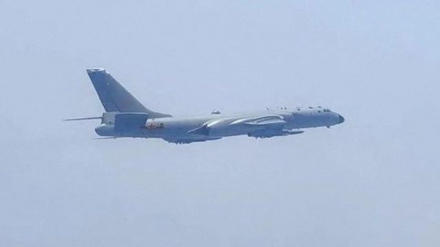
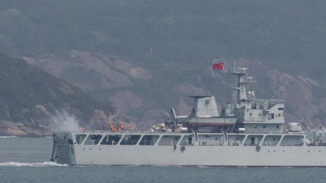

# [Chinese] 蔡英文过境美国后 中国进行环台湾军事演习

#  蔡英文过境美国后 中国进行环台湾军事演习

> 图像来源，  Reuters

**在为期三天的军事演习中，中国军队正在排练包围台湾。**

北京视台湾为中国的一个脱离省份，他们称这次行动是对台湾当局的“严厉警告”。

演习开始于台湾总统蔡英文从美国返回几小时后。

台湾国防部表示，71架中国军机和9艘船只越过台湾海峡中线。这条线是中国大陆和台湾领土之间的一条非官方分界线。

中国官方媒体称，军演将“同时组织围绕台湾岛的巡逻和推进，形成全方位包围和震慑态势”。

报道还说，中国军方也部署了“远程火箭炮、海军驱逐舰、导弹艇、空军战斗机、轰炸机、人为干扰发射机和加油机”。

中国《解放军报》引述东部战区新闻发言人施毅陆军大校称，演习是对“台独”分裂势力与外部势力勾连挑衅的严重警告，是捍卫国家主权和领土完整的必要行动。

许多中国网友认为，大陆军演并没有什么实质作用。但《环球时报》前总编胡锡进评论称，台当局惧怕解放军的大规模军演，他们担心这些军演会导致“擦枪走火”，也担心解放军围着台岛演练得战术上越来越成熟，摸透台军的反应机制。

台湾认为自己是一个主权国家，有自己的宪法和领导人。

但中国认为台湾是一个分离的省份，最终将被置于北京的控制之下，必要时将使用武力。中国领导人习近平曾说，必须实现与台湾的“统一”。

> 图像来源，  Reuters

尽管中国经常在台湾附近举行演习，但这次“包围”被视为对台湾总统蔡英文周三会见美国众议院议长凯文·麦卡锡（Kevin McCarthy）的回应。

美国国务院发言人说，美国正在“密切监视北京的行动”，并坚称，美国“在该地区拥有足够资源和能力，以确保和平与稳定，并满足我们的国家安全承诺”。

蔡英文周六表示，在台湾面临中国“持续威权扩张主义”的时候，她的政府将继续与美国和其他民主国家合作。

她在台北会见由众议院外交事务委员会主席迈克尔·麦考尔（Michael McCaul）率领的美国国会代表团时发表了上述评论。

麦考尔说，华盛顿正努力向台湾提供武器，“不是为了战争，而是为了和平”。

##  台湾反应

在台湾首都台北，居民们对中国大陆的最新举动似乎并未感到不安。

“我想很多台湾人现在已经习惯了，感觉就像，又来了！”吉姆·蔡说。

同时，迈克尔·庄（Michael Chuang）说：“他们（中国）似乎喜欢这样做，把台湾当成自己的然后环绕，我现在已经习惯了。”

“如果他们入侵，我们无论如何也逃不掉。我们将看看未来会发生什么，然后从那里开始。”

台湾国防部表示，将本着“不激化矛盾，不挑起争端，捍卫国家主权和安全”的原则，“以冷静、理性、严肃的态度”回应中国大陆的演习。

在蔡英文过境美国后，周五（4月7日）中国国台办发言人朱凤莲表示，中国决定对台湾远景基金会、亚洲自由民主联盟采取惩戒措施，禁止其负责人进入大陆和香港、澳门特别行政区，禁止大陆有关组织和个人与其进行合作。

朱凤莲称，这两家机构在民进党当局指使下，以民主、自由、合作为借口，打着学术交流、研讨等旗号，在国际上大肆兜售台独主张，极力拉拢贴靠反华势力，制造一中一台、两个中国等违反一个中国原则的事件，拓展台所谓国际空间。

去年8月，在麦卡锡前任南希·佩洛西（Nancy Pelosi）访问台北后，北京围绕台湾进行了近一周的演习。

此次演习是中国近年来最大规模的武力展示，包括战斗机和军舰部署，以及弹道导弹发射。

