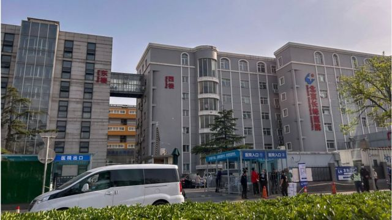

# [Chinese] 北京长峰医院：29死惨烈火灾遭遇8小时网络静默

#  北京长峰医院：29死惨烈火灾遭遇8小时网络静默

9 小时前

**北京长峰医院周二（4月18日）发生火灾，造成29人死亡。在火灾发生到官方通报中间的8个小时，中国网络对此事没有报道和讨论，但此事随后在中国网络引爆争议。**

##  事发经过

火灾事故在周二中午发生，但直到晚上近9时，官媒《北京日报》才发出了一篇情况通报。

《北京日报》的通报称，当天12时57分，丰台区消防救援支队接警：北京长峰医院住院部东楼发生火情。接警后，消防、公安、卫健、应急等部门即赴现场处置。13时33分许，现场明火被扑灭。

据北京市人民政府通报，截至4月19日9时，北京长峰医院火灾事故中29人身亡，其中26人为住院患者，1名护士，1名护工，1名患者家属。

《中国青年报》报道，在18日晚的火灾通报发出后，许多病人家属才知道起火的消息，他们想跟医院要一份死亡名单。但分诊台的工作人员说，要登记患者姓名，逐级上报，才能告知。

##  审查

在中国官方发布通报后，社交媒体开始流传一些火灾视频，但马上遭到审查，许多相关文章和视频被删除。

民众在社交媒体上表达对信息披露延迟和审查的不满。《环球时报》前总编辑胡锡进也在微博上表示：“到官方晚8点四十几分发布正式通告之前，网上关于这场火灾的信息很少有留存的，因此现在人们只看到了官方的文字通报，几乎搜不到有关这场火灾的照片和视频，我认为这不应该。”

> 图像来源，  Getty Images
>
> 图像加注文字，北京长峰医院火灾发生后的外墙和空调外机

但目前，在胡锡进的微博上已经看不到这条帖子。他随后又发文称：“在绝大多数情况下，舆论不会针对事故的发生本身产生真正的不满，有情绪也会是临时性的，因此第一时间的告知只会增加公众的信心，让大家更相信政府与自己确是同一利益共同体。”

“以前出了事是新闻记者第一到现场传回现场画面，对工作人员，消防人员等相关人员进行采访。现在就是转发政府的发文。”微博网民“小飞侠吃冒菜”说。

微博网民“手指头上淡淡的烟味V”也说：“出了事情，不遮遮掩掩，如实向公众报告，这才是负责任的做法！”

##  长峰医院

长峰医院微信公众号介绍称，集团是国内专注于血管瘤及脉管畸形诊疗的大型医疗集团，全国连锁医院近20家。

事故发生后，北京长峰医院院长王某玲、副院长汪某、总务科主任王某阳，施工公司负责人王某峰、现场施工人员程某君等12人，涉嫌重大责任事故罪被北京市公安局刑事拘留。

北京市消防救援总队表示，经初步调查，事故系医院住院部内部改造施工作业过程中产生的火花引燃现场可燃涂料的挥发物所致，具体原因和损失还在进一步调查。

> 图像来源，  Getty Images
>
> 图像加注文字，北京长峰医院

据界面新闻报道，长峰医院集团起家于2003年现任董事长汪文杰在湖北鄂州开创的第一家血管瘤专科医院，其扩展走的是并购收购模式。

《中国新闻周刊》引述接近长峰医院的医生指出，长峰医院疫情中亏损严重，近几年开始持续收治无法自理的失能老人，周边部分小区很多失能老人都被送到这里，这些老人行动不便，加剧了火灾逃生难度。

该医生还称，作为一家民办二级医院，长峰医院附近三公里内有多家大型公立三甲医院，要在这些大医院的夹缝中生存，长峰医院有自己的策略，会邀请一些北京公立医院的知名专家来坐诊。

