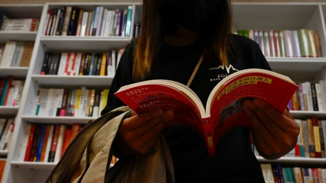
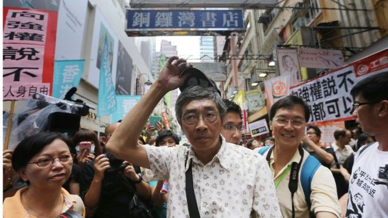

# [Chinese] 台湾八旗文化总编富察在上海失联 疑遭“秘密拘捕”

#  台湾八旗文化总编富察在上海失联 疑遭“秘密拘捕”

> 图像来源，  Getty Images

**台湾“八旗文化”出版社总编辑富察（本名李延贺）3月赴中国大陆探亲时，疑在上海被“秘密拘捕”，至今音信全无。**

“八旗文化”曾出版多部中国禁书，外界质疑是否遭到中国官方清算，并联想到香港“铜锣湾书店事件”。

富察失联的消息由其友人、中国大陆旅美作家贝岭4月20日在社交媒体率先披露，他呼吁上海警方包括国安系统及国保系统放人，让富察自由并返回台湾的家。该帖文已被删除，贝岭解释是家属希望低调营救。

台湾行政院长陈建仁4月21日回应事件时指，台政府会提供家属必要的关怀和协助。前一天，陆委会副主委詹志宏在记者会上透露富察“人是平安的”，指政府一直关注事态发展，但必须充分尊重家属意见，详情不便对外说明。

##  “铜锣湾书店”翻版？

> 图像来源，  Getty Images
>
> 图像加注文字，铜锣湾书店店长林荣基已流亡到台湾

中国大陆籍的富察长居台湾，是当地出版界名人，2019年曾获金石堂书店年度活动“出版风云人物”殊荣。

他所成立的“八旗文化”出版不少中国历史和政治题材书籍，部分被视为中国禁书，包括美籍华人裴敏欣的《出卖中国：中共官场贪腐分析报告》、何清涟的《红色渗透》、日本学者熊仓润的《新疆——被中共支配的七十年》等等。

据台湾中央社报道，富察赴大陆除了扫墓和探亲，也要处理户籍相关问题，上海官方部门回应称“目前没有听说这样的事”。

报道引述贝岭指，富察在新冠疫情前经常回大陆，近期许多台湾友人曾劝他暂时不要赴陆，他都以“我只是一个编辑”、“小咖（小角色）”回应，不以为意，是故低估了现时局势的复杂性。

贝岭指，希望台湾政府甚至是不久前访问大陆的前总统马英九，能努力促成富察返台。

这次事件令人联想到2015年的铜锣湾书店案件。该店是以贩售中国政治禁书闻名的香港独立书店，当时书店股东及员工包括吕波、桂民海、李波、林荣基、张志平等人突然失联，部分人据报是在泰国和香港被掳走到中国大陆。数月後，他们陆续被安排在中国官媒上“认罪”。

##  富察是谁？

富察是中国满族人，1971年出生于辽宁省鞍山市岫岩满族自治县，初中离家到沈阳读书，1990年代到上海求学，为华东师范大学文学博士，曾在上海文艺出版社任职副社长。

他与台湾籍太太结婚后，2009年依亲搬到台湾定居，加入读书共和国出版集团，并“内部创业”成立八旗文化出版社。据悉，富察2013年取得台湾居留证，但未入籍，目前仍持大陆户籍。

作者芳姿撰写的文章“当代知识分子富察”提到，富察是在1995年读博士班时认识了现在的台籍太太，两人2001年交往、2005年结婚，婚后仍分居两地。

文章透露，富察当时在上海为公职人员、共产党员，岳父起初很不能接受女婿是大陆人，反对两人婚事，后来“看到富察与苏贞昌、罗文嘉等人在一起，发现这个女婿其实是非典型共产党员，得意地说共产党现在做我女婿”。

文章指，富察之前在上海文艺出版集团，成果都属于国家和党，在台湾做出版业则让他深刻体会市场的存在，自由市场的环境下他需要跟很多人对话，而他很享受这个过程。

