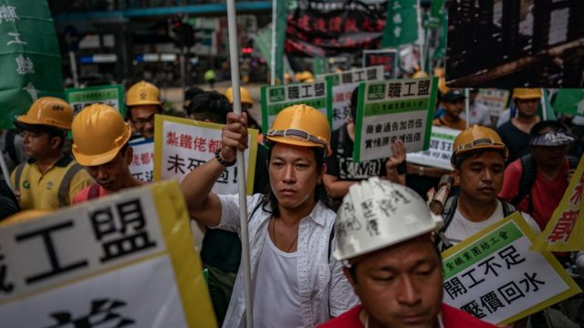
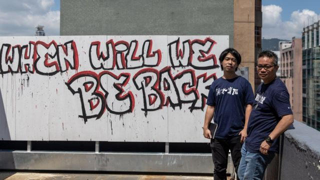
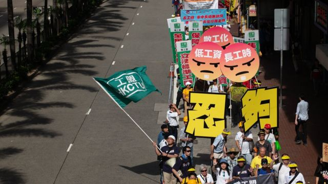
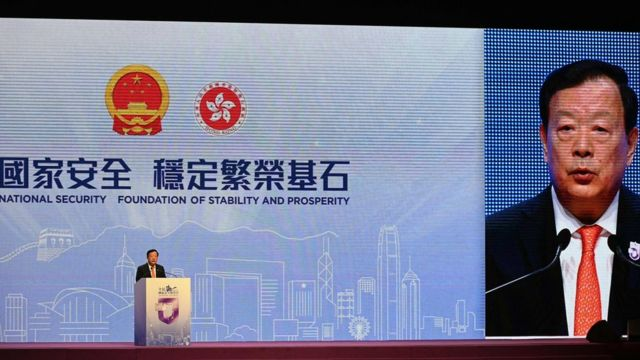

# [Chinese] 香港国安法：五一游行自行取消，申请人称“不由自主但不能讲”

#  香港国安法：五一游行自行取消，申请人称“不由自主但不能讲”

  * 李澄欣 
  * BBC中文记者 

> 图像来源，  Getty Images
>
> 图像加注文字，疫情前香港每年5月1日都有劳动节游行，是维持了二三十年的传统。

**中国国务院港澳办主任夏宝龙访港为“游行”定性后，香港再有团体撤销相关申请。早前以个人名义申请五一游行的前职工盟主席黄迺元，4月26日传出被当局带走，他其后宣布取消游行。**

此前不久，原拟在五一前夕举办游行的亲北京团体“港九劳工社团联会”（劳联），也撤回了游行申请。

与黄迺元一起申请游行的杜振豪26日中午在社交媒体发文指，黄迺元恢复自由，未有被捕，“但情绪崩溃，显然承受了巨大压力”，又指他已签纸取消游行申请，但详情限于《港区国安法》第63条无法透露。63条是指配合办理国安案件的组织及个人须保密。

帖文表示，“由于过往经历，能够想象期间发生了什么事”，相信黄已尽一切努力捍卫集会游行权利，希望公众给他时间休息，又强调这次挫折不会打击他们争取工人权益的斗志，“无论如何，谨此向社会大众致歉”。

当天稍早，黄传出“在住所休息时无故失去踪影”，亲友怀疑他是遭当局要求协助调查甚或拘捕，一度联络律师跟进。

##  “不由自主的决定”

> 图像来源，  Getty Images
>
> 图像加注文字，黄迺元（右）为香港职工盟前主席，该组织被视为泛民主派，2021年在政治压力下宣布解散，结束31年历史。图片摄于职工盟解散前最后一个展览。

杜振豪接受BBC中文访问时表示，黄迺元的家人早上7点还看到他在家中，7点半回到家突然发现他不在，“正常不会是这样，无缘无故不见了”。

到了11时半，杜振豪接到黄迺元来电，说已经签纸取消游行申请。“他情绪波动，从语调可以猜想过程很不愉快，很受屈，取消申请是不由自主的决定，但又不能讲。我问他签纸取消是用什么理由，他说没有理由。”

杜振豪说，在目前政治压力下，早有心理准备游行办不成，但一直以为会是警方直接反对申请，没想过是用这种方式要他们自行取消。“这是我们意料之外的，可能对政府来讲，反对我们游行没面子，所以就要你自己取消，以显示责任不在政府。”

> 图像来源，  Getty Images
>
> 图像加注文字，《港区国安法》下民间团体和工会难立足，工人声音减弱，图为2018年五一游行。

他续指，《国安法》实施后香港大量公民团体和工会解散，工人声音已减弱不少，尽管官员强调有其他渠道表达诉求，如写信给政府或透过议员发声，“但回响一定不及游行那么直接和有效”。

香港保安局长邓炳强被传媒追问早上是否有国安人员接触黄迺元时，并没有回应，他重申《基本法》及《港区国安法》均规定港人有游行集会自由，认为应向活动组织者查询取消原因。

黄迺元和杜振豪在脸书成立的“香港五一游行2023（申请中）”活动专页，傍晚已改名为“香港五一劳动节”，最新帖文指5月1日“我们不会前往游行路线的地方，也不会呼吁任何人前往”，又表明专页会继续发放劳工权益资讯，“希望未来有一天，可以在此正式宣传香港五一游行”。

##  夏宝龙定调

> 图像来源，  Getty Images
>
> 图像加注文字，夏宝龙访港时在“全民国家安全教育日”活动上公开评论游行。

中国国务院港澳办主任夏宝龙早前访问香港，在“全民国家安全教育日”致辞时称“游行不是表达利益诉求的唯一方式”，指游行“很容易被别有用心的人利用和操纵，甚至民生利益诉求被歪曲成为政治问题，进而诱发社会对抗”。

两天后，亲北京的劳工团体“港九劳工社团联会”（劳联）主席林振升宣布撤回五一游行申请，称担心被人“骑劫”，并强调与夏宝龙言论无关。

香港特首李家超其后公开认同夏宝龙说法，指公众活动组织者须考虑会否影响他人，若担心被骑劫而取消游行“是负责任做法”。

过去一个多月，香港警方时隔近三年后重新批准游行申请，但加入多项新规则和“国安条款”，包括要求参加者配戴挂颈编号卡牌及围起封锁线等，被指剥夺集会自由。

香港《基本法》第27条规定，香港居民享有言论、新闻、出版的自由，结社、集会、游行、示威的自由，组织和参加工会、罢工的权利和自由。

