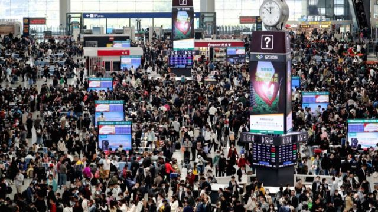
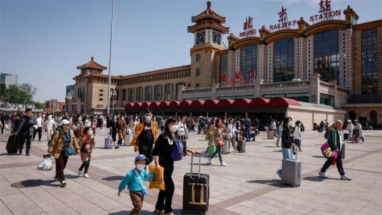

# [Chinese] 五一：中国出游火爆，三年疫情后长假旅游价格飙升

#  五一：中国出游火爆，三年疫情后长假旅游价格飙升

> 图像来源，  Getty Image
>
> 图像加注文字，4月28日上海虹桥车站出行的乘客

**“今年五一太难了。”家住河南的武女士说起自己筹划全家“五一”假期旅行计划时谈论起了遇到的苦恼。**

“疫情三年憋坏了，”武女士告诉BBC中文记者，家里的二女儿才四岁多，几乎没有出门旅行过，今年说什么也要出去。“大儿子说想去北京的环球影城，女儿想去上海的迪士尼，我一看票，说你们别争了，都去不成。”

对于武女士而言，今年“旅游热”比疫情前更甚，往年4月初开始订酒店机票都来得及，今年纷纷售罄，往年“五一”、“十一”也有涨价，今年则涨得接受不了。

“心情很复杂。”武女士称，她自己也从事学前教育行业，看到大家消费欲望这么强，自己的生意似乎也前景看涨；但这次长假出游只能委曲求全，最终她们一家四口自驾到连云港，因为“借助在朋友家，可以不用订酒店”。

##  火热

根据中国旅游研究院发布的数据，今年“五一”假期中国旅游出行规模有望突破2019年同期水平，预计达2.4亿人次，超过2019年4个百分点，同时也会创造1200亿人民币消费。

旅游业作为消费重要杠杆，能够有效拉动交通、景区、餐饮、住宿、零售等行业增长。

在长假开始前夕，中国各地周五（28日）的交通晚高峰就已经开始展露出火热的迹象。4月28日中午，滴滴出行副总裁李敏在微博上表示，“今天晚高峰打车不容易，成功率可能不足50%”，提醒大家错峰出行。

百度发布的《2023年五一假期出行预测报告》称，2023年五一假期高速公路整体车流将比2021年、2022年同期将分别上升超15%、110%，较今年非假期将上升超100%。

> 图像来源，  Getty Image
>
> 图像加注文字，4月28日，上海虹桥车站出行排队的乘客。

武女士也遇到“大堵车”，原本开到连云港需要五个半小时，但4月28日她开了七个小时才到临沂，只能找地方先住下，第二天早上再开两三个小时才能到连云港，“前提是不再堵车”。

28日，一条虹桥高铁站站内友情提示“上海虹桥站当日发往全国各站的车票均已售完”，和一张候车大厅内人满为患的照片冲上热搜。

中国比较热门的景区，如圆明园、颐和园、八达岭长城、环球影城、上海迪士尼、泰山等，“五一”期间的门票均已售罄。

不仅如此，热门城市的租车服务也“一车难求”。哈啰租车数据显示，五一期间订单比2022年五一增长超5倍，比2023年春节假期增长超70%。

4月28日是节前最后一个交易日，截至当日，旅游板块走强。收盘时，热门旅游股大连圣亚涨近9%，峨眉山A涨超4%，曲江文旅、众信旅游、西藏旅游、长白山等涨幅居前。

##  苦恼

“史上最贵五一假期，不夸张。”武女士分享她的朋友去内蒙古玩的开销，酒店、机票齐涨价，原本一家人预算一万五千元人民币，最后花了三万多。

机票价格的节日效应明显。比如在某购票平台搜索，北京飞往杭州的单程机票，节前一天4月28日，价格达到每张2350元，但29日则已经降至1300元，到30日往后就恢复到平常价格500-800元不等。

一些知名酒店，涨价幅度显而易见。上海东方明珠230空中酒店“五一”假期价格已涨至每晚58888元，比平时高30000元；北京华尔道夫酒店当前价格为每晚1988元，“五一”假期已涨至每晚2754元。

相对更平价的民宿酒店的涨幅也不遑多让。位于桂林阳朔的民宿从业者向BBC中文表示，他们平日价格根据房型不同分别为480元、580元、680元不等，“3月份开始就陆续有客人订五一的客房，我们的价格调整到1080、1380、1680，不到两周就订完了”。

上述从业者表示，往年也会在五一涨价，民宿行业主要靠“五一”、“十一”和暑假三个时期，收入可以覆盖全年成本，其他10个月左右较为淡季，调低价格，其收入都可算作利润。

##  扭曲

"疫情期间，非常难，尤其是去年，不是我给你卖惨，收入下降不止九成。而且跟房东说了很久也不给我降房租，虽然没留什么员工，还是欠了钱。"上述桂林的民宿经营者表示，一些大中城市的酒店还能被征用为隔离酒店，而旅游区的酒店比人多，轮不到成为隔离酒店，关门的比比皆是，更别说小民宿了。

旅游业去年的惨淡，从金融市场可见一斑。

从已披露去年年报的50家旅游业上市公司来看，其中仅7家实现净利润增长，而且增长有限，其余 43家公司净利润同比下滑。

根据旅游行业网站劲旅网一篇报告披露，酒店方面，2019年，中国国内共有酒店数量33.8万家；疫情爆发后的2020年，国内酒店数量暴跌至27.6万家，同比减少6.2万家；2021年略有回升，达到29.3万家；2022年勉强重回30万家，达到31.3万家，依然与疫情前有不小差距。

酒店属于重资产投入，即便2023年疫情结束，想要短时间内迅速增加酒店数量，几乎是不可能实现的，至少需要1-2年缓冲期，才有可能让国内酒店保有量稳定提升，恢复到2019年水准。

> 图像来源，  EPA

同样的情况发生在导游、大巴司机的资源上，造成现在的旅游业“无房、无车、无导游”的旅游资源荒现象，供给端的乏力遇到“五一”需求端的暴涨，造成供需严重失衡，影响游客正常出行。

“春节也出门了，不过主要是走亲访友，而且冬天能去的地方有限，现在春暖花开，憋了三年，大家都想出去了。”武女士认为，五一时间短，游客们集中在短时间出行，进一步扭曲了这个价格。

供需失衡造成价格扭曲，也催生了“酒店刺客”、“民宿毁约”等现象，有游客早早订下民宿，却因为价格飞涨，被民宿老板通知取消预订。

虽然经历这次“五一”暴涨，很难说中国的旅游业已经完全恢复到疫情前。中国旅游研究院院长戴斌对中国媒体表示，预计今年中国境内的出游人次、旅游消费、入出境旅游人数将分别恢复到2019年的85%、75%和40%。

