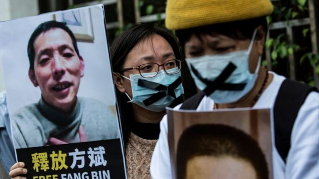
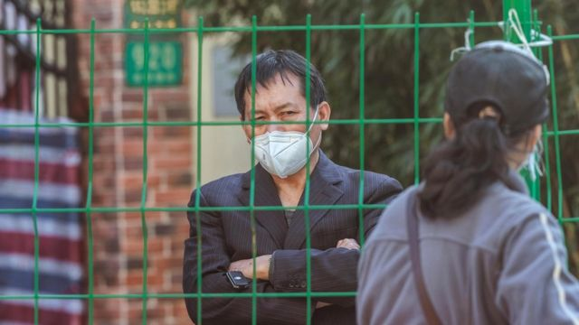

# [Chinese] 方斌：记录武汉疫情公民记者关押三年出狱后辗转京鄂两地

#  方斌：记录武汉疫情公民记者关押三年出狱后辗转京鄂两地

> 图像来源，  Getty Images
>
> 图像加注文字，方斌被捕的消息曾引发多方强烈关注。

**消息人士告诉BBC，记录中国武汉初期新冠疫情的公民记者方斌在服刑三年后获释。**

方斌是几名在中国新冠疫情期间遭到当局逮捕的公民记者之一，他在分享当时疫情中心武汉的运尸车视频后失踪。根据之前的多家媒体报道，他是湖北省武汉人，被捕前是一名商人。

方斌被抓捕满三年时，美国国会行政当局中国委员会（CECC）曾于今年2月9日发表声明，呼吁中共立刻释放公民记者方斌，及所有因为报道中国COVID-19疫情而被拘留的人士。

##  获释后辗转两地

消息人士称，在2020年2月失踪后，方斌在武汉的一次秘密审判中被判处三年监禁。

他们还说，方斌于周日（4月30日）获释，健康状况良好。

方斌出狱后先到了北京然后回到武汉。BBC无法联系到他的家人置评。

消息人士对BBC称，4月30日方斌出狱后被送到北京，但方斌的儿子很为难，与父亲吃了饭后给父亲买了几套衣服，当天买了回武汉的软卧，方斌在5月1日早上约7时回到武汉，住在他的姐姐家。

德国之声与自由亚洲电台也各自引述匿名消息人士称，方斌的儿子似乎因受到压力而未答应让他留在北京，所以在与方斌吃饭并为他买了衣服后，当天送他回了武汉。

在2020年2月初方斌拍摄发布的那段引起外界关注的 视频  中，他在五分钟内数了武汉一家医院外的八个尸袋。他说自己当晚被拘留，但被释放。据称此后他又发视频呼吁“全民反抗，还政于民”，并对外展示自己的呼吁书法，这可能是他触怒中国当局并对他采取强制措施的最终原因。

目前在美国的中国人权律师滕彪认为，从方斌的情况来看，他的亲人家属可能受到当局的压力，要他们与方斌保持距离，这是一种“政治株连”。

他还指出，疫情初期方斌对中国政府的政策提出质疑和批评 ，很显然是行使言论自由的权力，没有违反任何法律，也没有任何社会危害性，对方斌的判刑是一个文字狱，而且他也没有经过公开审判就被定罪，不符合法律。

“刑诉法规定，涉及国家秘密、个人隐私、未成年人和商业秘密的案件可以不公开审理，方斌的案件不符合其中任何一种。”滕彪说。

滕彪还对BBC中文指出，方斌被指控的寻衅滋事罪也是一个臭名昭著的口袋罪，定义非常模糊，当局很容易用这个罪名来打击报复异议人士。

活动人士对方斌的获释表示欢迎，但他们还担心另一名吹哨人的命运，即39岁前律师张展，她于2020年5月被拘留，并于2020年12月被判入狱四年。

活动人士表示，与方斌一样，张展也因“寻衅滋事”被定罪。活动人士表示，这一模糊的罪名经常被用来对付批评中国政府的人士。另外两名公民记者陈秋实和李泽华也于2020年2月在武汉失踪，但几个月后公开露面。

##  “重大胜利”和缺乏公开讨论

根据世界卫生组织的数据，自疫情开始以来，该国已报告有12万人死亡。其中近一半发生在2022年12月8日至2023年1月12日之间。但这些数字并不能代表真正的死亡人数。

今年2月，中共最高领导层中央政治局常委召开会议总结中国三年疫情防控，以“重大决定性胜利”、“奇迹”等词总结中国抗疫，并称中共应对疫情措施成效巨大。

美国外交关系委员会全球卫生高级研究员黄彦忠说：“我今年3月访问了中国，我的观察是，中国人希望向前看，把过去抛在脑后。”

“他们不得不长时间忍受清零政策的严峻考验，现在他们渴望回归更正常的生活方式，”但他也表示，这种继续前行的愿望也是由于缺乏公开讨论。

> 图像来源，  EPA

并非每个武汉人都忘记了2020年初的生活。

一位不愿透露全名的31岁武汉居民说，他没有听说过方斌，但记得李文亮，他是一名医生，曾试图提醒世人警惕冠状病毒，但他在感染后死亡。李文亮因"散布谣言"而受到调查，尽管当地政府后来向他道歉。

他说，他经常和朋友谈论疫情，但他承认他们可能是少数。

“社会正在修正这段时期的记忆。”

