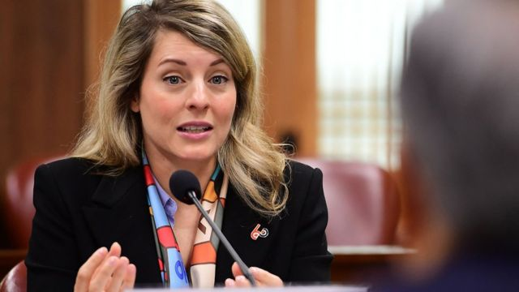
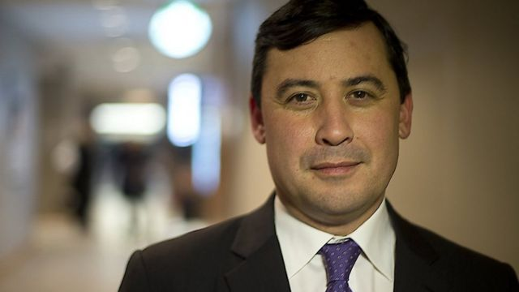

# [Chinese] 加拿大指控北京骚扰其港裔议员家属，称正考虑驱逐中国外交官

#  加拿大指控北京骚扰其港裔议员家属，称正考虑驱逐中国外交官

> 图像来源，  EPA
>
> 图像加注文字，加拿大外长乔美兰称，中方外交官涉嫌骚扰加方议员家属的行为“完全不可接受”。

**加拿大外长乔美兰（Melanie Joly）传召中国驻加大使丛培武，就该国联邦议会众议员庄文浩（Michael Chong）在港家属遭骚扰相关指控表达不满，并表示正考虑驱逐中国外交官。**

乔美兰星期四（5月4日）评论庄文浩事件时说：“有关事件完全不可接受。在我们权衡就此种行为采取行动时， 不排除所有可采取措施，包括驱逐外交官。”

在发予BBC的声明中，中国驻加拿大大使馆称，“中国一贯奉行不干涉别国内政原则”，并形容加方指控是“自导自演的政治闹剧”。

香港警方回答BBC中文查询称：“警队肩负侦查罪案、保护市民生命及财产安全的职责及使命。若市民遭受恐吓或滋扰，应立即报警，以便警方依法作出调查。”

> 图像来源，  Toronto Star via Getty Images
>
> 图像加注文字，庄文浩目前是在野加拿大保守党的影子外相。

乔美兰当日表示，她透过副外长告知丛培武，渥太华不会容忍干涉加国内政行径。中国驻加拿大大使馆回答BBC查询称，丛培武对加方威胁驱逐中方人员“提出强烈抗议”；中国外交部星期五（5日）称，中方已向加拿大驻华大使提出严正交涉。

加拿大媒体本周披露，加拿大安全情报局（CSIS）相信中国曾专门搜集庄文浩在港亲属的情报，以打击其“反华立场”。

香港裔的庄文浩因曾在议会发起决议案，认定中国对待新疆维吾尔族人的手段是“种族灭绝”，遭中国制裁。在北京，中国外交部发言人星期五被问及传召大使一事时说：“加拿大方面无端污蔑抹黑中国驻加使领馆正常履职，中方对此强烈不满，坚决反对。”

“加拿大个别政客和媒体炒作所谓中方威胁加议员，完全是子虚乌有的无稽之谈，是出于意识形态偏见的政治闹剧。2021年3月，中方决定制裁加拿大有关议员，是对加方基于谎言和虚假信息，借口所谓新疆人权问题，对中国有关个人和实体实施制裁的回应。加方无理挑衅严重损害中方利益在先，中方作出有力回应，完全正当和必要。”

BBC中文也向中国香港特区政府保安局寻求回应，至发稿时未获答复。

##  谁是庄文浩？

庄文浩1971年生于安大略省溫莎市（Windsor, Ontario），父亲于1952年从香港移民加国，靠勤工苦读成为医生，曾任职护士的母亲则是来自荷兰的移民。

庄文浩加入了加拿大保守党，2004年首次当选联邦议会众议院（下议院）议员，曾在总理哈珀（Stephen Harper）任内担任部长。他目前是保守党影子内阁外长，也是众议院加中关系特别委员会副主席。
 2021年2月  ，加拿大下议院投票以压倒性多数通过一项议案称，中国对待维吾尔少数民族的手段是“种族灭绝”，庄文浩是议案发起人。 同年3月  ，加拿大联同英美等国就新疆问题制裁中国，中国外交部宣布反制措施，制裁庄文浩等人。
 根据中方制裁令  ，庄文浩被禁止入境中国大陆及香港、澳门特区，禁止中国公民及机构同庄文浩交易或往来。庄文浩其后在BBC中文的专访中说：“我视（中共的）制裁为一个荣誉的标记。”
 加拿大《环球邮报》星期一（1日）报道  ，根据CSIS的一份情报以及知情人士说法，庄文浩在发起新疆议案后即被中国当局针对，中国驻加拿大多伦多总领事馆一名外交官被委派负责此事，其目的是要透过对付庄文浩做到“杀一儆百”，阻吓他人采取反华立场。

报告也指出，中国视身为“五眼联盟”成员的加拿大为首要情报目标之一。

庄文浩星期四表示，CSIS已向他通报情况。他批评总理特鲁多（Justin Trudeau）及其政府至今仍未驱逐涉事中国外交官。

庄文浩在一份声明中说：“与许多加拿大人一样，我在海外有亲戚。（中国）针对这些亲属得以恐吓和胁迫本土加拿大人，是严重的国家威胁。”

相关报道和庄文浩本人都没有透露更多细节。

特鲁多称他是在《环球邮报》报道发表后才得悉事件。

特鲁多星期三（3日）说：“CSIS认定这事情没有必要向上汇报，因为它还不够严重。”
 今年3月  ，特鲁多宣布对中国“干预加拿大近届大选”展开独立调查。中国否认对选举有任何干预，称相关的指控“完全是子虚乌有，无稽之谈”。

