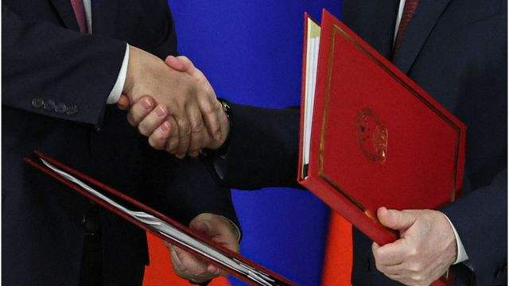
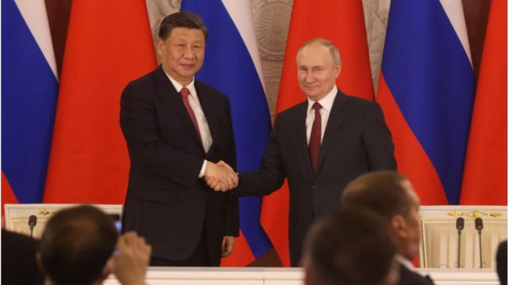

# [Chinese] 中国将派特别代表赴乌克兰 俄罗斯的定心丸与中国目的

#  中国将派特别代表赴乌克兰 俄罗斯的定心丸与中国目的

> 图像来源，  Getty Images

**中国外交部星期五（5月12日）表示，中国政府欧亚事务特别代表、前驻俄罗斯大使李辉将从5月15日起，访问乌克兰、波兰、法国、德国和俄罗斯，就政治解决乌克兰危机同各方进行沟通。**

中国外交部发言人汪文斌表示，“乌克兰危机爆发以来，中方始终秉持客观公正立场，积极劝和促谈”，此次中方代表出访有关国家，“是中方致力于劝和促谈的又一体现，充分表明中方坚定站在和平一边”。

他还表示，“中方愿继续发挥建设性作用，在停火止战、开启和谈、避免局势升级等方面凝聚更多国际共识，为推动乌克兰危机政治解决作出中国的贡献”。

此前在4月26日，中国领导人习近平与乌克兰总统泽连斯基通电话。通话中，习近平称将派中国政府欧亚事务特别代表赴乌克兰等国访问，引起各界关注。

中国外交部欧亚司副司长于骏4月底对媒体指出，将派出的代表为李辉，他曾担任中国驻俄罗斯大使十年。李辉与俄罗斯的亲密关系引发外界质疑他是否能够公允行事。

##  李辉是谁？

中国外交部官网资料显示，中国政府欧亚事务特别代表李辉是黑龙江人，今年已经70岁，他曾在俄罗斯及附近国家外交方面有广泛经验。

李辉简历显示，他曾担任驻苏维埃社会主义共和国联盟大使馆随员、中国外交部欧亚司副司长、驻哈萨克斯坦共和国特命全权大使以及驻俄罗斯大使等职。

李辉与俄罗斯关系亲密，曾担任10年驻俄罗斯大使。2019年卸任前，李辉还在俄罗斯塔斯社发表署名文章《青山不老，友谊长存》，文中提及他在俄罗斯的工作10年，是他外交生涯中最难忘的10年。2019年，俄罗斯总统普京曾授予他“友谊勋章”。

李辉在文中称，自己因俄语与俄罗斯结缘，先后三次共计16年在俄（前苏联）工作，对这片土地和人民充满真情，并且深受俄罗斯文学和艺术的吸引与熏陶。

“普希金、莱蒙托夫、果戈里、陀思妥耶夫斯基、契诃夫、托尔斯泰、高尔基等人的名著我常读常新，并感叹其魅力与思想，”李辉写道，“我热爱俄罗斯森林的广袤、平原的宽广、伏尔加河的厚重、贝加尔湖的纯净、北极的凛冽，这让我认识到俄罗斯人民坚韧的品格、顽强的精神和乐观的态度。”

> 图像来源，  Getty Images

另外，李辉也曾在2022年6月“新时代民主之路”国际研讨会中不点名批评“个别国家”。

俄罗斯卫星通讯社报道，李辉在活动开幕致辞时表示，个别国家国内民主进程乏善可陈，却热衷于在国际上搞所谓“民主峰会”，无视其自诩的“民主灯塔”早已坍塌的事实，却醉心于打造所谓民主对抗权威叙事。

##  定心丸

对于中国任命李辉为特别代表，乌克兰外交部在一份给美国全国广播公司（NBC）的声明中称，基辅希望李辉对该地区较深的了解能够有助于他与各方进行公正有效的沟通。

纽约州立大学奥尔巴尼分校政治学教授陈澄对BBC中文表示，选李辉做特使，在某种程度上是中国给俄罗斯的一颗“定心丸”，有助于打消俄罗斯的顾虑。

陈澄指出，俄乌战局僵持不下，西方对中国的调停持怀疑态度，但西方的援助也不可能无穷无尽，接下来几个月可能是一个谈判的窗口。

“当然，对于乌克兰和西方来说，这无助于改变他们认为中国偏向俄罗斯的印象，”她指出，“中国也许确实不是理想的中立调停者，但是，在西方全力支持乌克兰的背景下，中国的参与却成为把俄罗斯带上谈判桌的一种必需条件。”

##  中国目的

对于乌克兰问题，中国曾在今年2月发布《关于政治解决乌克兰危机的中国立场》，称对话谈判是解决乌克兰危机的唯一可行出路，国际社会应坚持劝和促谈正确方向，中国愿意为此发挥建设作用。

在中国表示将派遣特使到乌克兰之际，中国外交部长秦刚在5月8日至12日日访问德国、法国和挪威。

陈澄认为，中国既然要树立自己的全球大国形象，就必须在外交上积极主动地展现能力。这些外交活动旨在为乌克兰冲突未来的政治解决做好铺垫，设立框架。

“一方面，中国可以继为沙特伊朗调停后进一步加强自己的全球外交实力。另一方面，中国也希望能以此博得广大第三世界国家和一些不希望俄乌之间长期战争的欧洲国家的好感和支持。”陈澄说。

