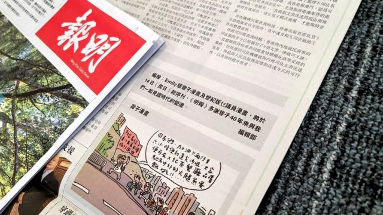
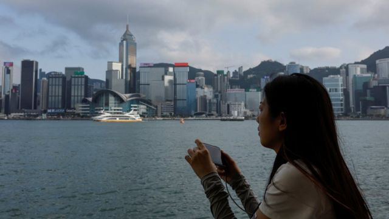

# [Chinese] 尊子漫画：《明报》停刊40年政治讽刺专栏 再引香港新闻自由争议

#  尊子漫画：《明报》停刊40年政治讽刺专栏 再引香港新闻自由争议

> 图像来源，  BBC News Chinese
>
> 图像加注文字，香港特区政府过去八个月先后六次指责尊子漫画失实。

**香港《明报》宣布结束政治漫画家尊子在该报已有40年历史的政治漫画专栏。该专栏过去半年多以来屡次被香港官员指责“抹黑政府”，停刊的决定再次引起业界担忧香港新闻自由状况。**

《明报》星期四（5月11日）出版的尊子漫画上部以“编按”形式公布该决定，称该专栏将于星期天（14日）起停刊。报社未给出原因，只称“《明报》多谢尊子40年来与我们一起见证时代的变迁”。

本名黄纪钧的尊子回覆BBC中文查询说：“我认为停刊的决定是协商下得出的。我觉得停刋的可能性常存在。漫画因应形势及读者对象调节是常有的，只要不损害或扭曲含意。”

香港记者协会对尊子专栏遭停刊感到“痛心”，称此事“反映本港容不下批评的声音，言论自由的空间遭进一步收窄，对社会百害而无一利”。明报员工协会称“多元社会应该包容不同声音”。

特区民政及青年事务局是最近一个批评尊子漫画的特区政府局级部委。局长麦美娟星期四被媒体追问香港是否再也容不下讽刺性及嬉笑怒骂的媒体内容。

麦美娟回答：“对于个别机构或人士所作的决定，我们不评论。作为政府来说，我们会虚心接纳不同的意见。”

“不过对于一些不实的言论，或与事实不符的事情，我们必须予以澄清。这是我们要让市民清楚知道事实的真相。”

##  特区政府一年内6次点名批评

黄纪钧1955年生于香港，香港中文大学艺术系毕业后曾当教师，当时已兼职创作政治漫画。1973年加入《明报》当外电编译，1983年获《明报》创办人金庸（查良镛）邀请他接手政治漫画专栏，他自此开始使用笔名“尊子”与“纪文”发表漫画。

尊子在1980年代还曾为直属中共涉港事务系统的《大公报》与《新晚报》画漫画，近年则以《明报》和《苹果日报》为主。2021年6月《苹果日报》遭香港国安警察搜查后停刊，尊子便只剩下《明报》两个漫画专栏。

过去八个月，尊子先后被特区政府六次指责其漫画失实。

其中，今年1月5日，尊子发表以中国人大常委会对中国《香港国安法》释法为题的漫画，当中写道：“今次人大释法没增加特首的权力……只是确认为维护国安，特首可为所欲为。”特区政府第二号人物，政务司司长陈国基 在Facebook上发文  ，点名批评该漫画“对行政长官履行维护国家安全的宪制责任作出偏颇、误导并且失实的指控”。

到4月，尊子的一幅漫画讽刺特区政府拨备巨资予执法部队更新器材，特区保安局局长邓炳强4月2日点名指控尊子“用一些误导性的指控来挑动市民对政府的不满”，又说：“事实上，《明报》的尊子在过往六个月不只一次针对政府，作出一些误导性的指控。”

邓炳强表态后， 《大公报》发表评论文章  ，称尊子“总之凡是中央和特区政府的政策必定肆意抹黑，凡是反中乱港分子必定大力吹捧，凡是爱国爱港力量必定嘲讽”，促请特区政府效法新加坡“以讼止谤”，提起诉讼，又提醒在一些国家，诽谤“更被认为是刑事犯罪而不是一种侵权行为”。

到本周，特区政府发表整顿区议会及其选举制度方案，尊子发表漫画，称只要“长官”认为合适，考试语文不及格、胆固醇过高、痴肥等都可被特首委任为指定地方组织成员，参与筛选候选人。民政及青年事务局发文称，该漫画“扭曲、抹黑政府”，“内容无视事实，混淆视听，并带有歧视成份”。
 这篇网帖还说  ：“近日《明报》接二连三针对政府完善地区治理建议方案作出一些误导性的言论，扭曲解读建议方案内容，属政治凌驾道德的行为。”

> 图像来源，  South China Morning Post via Getty Images
>
> 图像加注文字，尊子的漫画曾被用作泛民主派号召群众参与“七一”游行。

尊子以文字回应BBC中文记者查询说，他与《明报》编辑人员一直在关注这些官方表态。被问到会否担心遭执法人员抓捕时，他只说这“很难掌握”。

对于在这样的氛围下告别已工作了40年的专栏，尊子说：“我想无论从新闻工作人员或创作人员角度来看，都不会停下吧？用什么形式或方法则须做点脑力劳动。”

他还寄语香港新闻同业：“新闻工作可说是没有休止的。有心便有新闻，没心便看不到新闻发生。”

尊子从前也曾遭遇其它争议事件。1998年，尊子应邀到新加坡参与一场艺术创作交流活动，其中一幅以开国总理李光耀和时任总理吴作栋为题的漫画被认为内容不能接受，多次要求更改。尊子不予妥协，结果所有画作被撤展丢弃。当时香港有报章称是新加坡官员所为，《明报》则称是新加坡国家美术馆馆员所为。

1999年12月20日凌晨，葡萄牙刚向中国移交澳门治权不久，澳门特区司法警察将身处当地的尊子夫妇连同11名澳门艺术界人士拘捕扣留三个小时。尊子获释后称，他当时在参与澳门艺术界组织的另类“庆回归”活动。司警并未起诉尊子，他在2002年也再次到澳门参与“港澳报刊漫画人作品展”。

##  尊子漫画专栏结束后各界反应

《明报》报系在1995年被马来西亚商人兼华文报业大亨张晓卿收购，使其成为大马《星洲日报》报系的一部分， 2014年一轮人事耿迭  ，引起外间对其编采立场与自由的关注，而当时被观察人士质疑其亲近中共的张晓卿 强调其办报“没有预设立场”  。

此后该报在多数时间还是被视为亲民主派报章，在《苹果日报》结业后， 更反被《大公报》质问  “《明报》想接过《苹果》的煽动角色”。

《明报》工会——明报员工协会——就尊子专栏停刊发表简短声明说：“尊子从80年代开始在《明报》画政治漫画，以嬉笑怒骂的方式针砭时弊，吸引读者关注社会议题。本会对尊子漫画停刊表示遗憾和无奈，亦感激尊子多年来为《明报》付出的心血。”

工会指出，专栏作品也应视为报章核心价值的一部分，“多元社会应该包容不同声音，我们希望各界尊重言论自由，以及守护《明报》的核心价值，维护社会公正和善良”。

香港记者协会的声明称：“记协认同尊子所言，《明报》停刊尊子漫画的原因‘心照不宣’。”

“记协认为，坐拥庞大资源及公权力的特区政府连番狙击一介文人，反映本港容不下批评的声音；传媒机构或担心刊载的内容再遭到猛烈批评或被指违法，从而加剧自我审查，损害《基本法》所保障的新闻及言论自由空间，对社会百害而无一利。”

香港记者协会主席陈朗昇对BBC中文记者说，他对尊子漫画遭停刊不感到意外。但他认为，政治漫画不是新闻报道，一定会有一些比喻、讽刺。有时可能有点夸张。

“整个政府对尊子的漫画高度重视、注视，只要他画了什么政府不认同的话，政府都会高调批评。这样《明报》所受的压力便很大。”

> 图像来源，  Reuters
>
> 图像加注文字，香港特区政府坚称传播媒体行业在中国《香港国安法》下“蓬勃依然”。

陈朗昇指出，近期《明报》有不少显得特别谨慎的行为，例如在专栏版面刊登免责声明，强调评论内容并无引发仇恨之意。

“我不会过多怪责《明报》，因为大家都明白，你当然可以批评它没坚持，但坚持是有后果的。能在第六次批评后才喊停并不容易。”

自《香港国安法》实施以来，《苹果日报》和《立场新闻》在遭遇国安警察搜查后结束运营。此外，官方香港电台也换入政务官取代媒体人领导其运作，并撤掉讽刺时事节目，以回应亲建制政治人物的批评。

总部设在法国巴黎的无国界记者组织（Reporters without Borders）上周发表新一年度世界新闻自由指数，香港在报告评估的180个国家和地区中排名140，远低于2019年的73。

在此之前， 英国议会跨党派香港小组（APPG on Hong Kong）发表香港问题调查报告称  ，壹传媒创办人黎智英与他所创办的《苹果日报》高管遭以《香港国安法》起诉，《苹果日报》倒闭等事件，反映香港新闻自由每况愈下。小组认为香港当前局面“明显的违反了”1984年《中英联合声明》，没能保障人权。

中国外交部驻港公署与香港特区政府对英国议员小组报告“表示强烈不满和坚决反对”。其中，特区政府的声明称：“事实上，自《香港国安法》实施以来，本港的传媒环境蓬勃依然。一如既往，传媒可行使监督特区政府工作的权利；只要不违法，传媒评论和批评政府施政，不但自由无受到限制，而且正在惯常发生。”

