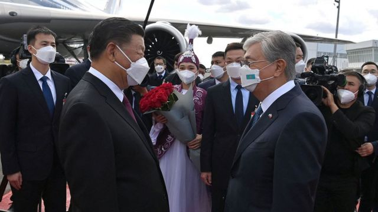
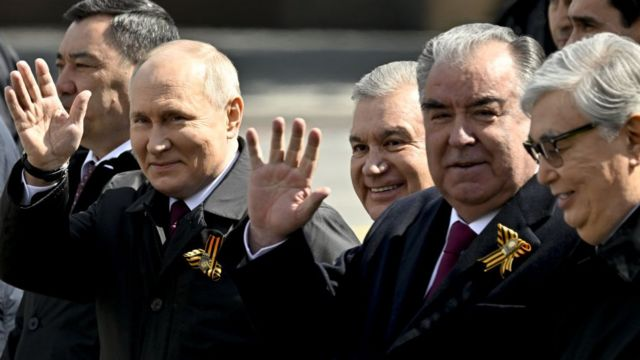

# [Chinese] 中国-中亚峰会前瞻：北京“首场主场外交大戏”的门道和热闹

#  中国-中亚峰会前瞻：北京“首场主场外交大戏”的门道和热闹

> 图像来源，  Getty Images
>
> 图像加注文字，2019年4月26日，习近平出席在北京人民大会堂举办的第二届“一带一路”国际合作研讨会。

**中亚五国总统周二（5月16日）开启对中国的国事访问。 两天后， 哈萨克斯坦总统托卡耶夫、吉尔吉斯斯坦总统扎帕罗夫、塔吉克斯坦总统拉赫蒙、土库曼斯坦总统别尔德穆哈梅多夫和乌兹别克斯坦总统米尔济约耶夫还将出席由中国领导人习近平在西安主持的中国- 中亚峰会（C+C5），拉开2023年北京“首场主场外交大戏”的帷幕。**

中国外交部发言人汪文斌称，峰会“是今年中国首场重大主场外交活动，也是建交31年来六国元首首次以实体形式举办峰会，在中国同中亚国家关系发展史上具有里程碑意义。”

既然是一台大戏，那么，内行看门道，外行看热闹，下面是BBC中文梳理的五大看点。

> 图像来源，  Reuters
>
> 图像加注文字，习近平2022年9月抵达哈萨克斯坦首都努尔苏丹。这是他自2020年1月初新冠疫情爆发以来首次出国访问。

##  “大男主”习近平：“得心应手”的舞台

外交大戏“男一号”当属东主习近平，他选择的舞台不是北京，而是西安。 不难联想，这座古城在中国和中亚交往史上、以及“习外交”当中的特殊地位。

古称长安的西安曾是丝绸之路的起点。这条连接中国和中亚、中东、非洲以及欧洲的通商要道，也是中国经济和外交扩张的重要通路。

整整10年前，上台不久的习近平正是在中亚国家哈萨克斯坦提出了重振古丝绸之路的“一带一路”计划。习近平的这一宏大倡议和他在2012年11月提出的“中华民族伟大复兴”和 “中国梦”一脉相承，甚至可以说是一个具体实施方案。因此，“一带一路”也被视为习近平要力保的政治遗产。

2022年9月，在开启历史性的第三个任期的前夜，习近平飞抵哈萨克斯坦首都努尔苏丹。这是他自2020初疫情爆发以来首次踏出国门。

英国皇家联合军事研究所（Rusi）、新加坡南洋理工大学拉惹勒南国际研究所高级研究员潘睿凡（（Raffaello Pantucci））说，此次习近平和中亚五国元首共聚一堂已然很重要，（疫情以来）他给与中亚的关注度更是可圈可点。

潘睿凡长期关注中国和中亚关系，并著有《中华斯坦--中国不经意造就的帝国》（Sinostan: China's Inadvertent Empire）。他对BBC中文说，习近平先去做客，现在又做东，“显然，和中亚这个地区打交道，习近平感觉更加轻松自如。这本身也能说明一些问题。”

他解释， 轻松自如、得心应手的对立面是障碍重重、力难从心。过去几年在国际大舞台上，中国在与西方交往中遇到很多变故，包括“经济胁迫”导致美国及盟友考虑多方位与北京“脱钩”、英中“黄金十年”画上句号、新冠疫情爆发后对中国的追责、对俄罗斯入侵乌克兰不表态引来指责等等；就连一些长期以来与中国关系尚算融洽的国家、比如日本、韩国、菲律宾，也开始更加靠近美国。

长期研究中亚局势的台湾国防部下属智库国防安全研究院副研究员侍建宇对BBC中文说，习外交东行“遇到僵局，只能朝西走”。在印太地区遇到阻力的中国更会希望去欧洲发展，这就意味着要在中亚这个必经之路抢占有利地形、在政治影响力和经济层面都能有更多突破。

中国官方媒体称，在中国与中亚五国领导人的共同擘画下，“一带一路”在中亚的高质量发展可期可待。但是，习近平能否持续在中亚“大撒币”推进一带一路，也还有一些问号。

侍建宇认为，问题是双方的。从中亚国家来看，他们没有加盟太多的国际条约，约束程度不够理想，“先拿了钱再说，欠下许多债务”；从中国角度来看，疫情持续三年，目前自身经济也存在难题。

他说，中国会维持、推动已有的项目，但“一带一路”策略在中亚“调整是一定的。否则，只有影响力增加，没有太多实际的经济收益。”

##  做配角的中亚五国：“别无选择”

中亚承东启西，连接亚欧，自古就是兵家必争之地。中国需要中亚的市场和影响力，中亚也需要中国。

在经济层面，毕竟， 中国已经是中亚五国最大的贸易和投资伙伴。根据官方数字，2022年中国与中亚五国贸易额达到702亿美元，创历史新高；截至2022年底，中国对中亚五国直接投资存量近150亿美元。

一个具体例子：在中亚五国GDP名列前茅的哈萨克斯坦， 现任总统托卡耶夫年轻时毕业于莫斯科国际关系学院，也曾在中国留学，并且作为前苏联外交官在改革开放后的中国工作生活多年，汉语流利，是个中国通。

随着中国经济的快速增长，哈萨克斯坦很早就把目光投向这个邻国。

哈萨克斯坦自然资源丰富，经济以石油、天然气、采矿、煤炭为主。但她与西邻俄国在经济上无法互补，还处于竞争关系。哈国向欧洲的油气出口要经过俄国，被俄国彻底控制。相反，东邻中国需要大量进口油气等资源发展经济，让哈中有了更多共同语言。

2007年，中哈间建成首条陆路跨境原油运输管道，让中国改变了以往原油进口依赖海上运输、实现了能源进口多样化； 哈萨克斯坦则在一定程度上摆脱了俄罗斯的钳制。

侍建宇说，美国已经从阿富汗撤军，去年乌克兰战争爆发后俄罗斯的角色今非昔比，中国成了中亚可以依靠的唯一大国。

他说，中亚国家中有的希望得到更多中国投资、发展关系，有些“就算不想要但也没办法”，比如吉尔吉斯坦和塔吉克斯坦，已经欠下中国太多外债。

“和中国来往是中亚现实的需要，因为他们没有别的选择。”

但是，中国在哈萨克斯坦投资的一些石油矿业工司曾被指与当地腐败官员勾结、引发环境污染、涉入土地争议，引发当地民众对中国的不满和反对。在吉尔吉斯斯坦，中资基建、采矿等项目也曾引发抗议。

> 图像来源，  Getty Images
>
> 图像加注文字，2019年1月，比什凯克的一场反对所谓“中国扩张”的抗议集会。

中亚和中国关系中的另一个热点是新疆问题。

中国官方媒体在报道中国--中亚峰会时提到，中亚地区的稳定，对于维护中国国内特别是西北地区的稳定至关重要。

中国西北，正是新疆。中国的新疆政策招致国际间、特别是西方国家的批评。在地理、民族、文化、历史等方面， 新疆与中亚各国联系更加紧密，新疆问题在这些国家也引发长期关注。

但是侍建宇认为，新疆问题不会影响中国和中亚的关系，因为“（中亚）这些国家很务实，并不在乎新疆的人权，他们认为人权是一个西方理念，在他们看来并不重要。”

##  舞台上的大象俄罗斯： “睁一眼闭一眼”

习近平和中亚领袖共聚一堂，不在场的俄罗斯是“房间里的大象”。

曾是苏联加盟共和国的中亚一向被视作俄罗斯的势力范围。莫斯科忙于乌克兰战争，中国深入自己的后院“挖呀挖呀挖墙脚”，原本说好的合作“无上限”，现在邀请自己的五个“小兄弟”来开峰会也没有请普京或者代表来列席，克里姆林宫心里怎么想？

潘睿凡指出，事实上，在前往西安参加与习的峰会之前，中亚五国领导人5月初才刚刚前往莫斯科参加普京在红场举行的“卫国战争胜利日”阅兵式。

当时中亚媒体报道称，出于安全和政治考量，领导人“迫于克里姆林宫的压力”前往莫斯科。

还以哈萨克斯坦为例。当地媒体报道称， 总统托卡耶夫是在最后一分钟改变计划，前往莫斯科。他的政治盟友、亲俄派分析人士说，这丝毫不令人吃惊，这并不代表着他支持普京的乌克兰战争；但他的举动也被视作向普京“展示团结”，招来强烈批评。

> 图像来源，  Anadolu Agency/Getty Image
>
> 图像加注文字，5月9日，中亚领导人参加在莫斯科红场举行的纪念“卫国战争”胜利78周年阅兵式

坊间曾有说法，伴随着和中国关系的亲密，中亚和俄罗斯的关系会更加疏远、紧张；甚至还曾有预测，中俄会因争夺地区影响力发生对撞。

但是潘睿凡认为，“事实上，（中国和中亚、中亚和俄国）这两种关系都在变得更加密切。在某种程度上，这更加引人注目。”

“我们看到，俄罗斯继续在中亚地区施加自己的影响，而中国和中亚的关系一直稳步上升。（西安峰会）就是一个例证。”

侍建宇说，过去三十年，北京已经在“鲸吞蚕食”中亚，主要透过经济，后来包括文化、科技等领域。除了军事之外，中国的影响力现在已经远超俄罗斯。对此，莫斯科“睁一眼闭一眼”，因为实在是无能为力。

侍建宇认为，中国和俄罗斯不会因为中亚“翻脸”，因为这不符合各自在国际关系上的最高利益。“中国需要联合俄罗斯抗衡美国，俄罗斯也需要联合中国抗衡美国。在美国这个‘敌人’消失前，俄中不会反目。”

##  场外观众美国：“懂地理”

中国—中亚峰会举办之际，美国和其他六个发达国家首脑将正在日本广岛登台另一台大戏：G7峰会，预计中国话题也将是焦点之一。

两场峰会同时登台，这样的事并不常见，难免引发“对台戏”联想。

欧盟委员会主席冯德莱恩本周还透露，将和美国总统拜登、日本首相岸田在峰会期间共同主持一场关于“全球基础设施与投资伙伴关系”的讨论。普遍认为，这个倡议是G7为了应对习近平的“一带一路”而提出的。

其实，如果不是因为一枚飘移的气球，北京2023首场主场外交大戏的嘉宾或许就是美国国务卿布林肯。布林肯原定于2月访华，如果成行，他将是2018年10月以来访华的首位美国国务卿，也是拜登政府自2021年执政以来访华级别最高的美国官员。

气球吹散访华行程后，布林肯2月底闪访哈萨克斯坦和乌兹别克斯坦，并出席了美国与中亚国家举办的 C5+1 年度会议，会晤中亚五国外长。此举也被视为美国试图进一步拉拢中亚、抗衡莫斯科和北京的地区影响力。

> 图像来源，  Anadolu Agency/Getty Images
>
> 图像加注文字，美国国务卿布林肯3月1日在乌兹别克斯坦访问

潘睿凡认为，美国对北京和中亚的关系实际上也有些无可奈何。

他对BBC中文说，美国“懂地理，只需看地图。中亚是世界最大、快速发展的经济体（中国）的近邻，美国不可能看不到这一点。”

潘睿凡认为，在很多层面上，美国认可中国是中亚一个“主要玩家”的事实。在某些特定方面，包括更紧密的安全关系、反恐、新疆政策等，美国会强烈反制，但“美国认识到，劝说（中亚）和中国完全脱钩，并非易事”。

“现实只有二个字：地理。”

##  中国和中亚峰会可能带来哪些突破？

中国-- 中亚峰会可能有哪些实质性的突破，目前尚需等待。中国外交部发言人说，峰会上各国元首将就“共同关心的重大国际和地区问题交换意见”，还将“共同签署重要政治文件”。

但发言人没有明说这些重大问题包括什么、重要政治文件又是什么。但是分析称，乌克兰战争或许“无法回避”。

俄罗斯入侵乌克兰将中亚推入两难境地。一方面，乌克兰也是前苏联加盟共和国，中亚五国难免感到唇亡齿寒；另一方面，长期在政治、经济等方面依赖莫斯科，中亚也会受到西方制裁的株连。回顾2022年战争爆发后，中亚五国态度谨慎如走钢丝：没有谴责俄罗斯侵略，但也没有公开表示支持。在联合国大会谴责俄罗斯入侵的投票中，中亚五国或弃权、或缺席。

侍建宇说：“如果北京希望利用峰会宣示中国作为的大国影响力和实力，就无法回避乌克兰问题。（北京）可能会重新提出和平倡议，并要求中亚附和自己的声音。”

专家预测，中国--中亚峰会的另一个看点是中国在中亚的军事影响力会否扩大，包括在武器贩售、军事培训等方面的合作会不会进一步深化。

侍建宇说，在军事合作方面，“此次峰会上不管是暗示还是提出实际提议，都将是一个突破。因为过去不会直接提军事，恐冒犯俄罗斯，”不过，峰会后双方签署文件的细节还有待观察。”

潘睿凡则认为，需要关注的一个重大问题是哈萨克斯坦可能和中国签署互免签证协议这样一份重要文件。

4月12日，该国外交部公布哈中互免签证协定草案，提议双方公民入境后停留期限为30天，180天内总停留时间不得超过90天。

BBC国际媒体观察记者注意到，草案一经公布，即在哈萨克斯坦引发一波抗议潮。4月23日，哈萨克斯坦私营新闻网站 Ulysmedia.kz  报道，一群来自与中国接壤的东哈萨克斯坦州宰桑区（Zaysan）的活动人士发布视频，呼吁总统放弃免签安排。视频中， 活动人士称：“他们的人口是我们的好几百倍，失业的中国人来到我们国家，我们正成为中国的殖民地。”

哈萨克斯坦外交部安抚称，免签只是为了促进旅游业和商业，并未赋予中国公民在哈萨克斯坦工作的权利。一些哈萨克斯坦专家呼吁国人克服对中国人“毫无根据的恐惧症”。

哈萨克斯坦战略研究所所长耶尔金·图库莫夫 (YerkinTukumov)就对当地媒体表示，担心中国公民可能涌入“简直荒谬”，“几十年来，我们的社会一直有这样的恐惧。一个拥有 14 亿人口的富裕发达国家就在身边。现在，任何恐华症都会对我们不利，”图库莫夫说。他指出，2022年移民到哈萨克斯坦的17425名外国人中只有416人是中国人。

“我们应该清楚底看到，吸引投资符合我们的国家利益，”土库莫夫说。

潘睿凡说，长期以来，在中亚国家这一直是一个争论点，他们担心中国人大批涌入。因此，允许中国人“不受限制的进入”是一个相当重大的话题。

“由此我们也可以看出，中亚地区真的非常希望中国回归，并和他们一起做更多事”。

