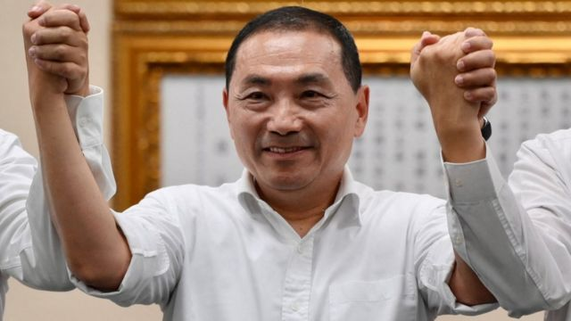
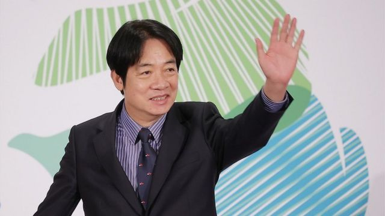
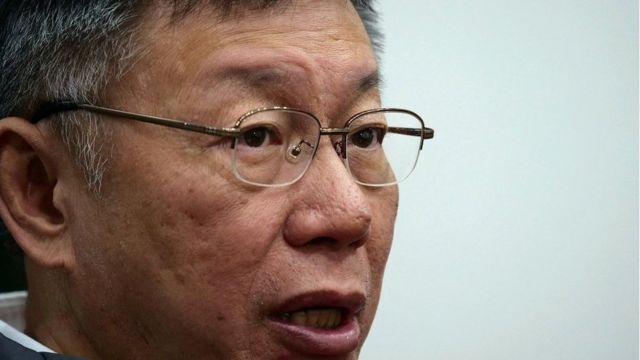

# [Chinese] 台湾总统大选2024：代表国民党参战的侯友宜，拒绝为一国两制和台独背书

#  台湾总统大选2024：代表国民党参战的侯友宜，拒绝为一国两制和台独背书

> 图像来源，  Getty Images
>
> 图像加注文字，侯友宜曾在民进党前总统陈水扁任职时被提拔在中央负责警政，后来他被朱立伦提携担任新北市副市长。

**台湾将在明年1月选出新一任总统，拖延许久的国民党参选人，终于在今天底定。国民党宣布征召现任新北市长侯友宜参选，挑战代表民进党参选的现任副总统赖清德，以及第三势力民众党党魁柯文哲。**

台湾舆论认为，虽然国民党在去年地方选举大胜，但却没有延续胜选气势，一鼓作气推出候选人，直至今日才“征召”侯友宜代表该党参赛，目前台湾各民意调查结果显示，目前赖清德保持领先，引发国民党支持者焦虑。不过，有分析称，国民党希望借着两岸关系紧张时，以“两岸牌”为吸引选票的主要战略，以相较民进党与北京有较大的谈判沟通空间这一特点来吸引选民。

侯友宜的两岸及外交政策，无疑将成为焦点。

侯友宜今天致词时强调，要参选就要胜选，要参选就要团结国家，要参选就要带给人民希望。他感谢鸿海创办人郭台铭，愿意团结在一起，为了中华民国，一定要再次政党轮替。

郭台铭在脸书发文表示，恭喜侯友宜获得征召提名， 他说侯友宜是国民党最稳固的民意础石，由侯承担更大的责任，是理所当然，也是国民党内最好的人选。

中国国台办发言人马晓光在例行记者会上指出，对于中国国民党的内部事不予评论：但他说“我们也注意到，中国国民党领导层与有关各方都多次表示要团结，不能分裂。对此持续关注。”

英国诺丁汉大学台湾研究学者丘琦欣向BBC中文解释称，迄今为止，侯友宜已陆续发言，尝试界定他的两岸政策，将自己定位为既反对“一国两制”，也反对“台独”的国民党人，“侯将一国两制和台独定性为极端观点，是试图将自己定性为一个温和的候选人。”

但是，丘琦欣说，具有讽刺意味的是，由于习近平仍然希望在“一国两制”的框架下拿下台湾，因此侯是否会成为北京属意的首选人选，还需观察。 “侯可能会被迫进一步阐述他对未来两岸关系的思考，迄今为止，侯一直试图避免这种情况。”

##  侯友宜是谁？

侯友宜1957年在台湾南部嘉义县的基层家庭出生。他长期在警界供职，过去曾担任基层警员，一路升迁到刑警、台湾警政署署长，之后在台湾中央警察大学获得犯罪防治研究所法学博士。

侯友宜早期曾在民进党前总统陈水扁任职时被提拔在中央负责警政，后来他被时任国民党籍新北市长的朱立伦提携担任副市长，被认为是在蓝绿阵营都有人脉的政治人物。

此外，因为新北市地方施政，掌握许多资源，侯受地方人士欢迎，也与台湾许多媒体集团交好，获得许多支持，譬如两岸“红顶商人”蔡衍明领导的《中天新闻》及《中国时报》等媒体。现在他的主要支持者以台湾“统派”人士及政治人物为主。

##  他可能面临的挑战

台湾东海大学政治系教授张峻豪不久前告诉BBC，侯友宜去年底刚连任新北市长，因此不想如上届大选的韩国瑜一样，刚当选高雄市长后不久就宣布参选总统，引发选民激烈反弹，最后大败收场，但这也导致国民党提名他的进程缓慢，被批评拖泥带水。但侯友宜能否说服选民自己连任新北市长半年不到就参选总统具有正当性，仍然是他面临的最大挑战之一。

> 图像来源，  President Office ,Taiwan
>
> 图像加注文字，赖清德主要工作是要在弥合在去年地方选举后，民进党党内各派系内部倾轧所造成的伤害。

> 图像来源，  Reuters
>
> 图像加注文字，此次由柯文哲领导的第三势力——民众党也以“打破蓝绿垄断”，“打破意识形态挂帅”为口号，希望吸引中间选民及年轻选民的支持（图为柯文哲资料照片）。

此外，侯友宜的地方政治人物背景，是否导致他对国际外交特别是台美关系及军事领域的论述不足，这一点也受到批评者质疑。去年疫情期间，新北市一名两岁男童“恩恩”染疫，家属认为该市行政疏忽，延误送医，至今争议没有平息，侯则回应已经尽全力抢救。

台湾独派的关注点则是，侯友宜过去担任台北市刑警队长时，就时常负责率队逮捕民主派人士。其中，1989年4月，侯带队攻坚，逮捕因为坚持“台独为言论自由”而绝食的“台独教父”郑南榕，后者在那次逮捕行动中自焚身亡，至今独派团体及郑南榕家人仍时常对其提出抨击。

在派系林立的国民党内，也有反对侯友宜的声音。因为2004年，民进党籍陈水扁竞选总统连任时，投票前夕遭受枪击，震撼全台，当时担任台湾刑事局长的侯友宜，是“319枪击案”调查主要负责人，而国民党候选人连战在该次选举小输陈水扁，导致现在国民党内仍有批评侯友宜没有彻底调查枪击真相的声音。陈水扁连任后，侯友宜升至台湾警政署长，2006年国民党立法院党团便赴台北地检署告发侯友宜等人在枪击案掩盖真相，甚至有人以“蓝皮绿骨”形容侯友宜。

> 图像来源，  Getty Images
>
> 图像加注文字，侯友宜（右一）曾负责陈水扁枪击案的调查。2004年，他与国际调查专家在记者会上。

##  最新民调

台湾民意基金会5月16日公布电访1076人的最新民调显示，若2024总统大选由赖清德、侯友宜、柯文哲3人竞争时，赖清德获35.8%支持、侯友宜27.6%、柯文哲25.1%。

此外，台湾年代新闻台的《年代民调中心》电话访问1070人，问及若明天是总统选举投票日，有33.3%的人选择赖清德、28.3%称会投侯友宜、19.7%则选择柯文哲。

位于华府的全球台湾研究中心（Global Taiwan Institute）智库执行长萧良其（Russell Hsiao）则在个人社交网站评论说，由于侯友宜是国民党内的本省人、他又担任警界高层和新北市长的相对稳固的纪录，以及迄今为止温和的两岸政策立场，民进党要将他与自己差异化将更具挑战性——至少比起郭台铭亲北京的形象，民进党和民众党要借着两岸政策攻击侯友宜会更难。

他认为，随着中国逐渐成为选举议题，侯友宜对两岸关系采取更微妙暧昧的态度，被认为比郭台铭更温和，或可会吸引更广泛的台湾选民。

