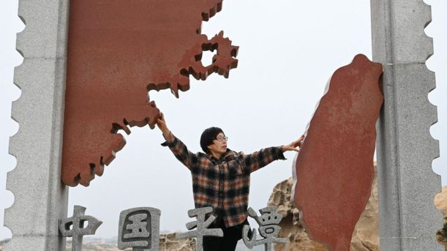
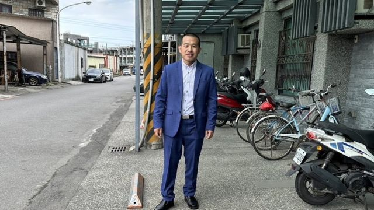
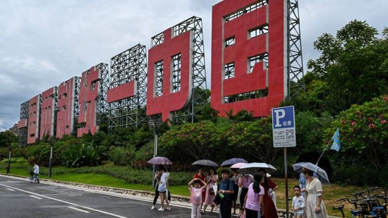
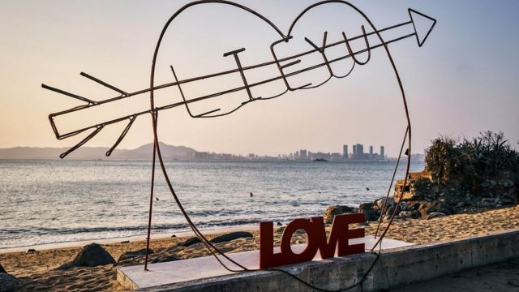

# [Chinese] 从“焦虑主妇”到富察，陆配入籍台湾一步之遥下的国安困境

#  从“焦虑主妇”到富察，陆配入籍台湾一步之遥下的国安困境

  * 李澄欣 
  * BBC中文记者 

> 图像来源，  Facebook Fu Cha
>
> 图像加注文字，本身是辽宁人的富察曾任上海文艺出版社副社长，是中共党员，他结婚移居台湾后曾出版多本政治敏感书籍。

**持中国大陆籍、2009年起就长居台湾的“八旗文化”总编辑富察（本名李延贺）3月前往上海探亲时被捕，大陆国台办指他涉嫌从事煽动分裂国家犯罪活动。据悉他是为了处理户籍问题而冒险到对岸，让各界关注台湾的大陆配偶（陆配）谋求入籍台湾时面对的政策风险。**

“最近的事情让我有点震撼，对小粉红来说当然没影响，但像我这种自由派、批判中共政权的就会怕。”山东出生的台湾陆配王第（笔名）对BBC中文说。

王第今年44岁，自言上世纪九十年代初因六四事件“政治觉醒”，此后在大陆曾声援维权活动，五年多前他与台籍太太结婚并依亲移居台湾，明年初住满六年就合资格入籍，但台湾法律要求必须回大陆原居地注销当地户籍。近日传出富察赴上海除籍时被捕，他深感忧虑。

“台湾人没有意识到，这个入籍方式实际上是‘送中条例’，帮着中共政权做长臂管辖、远程操控，等于把我们这些真正爱台湾的大陆人推向火坑。”

半年前，在大连出生的台湾知名陆配网红“焦虑主妇Lia”，也因到大陆注销户口疑被刁难，无法取得返台所需的“一次性出入通行证”而滞留数周。她连拍多条影片哭诉，引起广泛关注，但12月中取得证件后再拍片澄清是误会一场，指都怪自己“太心急”，并向大连市出入境管理局等公部门致歉及道谢。

另一陆配网红作家、成都出身的“上官乱”（笔名，本名凌怡）当时曾公开声援Lia，促请台湾陆委会和移民署检视相关规定。她对BBC中文说：“就像你逃离了家暴的老公到庇护所，但离婚必须要回老公那边签文件，你当然会很害怕回去会不会又被打。”

##  “一中宪法”下的台湾入籍政策

> 图像来源，  Getty Images
>
> 图像加注文字，台湾的“一中宪法”称两岸同属中华民国，只是分成“自由地区”与“大陆地区”。中国政府则将台湾视为其主权下的一个省级行政区，终将回归成为中国的一部分。图为中国平潭一名游客拍照。

1993年，台湾当局开放大陆配偶赴台定居，台湾目前约有35万陆配人士。据《台湾地区与大陆地区人民关系条例》（简称《两岸条例》）第17条，他们经团聚许可入境后申请“依亲居留”，满四年且每年合法居留逾183日者可申请“长期居留”，再满二年后可申请“定居”，凭“定居证”可到户政事务所办理设籍及领取身份证。

但这距离成功设籍还有一步之遥，法例规定申请人须在三个月内缴附“丧失原籍证明之公证书”，否则台湾户籍失效。这意味着，陆配要在限期内到大陆原居地机关注销户籍。

“这本身就是很矛盾的制度——大陆是敌对地方，但你要求人家去那边注销；台湾政府不承认大陆，但（注销户籍）又要大陆协助才办得到。”台湾国立政治大学公共行政学系教授苏伟业对BBC中文说。

他解释，该制度是基于台湾的“一中宪法”，即宪法上两岸同属中华民国，只是分成“自由地区”与“大陆地区”。两岸人民在法律上是“同一国的人”，因此身份不是用“国籍”区分，而是用“户籍”去定义——在台湾有户籍就是“台湾地区人民”，在大陆有户籍就是“大陆地区人民”，两者只能二选一，以符合两岸各自都规定的“单一户籍制度”。

##  除籍风险

> 图像来源，  Shangguan Luan
>
> 图像加注文字，上官乱说，在大陆政府的黑名单上的人回去除籍风险高。

台湾法律并没订明当事人取得“丧失原籍证明之公证书”的方式，市面上有中介公司协助陆配代办注销户籍手续，申请人也可以委托对岸亲属办理。

但专门研究外配权益的台湾国立政治大学法律系教授廖元豪向BBC中文指出，大陆每个地方省市的除籍行政流程不一样，且执行时可能有政治因素。“如果你这个人我们登记有案，你曾经批评我们政府，你是台独，有没有可能就不给你办？我们不知道。”

自称“小粉红”、今年28岁的陆配莉莉（化名）对BBC中文表示，圈内大部分人还是会亲自赴陆办理，并顺道探亲，她认为只要是“良民、好公民”就不用担心，指现在出事的人都是“异议份子”，那是政治问题，非政策问题。

“被刁难的只是少数吧，如果有事你自己要反思。就像Lia，她在台湾为了冲流量迎合绿营观众的口味、不停酸大陆，我们都很讨厌她。你想想她得罪了多少大陆人，被举报国安，回去才会被刁难。”

王第则表示，这种要顾虑有否“得罪政权”的心态，正是他担心的原因。“如果你公开说了中共不高兴的话，会被列入黑名单，他们可不会让你委托办除籍手续，你还是得亲自回去，那就出事了。”

有“才女”之称的陆配上官乱，曾在大陆出版多本书籍，并高调参与维权运动，她直言回乡除籍等同送死。“我以前就已经是黑名单上的人，经常被请喝茶，回去除籍肯定会有这个担心。”

##  中国延伸的“长臂”

> 图像来源，  Wang Di
>
> 图像加注文字，王第说在政策压力下很多陆配自我噤声, 他也曾被小粉红陆配公开威胁。

台湾陆委会回覆BBC中文查询时指，政府从未要求当事人必须亲自返陆办理，“倘个案有基于特殊因素或人身安全等考量，以至于不宜返陆办理相关证件者，政府主管机关应会衡酌个案特殊状况提供适切的谘询与协助”。

被问到疫情前后的近四年来，共有多少个案获豁免或特殊协助时，当局没有正面答覆。

上官乱表示无奈，又指听说专案的范围很窄，“获得豁免的可能是像当年的王丹吧，但我只是个普通的陆配，我有王丹的地位吗？”

她认为富察事件对陆配群体而言是很大的警号，而且中国政府在疫情后明显收紧了意识形态管控。“以前还比较宽松，像富察在疫情前回去也没事，但白纸革命后维稳加倍了，两岸关系也在去年佩洛西访台后更紧张，现在回去越来越危险。”

台湾中央研究院社会学研究所研究员林宗弘对BBC中文分析指，除了富察受查，台湾民族党副主席杨智渊也在大陆因被指涉嫌“分裂国家罪”遭到拘捕，加上北京被揭发在海外设立秘密警察站等一连串事件，可见中国政府在习近平第二任期末、第三任期初开始，明显延伸长臂管辖，司法权变成治外法权。

“之前抓李明哲是因为他支持中国境内的人权运动，但这次杨智渊、富察事件，中共罗织的罪名和证据是针对他们在中国境外发生的事。现在不管你在世界哪里，只要判定与中国的国家安全有关，你一入境中国包括港澳，都会被抓。”

林表示，台湾政府应对所有民众提出警告，尤其是经常往返两岸的台商台干，同时检讨陆配入籍的制度性问题，尽快提出调整方案。

##  “头上一把刀”

> 图像来源，  Getty Images
>
> 图像加注文字，有陆配指在压力下被迫唱好大陆及配合统战工作，但此举又恐涉及台湾国安。

台湾现行入籍规定，除了影响陆配除籍时的人身安全之外，还变相限制了在台居留六年期间的言论自由，这是陆配群体中被讨论颇多的“潜规则”。

经常在网上“出征”、维护大陆官方立场的陆配莉莉说，大家都知道“要等六年后才发表敏感言论”。她指疫情期间看到有些陆配批评大陆的封控政策，“我就觉得他们没脑子，毕竟以后还是要回大陆，没担心过入境会有什么状况吗？”

上官乱形容入籍规定犹如“头上一把刀”，让身边很多陆配朋友不敢说话，十分压抑。“这几年两岸意识形态和制度差距越来越大，现在很多陆配都知识水平高也认同台湾，他们很想公开夸赞台湾，但因为除籍要看大陆，不敢自由说话，不能像台湾人一样享受言论自由。”

王第表示，在相关政策下陆配不仅被迫噤声，还不得不违心地“支持祖国统一大业”和“反对台独反裂活动”，甚至配合统战工作渗透台湾。“如果你是陆配中有点名气和影响力的人，中共的统战组织找到了你要求你配合，你敢拒绝吗？你敢拒绝，回去除籍时就随便给你一个罪名，说你是间谍抓捕你。”

他说曾揭发花莲一名陆配在网上渗透及散播仇台言论，涉嫌危害台湾国安，双方在网上互呛，“她当时就公开威胁我说：你得罪我们，以后还要不要回去除籍呢？所以台湾的法规反而是保护这些人，打击我们。”

王第承认陆配当中支持台湾、反对武统的人是少数，但是“保护我们等于保护台湾”，他希望当局调整行政规定。“台湾朝野以为这个规定是在维护台湾国安，但实际造成的结果是让中共利用这一点去操控陆配。”

##  法律可否变通？

> 图像来源，  Getty Images
>
> 图像加注文字，两岸通婚30年，目前台湾约有35万陆配，图为台湾金门烈屿一个景点，与对岸的中国大陆厦门市仅5公里。

陆配入籍政策触碰到敏感的国安问题，在台湾社会容易引起反弹。上官乱月前公开声援Lia并促请政府修法后，随即变得“两面不是人”，有“小粉红”翻墙出征骂她是“汉奸”，另一方面也有台湾人怀疑她是“共谍”。

她笑言已习惯这些人身攻击，“生在中国就是原罪，哪怕对台湾那么多贡献”，但她仍希望推动相关政策讨论，为许多被迫沉默的陆配发声。

法律教授廖元豪表示，《两岸条例》以“户籍”区分台湾和大陆人民的原则难以改变，但具体细节可以调整，例如规定在某些情况下不用提交原籍证明。

“你需不需要大陆发一个证明呢？因为如果需要，你就要听他的。这是可以讨论跟修订的。假设我符合了台湾所有条件，也宣誓放弃大陆户籍，至于除籍手续什么时候办好，可以不影响台湾这边的（身份），证明书只是一个技术的小事。”

他指出，相关修订可参考适用于外国人的《国籍法》第九条，申请人须在归化日起一年内提出丧失原有国籍证明，但如“经外交部查证因原属国法律或行政程序限制属实”则可申请展延时限。

“譬如越南人归化，原先规定他们要先放弃越南国籍再拿台湾归化，但这造成很多人在中途变成无国籍，后来就改为让他们先拿到归化证明，事后再补件，如果因为外交因素不拿证明也没关系。日本人归化也是，（台湾）外交部知道日本不会发这个（丧失原有国籍）证明，他们已经讲得很清楚，所以我们也不会要求他们提交。”

公共行政学者苏伟业也批评当局官僚僵化，“其实大陆（户籍）注销与否，不会影响到台湾，我们根本就不用管大陆怎么看。现在这些奇怪的要求在一中宪法下是有法理依据，不过是否合理呢？”尽管如此，他研判在当前政治气候下，相关政策很难会改变。

“台湾人会问，为什么要为大陆人而改变？”

