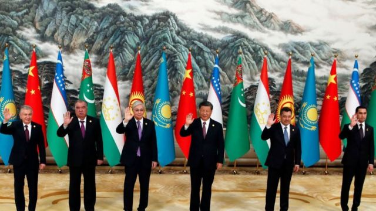

# [Chinese] 中国中亚峰会：《西安宣言》避谈俄罗斯乌克兰，北京展示外交优先选项

#  中国中亚峰会：《西安宣言》避谈俄罗斯乌克兰，北京展示外交优先选项

> 图像来源，  AFP via Getty Images

**在西安举行的中国——中亚峰会19日闭幕。这场峰会是今年中国首场重大主场外交活动，也是中国和中亚五国建交31年来首次以实体形式举办峰会。**

东道主中国领导人习近平发表了 主旨讲话  ；峰会后六国领导人签署了 《西安宣言》  、公布了峰会 成果清单  。

在日本广岛举行的七国集团峰会上北京被描绘为一个“胁迫者”负面形象的背景下，哈萨克斯坦、吉尔吉斯斯坦、塔吉克斯坦、土库曼斯坦和乌兹别克斯坦的领导人承诺支持北京、深化双边关系，中国官方媒体将峰会称为中国区域外交的胜利。

峰会自始至终贯穿的主旋律凸显北京中亚外交的优先选项。但是，没有提到的议题或许也能说明问题。BBC中文梳理峰会活动及成果性文件中的三个重点和一个回避事项。

##  北京力图彰显历史和友谊

> 图像来源，  Getty Images
>
> 图像加注文字，西安，古称长安，是丝绸之路东方起点。

在俄乌战争旷日持久、美中竞争加剧、西方与中国关系疏远的背景下，中国希望扩大国际影响力，中国-中亚峰会给北京提供了一个彰显和中亚“深厚友谊”的好机会。

峰会在西安——古丝绸之路的起点长安——举行，充满象征意义。北京希望人们看到的是，中国与中亚自古以来就有密切交往。

5月18日晚，习近平和夫人彭丽媛在西安的大唐芙蓉园举行欢迎仪式和宴会。习近平在致辞中就说到，陕西“见证了中国同中亚国家两千多年的深厚友谊”。

从宴会后的演出节目单中，东道主的用心也可见一斑：有“海内存知己，天涯若比邻”的中俄双语吟诵，也有六国歌手齐唱《美美与共》。中国官方媒体将其总结为“大道不孤，命运与共”。

17、18日，习近平还与中亚元首举行了一对一会谈。第一个是中国在中亚最大的贸易伙伴、哈萨克斯坦总统托卡耶夫。习近平祝对方70岁生日快乐，还称中哈关系开启新的“黄金三十年”。曾在中国留学的托卡耶夫在受访时大秀中文，透露想念北京烤鸭、担担面等中国美食。

峰会后，中国国务委员兼外长秦刚接受媒体采访时说，习近平为恰逢生日的托卡耶夫庆生，充分体现了两国元首的深厚友谊。六国元首共植石榴树，象征着六国像石榴籽一样紧紧团结在一起。

##  寻求合作和发展

峰会上，习近平就如何建设中国——中亚命运共同体提出了“四个坚持”。这四个坚持分别为守望相助、共同发展、普遍安全、世代友好，以此打造“团结互信、合作双赢、永沐和平、同心同德”的共同体。

《西安宣言》近五千字，其中“合作”出现50多次，“发展”超过40次、都在出镜频率排行榜上名列前茅。

> 图像加注文字，中亚峰会宣言词云

细看峰会成果清单，“主要合作共识和倡议”共计54项，涵盖贸易、投资、基础建设、能源、数字科技、农业、文化、人员交流等方方面面。重点措施包括：

  * 正式建立中国——中亚元首会晤机制，每两年举办一次，轮流在中国和中亚国家间举办。下次峰会将于2025年在哈萨克斯坦举行 
  * 向中亚国家提供总额260亿元人民币的融资支持和援助；中国同哈萨克斯坦签署了互免签证协定，哈萨克斯坦成为首个同中国互免签证的中亚国家 

中国在中亚的贸易额虽然并不是中国外贸的重头，但是，中亚五国不仅自然资源丰富，而且承东启西，是欧亚贸易必经之路。在俄罗斯陷入旷日持久的乌克兰战争时，中亚可以将中国作为替代选项。

##  关注安全和稳定

贯穿习近平演讲、西安宣言和峰会成果清单的另一条主线是和平、安全和稳定。

习近平的“四个坚持”中，第三项是坚持普遍安全。他在主旨讲话中说，坚决反对外部势力干涉地区国家内政、策动"颜色革命"，保持对“三股势力”零容忍。但是，习近平没有明说“外部势力”是谁。

习近平还说，中方愿帮助中亚国家加强执法安全和防务能力建设，支持各国自主维护地区安全和反恐努力，开展网络安全合作。

秦刚在峰会后接受媒体采访时也强调，任何人都无权在中亚制造不和、对立，更不应该从中谋取政治私利。

峰会前，中国官方媒体在报道时提到，中亚地区的稳定，对于维护中国国内特别是西北地区的稳定“至关重要”。

中国西北主要指近年来因人权问题引起关注的新疆。中国的新疆政策招致国际间、特别是西方国家的批评。在地理、民族、文化、历史等方面， 新疆与中亚各国联系更加紧密，新疆问题在这些国家也引发长期关注。

> 图像来源，  Getty Images
>
> 图像加注文字，在广岛举行的七国集团峰会，乌克兰战争是一个重要议题。

##  乌克兰战争、俄罗斯只字未提

中国——中亚峰会与在日本广岛举行的七国集团峰会重叠。七国峰会上，乌克兰战争、北京“胁迫”都将是重要议程。

中国——中亚峰会之前曾有预测说，试图在莫斯科和基辅之间调解和平的中国可能会在峰会期间再次表态，并要求中亚五国附和自己的声音。但事实上，在习近平讲话、西安宣言等峰会公开文件中，对乌克兰战争都是只字未提。

俄罗斯入侵乌克兰将中亚推入两难境地。一方面，乌克兰也是前苏联加盟共和国，中亚五国难免感到唇亡齿寒；另一方面，长期在政治、经济等方面依赖莫斯科的中亚各国也难免受到西方制裁的株连。回顾2022年战争爆发后，中亚五国态度谨慎如走钢丝：没有谴责俄罗斯侵略，但也没有公开表示支持。在联合国大会谴责俄罗斯入侵的投票中，中亚五国或弃权、或缺席。

虽然中国——中亚峰会并未提及乌克兰战争，但是中国官方媒体却在此期间批评七国集团“拱火”俄乌冲突。

中国官方媒体《环球时报》在5月18日的社论中称，七国集团国家除了采取进一步拱火俄乌冲突的具体行动外，也将中国作为针对的重点，兴趣都放在了组团加强遏制别国上面。

秦刚在峰会后接受媒体采访时说，中国和中亚的合作“不针对任何第三方，也不受制于第三方，不搞封闭排他的‘小圈子’，更反对集团政治和冷战对抗”。

> 图像来源，  Getty Images
>
> 图像加注文字，俄罗斯总理米舒斯京

中国——中亚峰会上也没有提及俄罗斯，但峰会闭幕的当天传出的另外一则新闻是，俄罗斯总理米舒斯京将于下周（5月23-24日）访问中国。

中国外交部发言人汪文斌周五（5月19日）在例行记者会上宣布了这个消息。

汪文斌说，我们期待通过米舒斯京访华“进一步加强双方合作，深化人文和地方交流，为世界经济复苏注入强劲动能”。

克里姆林宫表示，访问期间“俄中双方将讨论双边贸易和经济合作议题”。

