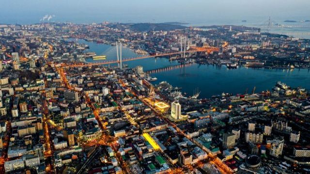
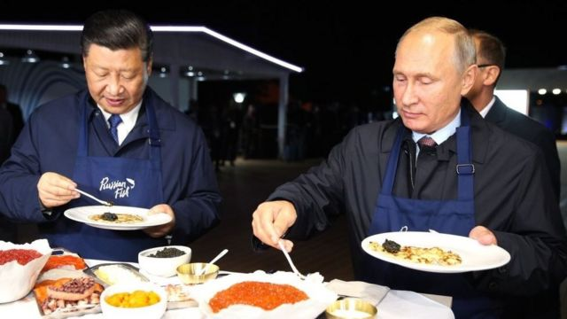
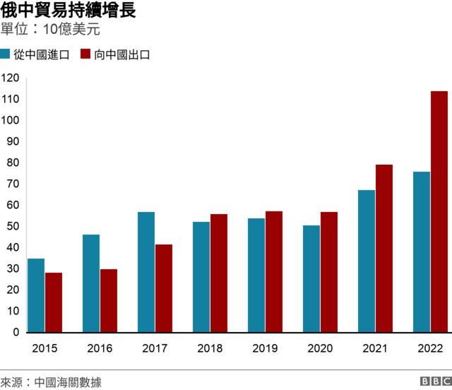
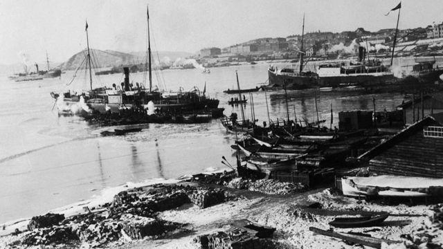
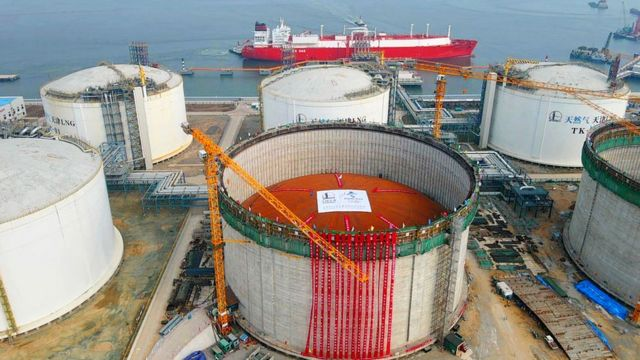

# [Chinese] 符拉迪沃斯托克变身中国内贸港？中俄远东互动的现实与历史

#  符拉迪沃斯托克变身中国内贸港？中俄远东互动的现实与历史

> 图像来源，  Getty Image
>
> 图像加注文字，符拉迪沃斯托克临近俄、中、朝三国交界之处，三面临海，是俄罗斯在太平洋沿岸最大的港口。

**中国海关总署近期发文称，同意在吉林省进一步扩大内贸货物跨境运输业务范围，增加俄罗斯符拉迪沃斯托克港（中国旧称“海参崴”）作为内贸货物中转口岸。**

这意味着，中国的货物在国内运输，穿过中俄边境，通过符拉迪沃斯托克港出海，再在中国东南沿海港口卸货。而中国则按照国内货物流通来处理，不必经过出口和进口的繁杂程序。

符拉迪沃斯托克是俄罗斯滨海边疆区的首府，也是远东行政中心所在地。“海参崴”是该市的中国传统名。《瑷珲条约》和《中俄北京条约》签订后，此地割让给俄罗斯并被改名为“符拉迪沃斯托克”，成为中国东北地区约40万平方公里割让领土的象征。该市临近俄、中、朝三国交界之处，三面临海，是俄罗斯在太平洋沿岸最大的港口。该市还是俄罗斯太平洋舰队司令部所在地。

很多中国人仍对这段历史耿耿于怀，称其为“海参崴”，即其中文旧名。因此，上述消息一出，在中文互联网引起不小反响，有自媒体账号以“163年后，中国重获海参崴出海口”为标题进行报道，获得广泛关注。

但专家解读称，类似安排早在2007年就已开始，对中国的东三省经济有一定好处，但远未到俄罗斯让渡权益的地步，“海参崴”回归中国更是“可能性为零”。

##  对中国有何好处？

对于毗邻俄罗斯的中国吉林省而言，原本要运送货物到经济发达的南方省份，需要经过长途陆运，再通过辽宁省的港口入海，从南方的宁波、厦门等港口上岸。如果北上从更近的符拉迪沃斯托克港下海，就大大减少了运输距离。

“这样安排对中国的好处，最主要是降低东北地区大宗货物向南运输的物流成本，因为东北没有办法直接向南海运，需要通过转运。”华东师范大学俄罗斯研究中心副主任张昕表示，把货物运到毗邻国家港口中转，抵达中国南方再入境，把外运的部分当作国内业务来做，就是所谓的国际中转。

张昕提醒，这并不是突破性的制度安排，事实上早在2007年中俄间就有这样的安排，而且当时就已囊括符拉迪沃斯托克港，中国国内从黑龙江省的绥芬河口岸出境，经俄罗斯的符拉迪沃斯托克港、东方港、纳霍德卡港，再从中国的上海、宁波、黄埔等入境。

只不过此次扩展了适用范围，允许吉林省也可以通过符拉迪沃斯托克港转运，中国国内接收的港口则增加了浙江省舟山甬舟集装箱码头和嘉兴乍浦港。

其实就东三省而言，能在这项安排中受益的主要是黑龙江省和吉林省东部。辽宁省自身有大连、营口等港口，而黑龙江距离远，原来需要上千公里的陆运才能抵达辽宁的港口出海。

吉林省会长春距离符拉迪沃斯托克港和大连港的距离差不多，获益有限。但吉林东部与俄罗斯接壤的部分则能节省路上运距，以吉林东部的珲春口岸为例，这里到符拉迪沃斯托克港270公里，到大连港1000余公里。事实上，此次也是吉林最东部的珲春市航务局向中央政府申请增加符拉迪沃斯托克为内贸货物跨境运输中转口岸，而此前，珲春市已可以通过朝鲜的罗津港完成国际中转。

##  与俄乌战争的关系

“一些媒体、社交媒体上，把整个事件作为，好像俄罗斯在俄乌冲突背景下做出重大让步，甚至有标题说是俄罗斯主动向中国开放已经封闭一百多年的海参崴，我觉得这样的理解不太恰当。”张昕说，可以说这个事与俄罗斯在乌克兰战场的压力有一定关联，但关系并不是特别大。

俄罗斯入侵乌克兰后，西方国家对俄罗斯实施了严厉制裁，包括禁止进口石油和出口高科技产品。

> 图像来源，  RUSSIAN PRESIDENTIAL PRESS AND INFORMATION OFFICE
>
> 图像加注文字，2018年9月，习近平访问符拉迪沃斯托克，与普京一同享用俄国传统煎饼。

许多西方公司完全切断了与俄罗斯的联系，俄罗斯与美国、英国和欧盟国家的贸易在2022年期间大幅度下滑。

然而，中国与俄罗斯的整体贸易额在2022年达到了创纪录的1900亿美元，同比增长了30%。中国在很大程度上成为莫斯科最重要的贸易伙伴。

到了今年这种猛涨的势头有增无减。今年4月最新外贸数据显示，中国对俄罗斯出口同比增长153%。

再者，在制裁之下，俄罗斯甚至无法使用国际资金清算系统（SWIFT）结算，这使俄罗斯不得不加大对华贸易力度，因为对华贸易至少可以通过中国央行打造的人民币跨境支付系统（CIPS），使用人民币结算。

张昕称，在西边面临冲突，普京一定会推动他所说的东向战略。但并不是各方面主动做出重大让步。

中文媒体财新的报道中则称，2022年以来随着中俄贸易量大增，中国东南沿海港口至符拉迪沃斯托克港集装箱船舶运力增加，船舶回程带货能力增强。间接刺激了通过该港口进行中转的吸引力。

##  收复海参崴？

海参崴在明清时是中国领土，意为盛产海参的地方，位于中国东北部区域。1860年签署的《中俄北京条约》（《北京条约》的组成部分）将包括海参崴在内的乌苏里江以东地域割让给俄罗斯，随后俄罗斯将其命名为符拉迪沃斯托克，意思是“统治东方”。

割让海参崴被视为中国自1840年鸦片战争后百年屈辱史的一部分，囊括在历史教科书中，《北京条约》被当作“不平等条约”反复提及，甚至作为要点而被要求背诵。

> 图像来源，  Getty Image
>
> 图像加注文字，1893年的符拉迪沃斯托克港，此时距割让给俄国33年。

因此很多中国人对“海参崴”一词意难平。甚至在官方层面也有一定程度体现，比如今年3月，中国自然资源部发布通知，在出版地图上，俄罗斯境内8个曾经属于中国的地方，必须同时标注上中文地名，包括海参崴、尼布楚、伯力、庙街、海兰泡、双城子、外兴安岭、库页岛。其中海参崴在中国的知名度最高。

因此在中国社交媒体上，经常会有网友提醒不要忘记被列强割去的土地，而其中最大的一块就是被俄国割走的包含海参崴的地区。

“社交媒体上的反应，折射出一部分中国人对海参崴这个城市的历史情结，这个可以理解。”华东师范大学俄罗斯研究中心副主任张昕解释，但在现实层面，中俄两国关于领土边界的谈判，从苏联时代开始，绵延几十年，很周折，直到本世纪初才有突破性进展，全面确定中俄边界，两国不再有领土层面的争议，是双边关系的重大进展。所以现在去追溯海参崴的历史归属，在法律和政治层面，恐怕空间非常有限。

“至于说俄罗斯进一步让渡海参崴，包括驻军，甚至像一些网友所说的回归中国，我觉得现实中可能性为零。”张昕称。

在2016年一篇《纽约时报》的报道中则援引一位俄罗斯人称，中国收回符拉迪沃斯托克，就跟俄罗斯收回阿拉斯加一样，不切实际。

##  中国的“加油站”

不过，符拉迪沃斯托克的景象，折射出远东贸易的繁荣，背后是俄罗斯对中国越来越强的经济依赖。俄乌战争爆发后，俄罗斯从欧美日本进口份额下降14%左右，从中国进口份额则增长7%左右。

西方媒体上有声音认为，长此以往，俄罗斯将沦为单纯的中国“加油站”。

> 图像来源，  Getty Images
>
> 图像加注文字，位于天津的这个储存装置用于接收从俄罗斯进口的液化天然气。

这么说背后是中俄之间蓬勃的能源交易。俄罗斯几乎一半出口收入来自石油和天然气，随着制裁生效，俄罗斯对欧盟国家的销售急剧下降。缺口相当大的一部分通过亚洲市场来弥补。去年，俄罗斯向中国出口的液化石油气（LPG）是前一年的两倍。它还通过西伯利亚“力量”管道增加输送了50%的天然气、10%的原油。

中国不仅不愿遵循西方诸国对俄的制裁，还和莫斯科进一步发展能源关系，两国已同意建造一条新的天然气管道（西伯利亚力量2号）。而现有的管道于2019年开始运营，合同为期30年，总值超过4000亿美元。

张昕认为，能源是中俄贸易非常重要的一个环节，但并不是所有，两国即便在传统能源领域也在保持一定多样性，因为不管是对供给方还是需求方来讲，过高的单向依赖都是额外的安全隐患。即便在制裁下，印度、土耳其也在提升从俄能源进口，一部分还转运回欧洲。虽然俄罗斯不一定成为中国的“加油站”，但如果其经济结构不发生根本性改变，出口依赖能源的情况恐怕很难改变。

