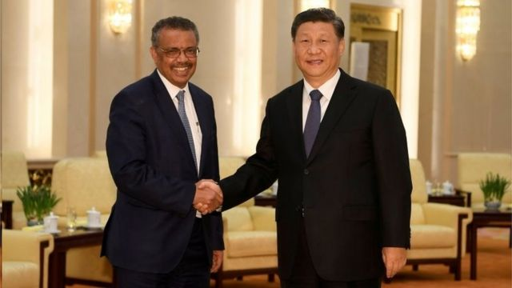

# [Chinese] 世界卫生组织大会： 台湾记者讲述注册成功领证遭拒过程细节

#  世界卫生组织大会： 台湾记者讲述注册成功领证遭拒过程细节

> 图像来源，  AFP

****世界卫生组织（WHO）在本周决定再次拒绝台湾以观察员身份出席世界卫生** ** ****大会** ** ****（WHA）之后，台湾官方媒体中央社称，已经成功申请采访证的两名记者，在大会当日突然被联合国工作人员禁止入会采访** ** **。**

根据中央社派驻欧洲的记者曾婷瑄及田习如表示，两人在年会开幕当日领取记者证时，遭到一位工作人员阻挡，并拒绝给证，理由是北京施压。

曾婷瑄告诉BBC中文称，对方以英语明确表示，几天前收到来自中国的压力，因此无法让他们领证。

“我们一周前收到采访许可，所以事件一定是在这一周之间生变的。我当场问工作人员说，中国怎么会知道我们拿到采访许可，工作人员回覆我们说：中国什么都知道。”曾婷瑄告诉记者。

曾婷瑄解释，从2009年以来，中央社每年都派驻欧洲记者到日内瓦采访世卫大会，只有新冠疫情期间因大会改以线上举行时没有申请。但是，自2016年以来台湾无法再以观察员地位参与世卫大会，中央社驻欧记者也一直无法取得采访证，今年中央社记者办妥线上申请并接到批准通知，但来到大会现场却无法领证，这种情况是第一次发生。

目前为止，世卫组织并未就此事回覆BBC中文询问。北京也没有针对此事回应。

> 图像来源，  CNA
>
> 图像加注文字，中央社向BBC中文提供的世卫大会采访申请成功确认电邮

针对台湾在世卫的困境，台湾在野党国民党立委陈以信周三（5月24日）说，现在WHA秘书处，是以联合国2758号决议文“一中原则”拒绝台湾参加，台湾政府应采取2016年模式，以“九二共识、一中各表”回应，复制当年成功入会模式，重回联合国相关组织。

据此，台湾陆委会回应称中共以“一中原则”的政治前提阻扰台湾参与大会，陈以信委员的建议“是否迎合中共政治勒索疑虑，社会自有公评”。

不过，总部位于巴黎的“无国界记者”（RSF）则发出公开声明，反对以国籍为理由限制记者采访违反新闻自由及民众获取资讯的权利。在台北的“台湾外国记者协会”，也发出声明批评世卫。

此外，包含美国，法国及日本等世卫代表，这两天在大会陆续发言表达支持台湾以观察员身份与会，并称台湾管控新冠疫情的经验，值得与全球分享，不该因为政治因素阻碍公共卫生的意见分享。

##  台湾记者被拒于门外

根据曾婷瑄说法，她与同事数星期之前便在联合国媒体申请平台递交采访申请。申请时，该系统国籍栏位并没有“中华民国”或“台湾”选项，因此两人先勾选“泰国”（Thailand），但在备注栏位中，注记中央社记者来自“台湾（中华民国）”。

之后，两人于5月16及17日收到大会采访许可通知确认电邮。但是，在5月22日瑞士时间上午8时，曾婷瑄与田习如二人在联合国日内瓦办事处领取证件时，却被禁止取证。曾婷瑄表示，当时使用英语的联合国工作人员，强调“WHO不再承认台湾护照”，对方又说若二人同时出示中华民国护照及“台胞证”（台湾公民入境中国大陆需要的证件），或可放行。但是，两人身上没有台胞证。

“他听起来很有歉意，态度也很好，强调是北京施压。他说，若他让我们进去，那么他的工作将不保。”曾婷瑄告诉BBC。

曾有媒体询问台湾是否能以观察员身份出席WHA，当时世卫组织回应法国国际广播电台说，一般来说，相关的决定由世卫组织成员国在大会“多数表决”，他们遵守大会表决结果。

> 图像来源，  Reuters
>
> 图像加注文字，中国国家主席习近平2021年1月28日在北京会见世卫组织总干事谭德塞。

世卫组织公关部门曾对外表示，世卫大会是在联合国日内瓦办事处举行，记者进入联合国日内瓦办事处的认证由联合国负责，而非世卫组织。而联合国现在的政策是总部仅开放给拥有联合国会员国身份的人士。

##  台湾的世卫困境

世卫组织，1948年成立并隶属联合国、为全球防疫以及医疗问题把脉的世卫组织，也一直是台湾希望持续参与及接触的国际机构。

但因为中国因素，台湾一直无法成为世卫组织成员。1971年退出联合国后，台湾也被迫退出隶属于联合国的世界卫生组织。1972年第25届世卫大会决议以中华人民共和国取代中华民国的席位。台湾自1997年开始积极重返世卫大会，以不同名义申请加入会员或观察员。台湾前副总统陈建仁在2004年担任卫生署长期间曾出席世卫大会，虽未以“台湾卫生当局”的名义申请成功成为观察员，但美国及日本首度公开投票支持。

2009年，马英九任职总统时台湾收到邀请函，台湾以中华台北（Chinese Taipei）名义、观察员身分、部长名衔受邀参与世卫大会。马英九对外说明成功原因在于国际支持、国内共识以及“两岸和平”。当时世卫秘书长是来自香港的陈冯富珍。然而，长期推动台湾加入世卫组织的“台湾医界联盟”执行长林世嘉曾经接受BBC中文采访时称，马英九当时是因为接受“九二共识”，也对世卫文件中称台湾为中国一省不做任何抗议，因而能参与世卫会议或事务。

> 图像来源，  Getty Images
>
> 图像加注文字，世卫组织掌管疫苗等相关卫生健康事务，在国际合作中发挥极大作用。

2016年，民进党蔡英文就任台湾总统后，不希望台湾在世卫的名称以及立场上妥协，亦不承认“九二共识”，之后北京开始施压，2016年后至今，台湾就不再拥有世卫组织观察员身份，也无法参与大会。2018年北京便向大会施压，称在会议中台湾不能独立于中国，台湾代表与随行媒体皆被拒绝进入会场，台湾总统蔡英文因此向国际抗议。

2019年，台湾同样因为北京施压，五年来无法加入疫苗采购大会。2020年，新冠疫情爆发，台湾的防疫经验，让各国认为，在全球捍卫公共卫生的价值上，没有排除台湾参与世卫的理由。2020年1月底，加拿大总理特鲁多及时任日本首相安倍晋三皆公开表示，支持台湾参与世卫组织会议，为前所未见。英国《经济学人》在当年3月26日在刊出的专栏称“将台湾排除在世卫外，是全球的损失”。

中国世卫代表当时回应称，不让台湾参加世卫大会将导致国际防疫体系出现缺口，是“台湾当局图谋参与世卫大会而编织的谎言和借口”。

