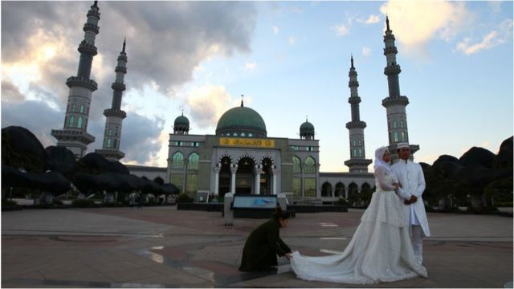
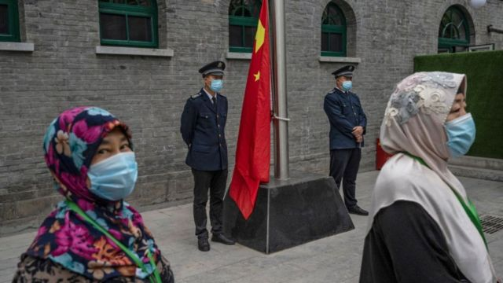

# [Chinese] 中国云南清真寺疑遭“强拆”，警民冲突引“宗教中国化”疑虑

#  中国云南清真寺疑遭“强拆”，警民冲突引“宗教中国化”疑虑

> 图像来源，  Getty Images
>
> 图像加注文字，云南省有众多清真寺（资料图片）

**日前互联网上传出消息，中国云南省一座清真寺的阿拉伯式外观遭当局强行拆除，施工期间有当地穆斯林居民到场试图阻止，与警察发生冲突。**

社交媒体上流传的 视频片段  显示，数十名民众在云南玉溪市通海县纳家营清真寺外与配有防暴装备、手持盾牌的警察发推撞，试图突破警方防线，期间有人向警察投掷物件。

视频背景音中有人说，“就是这样对付老百姓啊。”

法新社报道引述现场一名不具名的女性说，当局试图强行拆除部分建筑，“我们肯定不会让他们这么做”，并表示“建筑就是建筑，不伤害任何人，也不影响社会，为什么要毁掉？”

BBC无法独立核实事发现场的事实细节。

中国官方消息似乎确认该事件发生于上周六（5月27日）。当地警方于5月28日 通报  ，称“通海县纳古镇发生一起严重妨害社会管理秩序的案件”，呼吁涉案人员在6月6日前“投案自首”，以争取“宽大处理”。

冲突被指是与当局拆除清真寺的穹顶有关。当地法院曾于2020年作出一项判决，指清真寺部分改建属于违法，下令拆除。

资料显示，纳家营清真寺始建于14世纪明朝年间，数个世纪历经多次改建，现有清真寺建筑于2004年落成，有四个宣礼塔和一个穹顶，可同时容纳数千人。

该清真寺在2018年被列为该县文物保护单位。

美国《华盛顿邮报》（The Washington Post）引述当地活动人士指，当局疑似一度切断当地手机网络服务，周一打至当地的电话被转接至留言信箱。

通海县警方在周日的通报中称，事件造成了“恶劣的社会影响”，将严厉打击，并且“鼓励和保护”民众积极举报。

##  “宗教中国化”

> 图像来源，  Getty Images

中国在近年加紧了对宗教团体及个人的政治管制，并将“深入推进我国宗教中国化”列为统战工作的明确要求。

中国国家主席习近平在2021年的全国宗教会议上曾强调，要引导及支持中国的宗教以社会主义核心价值观为引领，增进宗教界人士和教徒对中华民族和中国共产党的认同。

5月底，中国启动了伊斯兰教、天主教、基督教教职人员的网上信息查询系统，作为对宗教教职人员的认证管理手段。

有报道指，该系统加强了对中国境内宗教人士的监控。

近年的宗教中国化官方叙事特别强调警惕外国势力“利用宗教渗透的危险”，以及“带有政治意图的宗教诉求”。

习近平上台之后，一直表示要“坚决抵御”境外势力利用宗教进行渗透，以及防范宗教极端思想侵害。

当中最显著并引起国际关注的事例是对西北部新疆维吾尔族穆斯林的 处理手法  。

中国当局在当地建立大量“再教育营”，对穆斯林进行“思想转化”，声称以此去除恐怖主义极端思想的渗透。

联合国人权报告则称中国对维吾尔人及其他穆斯林社区的做法是“严重侵犯人权的行为”。

法新社引述英国曼彻斯特大学回族问题专家大卫·史特鲁普（David Stroup）评论指，虽然这些做法对新疆以外的社群影响相当较小，但仍然有不少清真寺被“强制改建”，以符合官方的中国化定义。

自由亚洲电台引述一位中国基督徒王先生的话说：“基督教教堂十字架拆得差不多了，下一步就是对其他宗教。清真寺被拆圆顶类似于基督教教堂拆十字架。因为圆顶是清真寺的标志。现在要进一步整治基督教以外的宗教了。”

香港《明报》读者Sowe Ho则在报道下留言：“中国化应该经过洽谈而不是要求。”

回族是中国政府认可的56个国内民族之一，主要以逊尼派穆斯林为主。据悉全中国有约1000万回族穆斯林，其中70万居住在云南省。

