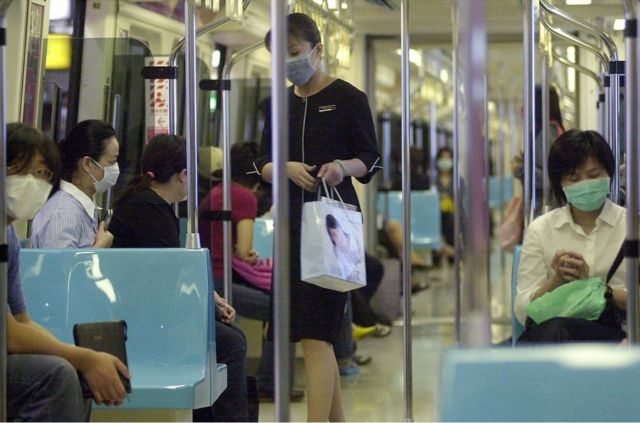
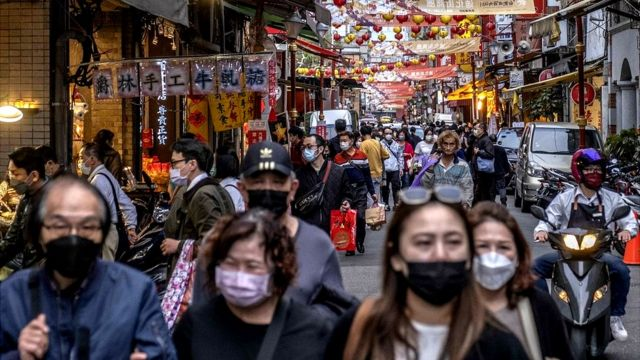

# [Chinese] 台湾2024总统大选：性骚扰议题意外成为政治风暴

#  台湾2024总统大选：性骚扰议题意外成为政治风暴

  * 吕嘉鸿 
  * BBC中文记者 

> 图像来源，  Getty Images

**“我们不要就这样算了，好不好？很多事情不能就这样算了，如果这样的话，人就会慢慢地死掉，会死掉！”这是上个月在台湾爆红的电视影集《人选之人：造浪者》中的经典台词，出自一位反对党女主管告诉女性基层党工，愿意与后者一起在党内向上申诉遭遇性骚扰。**

这部影片在国际串流平台上播出后风靡台湾，彼时被影射的各大政党幕僚，包括台湾总统蔡英文及民进党总统候选人赖清德都发文提到这部影片制作的成功。

但当时没有人想到，这套由前民进党政治幕僚担任编剧的热门影集，预言了台湾政坛（包含各党）“性骚扰”指控海啸的来袭。

相关实名指控先在民进党内部开始出现，之后有资深媒体人控诉国民党民代性骚扰等，性骚扰议题成为台湾总统大选开跑后不久的意外风暴。

但争议也延烧到学术界及文艺界，这几天被指控者众，包括在台湾清华大学任客座助理教授的的中国“六四”民运人士王丹，曾在台湾访问的流亡作家贝岭。但两人都已否认相关指控。

其他案例尚有台湾中正大学副教授，台大医院教授，民众党主席柯文哲前文胆，国民党智库学者，纪录片导演及当地前报社高层等等，台湾的性骚扰议题继续延烧。

这些受指控者多数否认相关指控，并称愿意循司法途径釐清。BBC中文无法独立核实相关指控。

##  “性骚扰”指控风暴

> 图像来源，  AFP/Getty Images
>
> 图像加注文字，台北捷运。

上周，一位曾任职台湾民进党的基层党工陈汘瑈在“脸书”实名指控，去年在党内工作打选战时，遭遇到职场性骚扰。她表示，虽然立即通报党内妇女部（现改为性别平等部），但她称遭到妇女运动出身的资深女性主管不当对待及二次伤害。她说，看了有关电视剧，她情绪再次崩溃，但因此将此事公诸于世，希望该党仍据此改革。

陈姓女子发文迅速在台湾政坛引发激烈讨论。隔日，民进党另一位陈姓前党工，再指曾经在党内遭遇同事职场性骚扰。该女发文自称，向主管呈报后却遭遇后者轻视，并联手加害者对其排挤之后，精神健康出现问题，然后离职。陈姓女子同时控诉指，当时现场目击者众，却鲜少有人伸出援手。

两篇文章发出后，引起台湾社会舆论哗然，民进党面对党内风暴，台湾总统蔡英文发文致歉，涉事主管离职，现任党主席，也是下届总统候选人赖清德在这几天除了数次致歉外，又称民进党将彻底改革。

赖清德在周一（6月5日）提出三点革新方案，包括建立直接申诉窗口、零容忍的处理原则以及立即修改党内规章。民进党性别平等部主任李晏榕则成立一个申诉信箱称，该信箱只有她一人能读到，鼓励受害者提出申诉。

性骚扰议题在2024年台湾总统大选正式开跑时，成为意外的政治风暴。台湾舆论现在的关注焦点，首当其冲是在民进党方面——该党曾推动多起妇女参政及婚姻平权法案——现在将如何彻底改革回应外界，特别是年轻世代的质疑。

观察民进党涉及的性骚扰指控危机，台湾清华大学社会学研究所退休教授李丁赞在脸书发文称，“民进党以重视弱势与少数起家，是该党重要核心价值”。但最近几年来，蔡英文总统特别偏重国安与经济，边缘化了核心价值，许多社会、文化和教育问题，“几乎都不在执政者的脑中。这次性别平等事件，只反映出冰山的一角。出现在妇女部与青年部，更是天大的讽刺，也凸显了执政党近年来的改变。”

李丁赞认为，民进党要回到建党的初衷，“并从这里出发，借着这个事件进行全面的反省，积极照顾弱势与少数，并提出具体的政策方案，才能慢慢把失去的人心找回来。”

##  台湾政坛性骚扰案件频传

事实上，在台湾政治圈，无论立场如何，有关性骚扰甚至性侵害的案件频传，一直令人诟病。

星期二（6月6日），台北法院判决国民党立委陈雪生对民进党立委范云性骚扰成立，判赔范男8万元新台币全案定谳。国民党回应称，尊重司法判决但不会撤销陈雪生提名参选下届立委的资格。

根据 台湾媒体  中央社，2021年底，现任台北市副市长林奕华过去担任立委时期，办公室主任林男亦涉嫌性侵一名女子，台湾最高法院判决林男性侵罪成，入狱服刑，台北地院一审亦判决林奕华与林男连带民事赔偿200万余元新台币。

曾经在民众党内指控遭遇职场性骚扰的钟姓女子 则在脸书发文  ，质疑民众党批评民进党性骚争议时，对她的指控冷处理的态度，钟女称：“有想过我的感受吗？为何他党事件出来隔天就义不容辞相挺？”

台湾政治评论者、英国诺丁汉大学台湾研究学程（Taiwan Studies Programme）研究员丘琦欣告诉BBC中文说，民进党很可能会试图揭露国民党内的相似案件，以扭转好像只有民进党党内有“性霸凌案件”这种说法。

他说，国民党也可能不愿在这个问题上攻击民进党过猛，因为该党过去也有类似的案件传出，不愿意披露的案件可能也有。丘琦欣表示：“同样，民众党主席、总统候选人柯文哲长期以来频繁发出厌女的言论一直备受批评，这也可能被泛绿阵营抓住把柄。”

##  性骚扰事件难以成案？

> 图像来源，  Getty Images
>
> 图像加注文字，台湾街头。

根据台湾卫生福利部去年的 统计资料  显示，近5年来，有关台湾性骚扰申诉件数逐年上升。而性骚扰被害人当中96%是女性，且年龄为30岁以下者超过60%。

台湾妇权团体周一（6月5日）也召开了一场“让性骚扰被害人不再沉默”记者会。她们援引台湾行政院劳动部2017年至2021年“工作场所就业平等调查”数据称，在职场遭遇性骚扰的当事人中，有70-80％的人选择不申诉，成了“沉默黑数”（指被低估的数字）。

这些团体表示，依据现行台湾相关法规，仅提到雇主“得”引介辅导或医疗资源给被害者，但法律未强迫规定雇主该提供实质协助或服务。因此，性骚扰被害人通常只能独自摸索解决方式，多数人便选择放弃申诉或私了。

台湾妇女新知基金会法律部主任戴靖芸在记者会上强调，现行台湾《性别工作平等法》将调查责任归于雇主，但如果性骚扰加害人是雇主，就会变成球员兼裁判，在法律实务上形成一大漏洞。

此外，以民进党陈姓女党工的案例来说，当加害人是任职单位的客户或合作伙伴，譬如外包厂商，依法雇主亦难以调查或惩处。戴靖芸称，现行的性骚扰防治法规复杂，民众不但难以理解法条，法律实务上时常出现争议。

台湾励馨基金会执行长王玥好则在记者会上说，根据她们在2021年完成的“性别暴力问卷调查”发现，有25％的台湾民众在职场遭遇性骚扰时会向工作单位提出申诉，但有50％因为证据不足而无法成案。

女权团体呼吁台湾政府尽速将职场性骚扰的关怀服务机制纳入《性别工作平等法》，让遭受职场性骚扰的民众，可以依法获得法律谘询、心理谘商、及社工等协助。

